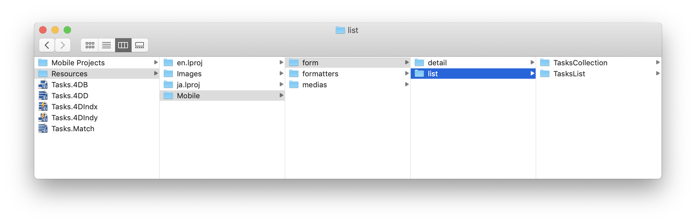

<div markdown="1" class = "objectives">

**OBJECTIVES**

Add actions to custom templates

</div>

<div markdown="1" class = "prerequisites">

**PREREQUISITES**

Click [here](prerequisites.html) to see what you'll need to get started!

</div>

In this tutorial, we'll guide you to add actions to custom templates.

## STEP 1. Download the Starter Project

To begin, downlod the Starter Project, which includes:

* 2 List custom form templates (TasksList and TasksCollection)
* 1 Detail custom form template (TasksDetail)
* a Tasks.4dbase file

## STEP 2. Add custom templates to 4D for iOS Project

First, drop:

* **TasksList** and **TasksCollection** folders in *Tasks.4dbase/Resources/Mobile/form/list* folder 



* **TasksDetail** in *Tasks.4dbase/Resources/Mobile/form/detail folder*


## STEP 3. Add actions in List forms

As we have seen before in the [actions section description](actions.html), two types of actions are availble (Table actions and Entity actions). 

Let's first open the ```list/TasksList/Sources/Forms/Tables/___TABLE___/___TABLE___ListForm.Storyboard``` file.

### Add actions to TasksList custom template

#### A. Add Table action Tag

Select the **List form Controller** and add this line in the **User Defined Runtime Attributes** (Identity inspector):

* Key Path: ```actions```
* Type: ```String```
* Value: ```___TABLE_ACTIONS___```


#### B. Add Entity action Tag

Select the Animatable Table View and add this line in the **User Defined Runtime Attributes** (Identity inspector):

* Key Path: ```actions```
* Type: ```String```
* Value: ```___ENTITY_ACTIONS___```


Your custom template is ready to display actions defined in the Project Editor.

Now let's add action tags to the TasksCollection custom template

### Add actions to TasksCollection custom template

To do so, open the ```list/TasksCollection/Sources/Forms/Tables/___TABLE___/___TABLE___ListForm.Storyboard``` file.

#### A. Add Table action Tag

The process is quite similar as for TasksList custom template

Select the **List form Controller** and add this line in the **User Defined Runtime Attributes** (Identity inspector):

* Key Path: ```actions```
* Type: ```String```
* Value: ```___TABLE_ACTIONS___```


#### B. Add Entity action Tag

For entity the way you display action is quite different as for TableView: swipe action are less adapted for CollectionViews.

So with collection views, the best way to display action is to use a **long pressure** on the cell you want to interact with!

For that, select the collectionView cell and add this line in the **User Defined Runtime Attributes** (Identity inspector):

* Key Path: ```actions```
* Type: ```String```
* Value: ```___ENTITY_ACTIONS___```


## STEP 4. Add actions in Detail forms
 
In Detail forms you will also be able to use entity actions clicking on a generic action button.

You can use the **generic button** in the navigation bar or **create easily you own custom action button**. In both case you have to add tags.

For generic button embeded in navigation bar, select the Controller and add this line in the **User Defined Runtime Attributes** (Identity inspector):

* Key Path: ```actions```
* Type: ```String```
* Value: ```___ENTITY_ACTIONS___```


In our tutorial, we want to build our own button. For that, open the ```detail/TasksDetail/Sources/Forms/Tables/___TABLE___/___TABLE___DetailsForm.storyboard``` file.

Open it, select button at bottom right and add this line in the **User Defined Runtime Attributes** (Identity inspector):

* Key Path: ```actions```
* Type: ```String```
* Value: ```___ENTITY_ACTIONS___``


As you can see few button visuals are missing in the Storyboard file. They are included in the  template **Resources folder** and will be included in the project during the build process.

For example the **moreButton.imageset**:


Congratulations, your Tasks iOS app is complete including action in List form and Detail form !


