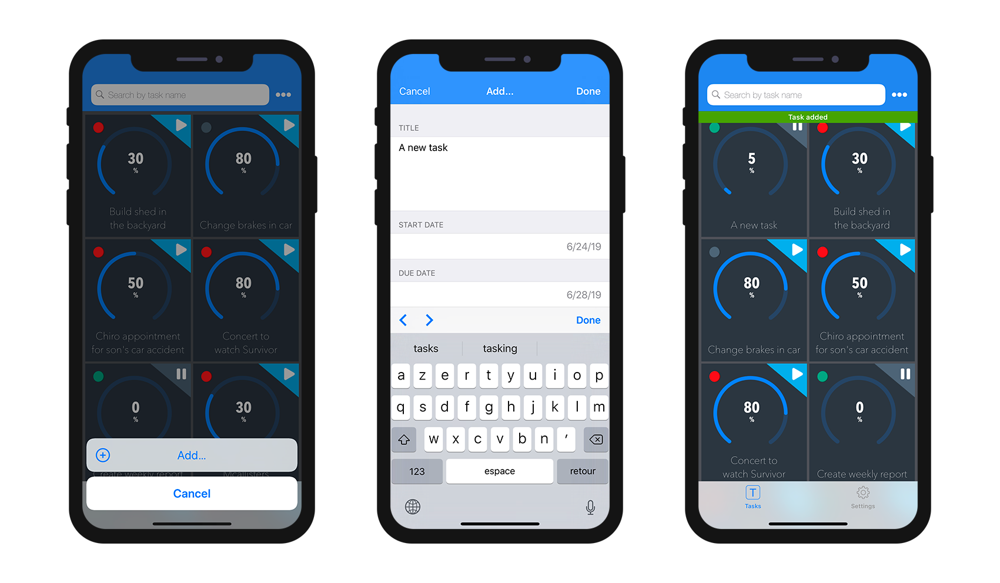

<div markdown="1" class = "objectives">

**OBJECTIVES**

Define action parameters to edit the content of your app.

</div>

In the [previous tutorial](define-first-action.html), we discoverd how to execute 4D code from an iOS app by defining actions from the [Actions section](actions.html).

In this tutorial we are going to go further and create:

* an Add action in order to **create a new task**.
* an Edit action that will allow you to **edit existing tasks** from the iOS app.
* a Delete action to **delete an entity**.
* an action that will enable you to **email a comment for a specific task**.

To begin, let's first download the **Starter Project** based on our existing Tasks app iOS app.

<div markdown="1" style="text-align: center; margin-top: 20px; margin-bottom: 20px">

<a class="button"
href="../assets/en/actions/ActionParametersStarterProject.zip">STARTER PROJECT</a>

</div>

## STEP 1. Add action

Let's begin simple. Open the Tasks mobile project and go right to the **Actions section**. 


Quite empty for the moment... But here is what we want for now: **create a new task from the iOS app**.

For that, let's create an action using a **Preset Add action**:

* Clic on the arrow situated into the **Plus button** at the bottom left of the Actions table.
* Select the **Add action for** option.
* Select the **Task table**. 


* **A new action** named *"addTasks"* with *"Add..."* as default label.
* **All action parameters** and their **properties** should be available under **Actions parameters**.


At this point, all **Add action parameters** are automatically created and ready to use.

## STEP 2. Edit action

Now Let's create an action that will allow you to **edit your app content**.

For that, let's create an action using a **Preset Edit action**:

* Click on the arrow situated into the **Plus button** at the bottom left of the Actions table.
* Select the **Edit action for** option.
* Select the Task table. 


At this point, you should see:

* **A new action** named *"editTasks"* with *"Edit..."* as default label.
* **All action parameters** and their **properties** should be available under **Actions parameters**.


Don't worry, we will manage 4D code later to do what we want to do :)

## STEP 3. Delete action

The **Preset Delete action** creation process is quite the same as for The Edit action:

* Clic on the arrow situated into the **Plus button** at the bottom left of the Actions table.
* Select the **Delete action for** option.
* Select the Tasks table. 


At this point, you should see a **new action** named *"deleteTasks"* with *"Remove"* as a default label.


You won't have to worry about parameters or properties for this type of action.

## STEP 4. Send a comment action

There we want to **send a comment** to a **specific email** depending on a specific task. To do so, clic on the Plus button and create a new action named **sendComment**.


Now let's create Three parameters:

* Click on the plus button and select **Title** in the parameter's list because you want to include it in the email your are going to send.
* Create a **Comment parameter** and select Text area as a format property.
* Create an **email parameter** and select Email address as a format property.

Your Actions section should look like that :


## STEP 5. Create All the method you need


### addAction

```

C_OBJECT($0)
C_OBJECT($1)

C_OBJECT($entity;$in;$out)

$in:=$1

$out:=New object("success";False)

If ($in.dataClass#Null)
	
	$entity:=ds.Tasks.new()  //create a reference
	
	$entity.CompletePercentage:=$in.CompletePercentage
	$entity.StartDate:=$in.StartDate
	$entity.DueDate:=$in.DueDate
	$entity.Description:=$in.Description
	$entity.Title:=$in.Title
	$entity.Status:=$in.Status
	$entity.Priority:=$in.Priority
	
	$entity.save()  //save the entity
	
	
	$out.success:=True  // notify App that action success
	$out.dataSynchro:=True  // notify App to refresh the selection
	$out.statusText:="Task added"

	
Else 
	
	$out.errors:=New collection("No Selection")
	
End if 

$0:=$out


```

### editAction

```

C_OBJECT($0)
C_OBJECT($1)

C_OBJECT($dataClass;$entity;$in;$out;$status;$selection;$emailToSend)

$in:=$1

$selection:=ds[$in.dataClass].query("ID = :1";String($in.ID))

If ($selection.length=1)
	
	$entity:=$selection[0]
	
	$entity.CompletePercentage:=$in.CompletePercentage
	$entity.StartDate:=$in.StartDate
	$entity.DueDate:=$in.DueDate
	$entity.Description:=$in.Description
	$entity.Title:=$in.Title
	$entity.Status:=$in.Status
	$entity.Priority:=$in.Priority
	
	$status:=$entity.save()
	
	$out:=New object
	
	If ($status.success)
		
		$out.success:=True  // notify App that action success
		$out.dataSynchro:=True  // notify App to refresh this entity
		$out.statusText:="Task edited"

	Else 
		
		$out:=$status  // return status to the App
		
	End if 
	
Else 
	
	$out.success:=False  // notify App that action failed
	
End if 

$0:=$out


```

### deleteAction

```

C_OBJECT($0)
C_OBJECT($1)

C_OBJECT($dataClass;$entity;$in;$out;$status;$selection)

$in:=$1

$selection:=ds[$in.dataClass].query("ID = :1";String($in.ID))

If ($selection.length=1)
	
	$entity:=$selection.drop()
	
	$out:=New object
	
	If ($entity.length=0)
		
		$out.success:=True  // notify App that action success
		$out.dataSynchro:=True  // notify App to refresh this entity
		$out.statusText:="Task deleted"


	Else 
		
		$out:=$status  // return status to the App
		
	End if 
	
Else 
	
	$out.success:=False  // notify App that action failed
	
End if 

$0:=$out


```

### sendEmail

```

C_OBJECT($0;$out)
C_OBJECT($1;$in)

C_OBJECT($dataClass;$entity;$selection)

$in:=$1

$selection:=ds[$in.dataClass].query("ID = :1";String($in.ID))

If ($selection.length=1)
	
	$entity:=$selection[0]
	
	$taskTitle:=$in.Title
	$commentToSend:=$in.Comment
	$emailToSend:=$in.Email
	
	$out:=New object
	
	
	$server:=New object
	$server.host:="smtp.gmail.com"
	$server.port:=465
	$server.user:="test@mail.com" //To be replaced by your email
	$server.password:="yourPassword" //To be replaced by your password
	
	$transporter:=SMTP New transporter($server)
	
	$email:=New object
	$email.subject:="New comment about one of your task"
	$email.from:="yourEmail" //To be replaced by your email
	$email.to:=$emailToSend
	$email.htmlBody:="<h1>Comment from Tasks for iOS</h1>"+"<p><b>Task:</b> "+$taskTitle+"</p><p><b>Comment:</b> "\
	+$commentToSend+"</p><br><p><i>Send from my 4D for iOS app</i></p>"\
	
	
	$status:=$transporter.send($email)
	If ($status.success)
		$out.success:=True  // notify App that action success
		$out.statusText:="Mail sent"
		
	Else 
		$out.success:=False  // notify App that action success
		$out.statusText:="Mail not sent"
		
	End if 
	
Else 
	
	$out.success:=False  // notify App that action failed
	
End if 

$0:=$out

```

<div markdown="1" class = "tips">

**TIPS**

* Don't forget to add your own values for this **sendEmail Action**.

</div>


## STEP 6. Create the on Mobile App Action

As described in the [documentation](actions.html) click on the Create button to create the On Mobile App Action Database method.

All your actions will automatically included in this database method in a case of.

The only thing you got to do is add a reference to your methods depending on the case your want to cover.

Here is the final example of the On Mobile App Action database method:

```
C_OBJECT($0;$response)
C_OBJECT($1;$request)

C_OBJECT($o;$context;$request;$result;$parameters)

$request:=$1  // Informations provided by mobile application

$context:=$request.context
$parameters:=$request.parameters

Case of 
		
	: ($request.action="addTasks")
		
		  // Insert here the code for the action "Add…"
		
		$o:=OB Copy($parameters)
		$o.dataClass:=$context.dataClass
		$o.ID:=$context.entity.primaryKey
		
		$result:=addAction ($o)
		
	: ($request.action="editTasks")
		
		  // Insert here the code for the action "Edit…"
		
		$o:=OB Copy($parameters)
		$o.dataClass:=$context.dataClass
		$o.ID:=$context.entity.primaryKey
		
		$result:=editAction ($o)
		
		
	: ($request.action="deleteTasks")
		
		  // Insert here the code for the action "Remove"
		
		$o:=New object(\
		"dataClass";$context.dataClass;\
		"ID";$context.entity.primaryKey)
		
		$result:=deleteAction ($o)
		
	: ($request.action="sendComment")
		
		  // Insert here the code for the action "Send Comment"
		
		$o:=OB Copy($parameters)
		$o.dataClass:=$context.dataClass
		$o.ID:=$context.entity.primaryKey
		
		
		$result:=sendMail ($o)
		
	Else 
		
		  // Unknown action
		
End case 

$0:=$result


```

## STEP 7. Build your app


Build your app ! 

From here, if you click on the action navigation bar button, you will be able to **create a new task**.



If you make a long pressure on your new task cell in the List Form, you will find that an **Edit...** action has been added in the action list.


Send a comment using the **Send comment** action.


And finally you can delete an entity using **Delete...** action.


## STEP 8. Where to Go From Here?

Congratulations, your Tasks iOS app is now complete. You can modify your app data direclty from your device and sychronize it with your server!

<div markdown="1" style="text-align: center; margin-top: 20px; margin-bottom: 20px">

<a class="button"
href="../assets/en/actions/ActionParametersFinalProject.zip">FINAL PROJECT</a>

</div>

