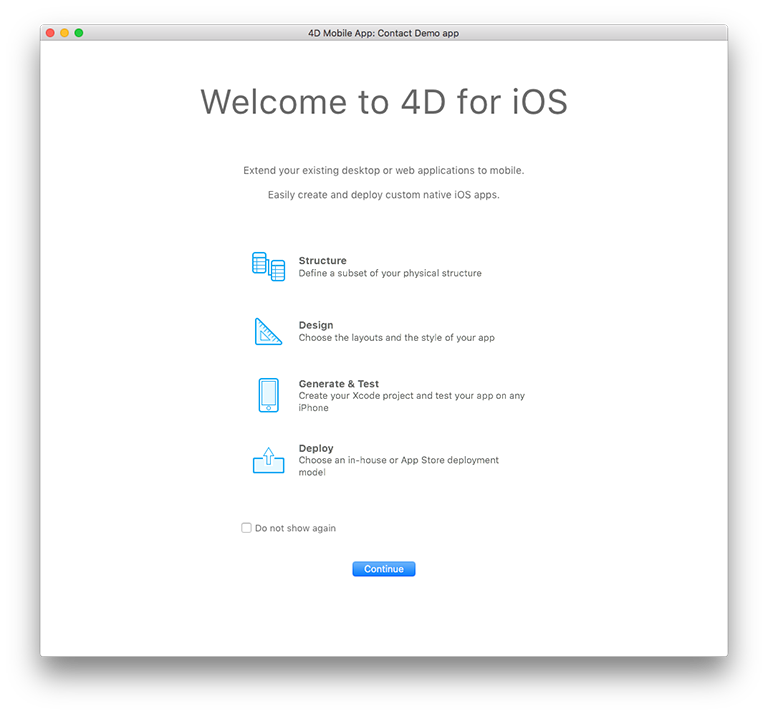
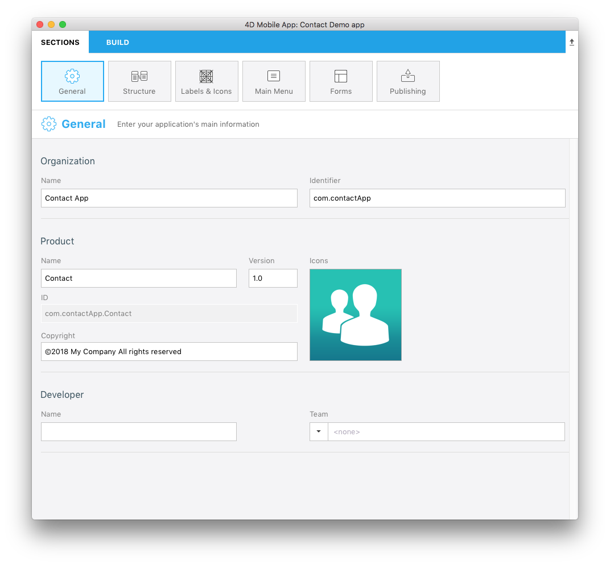
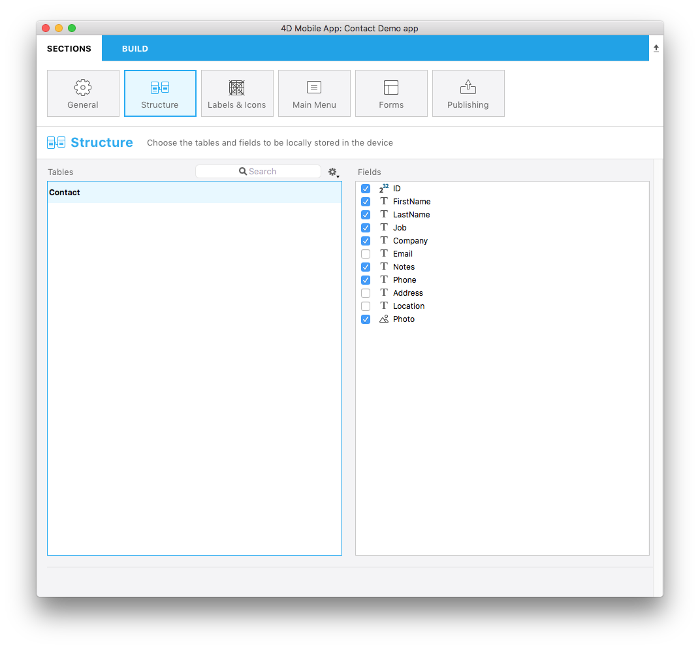
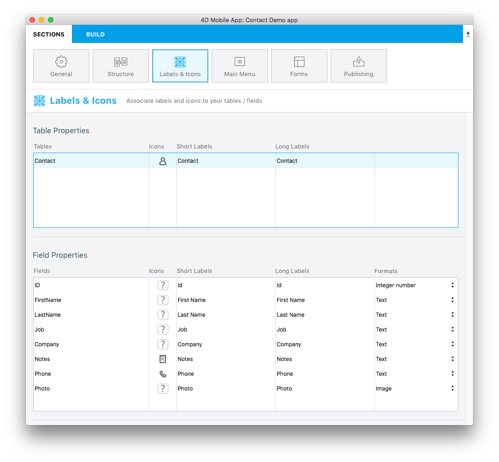
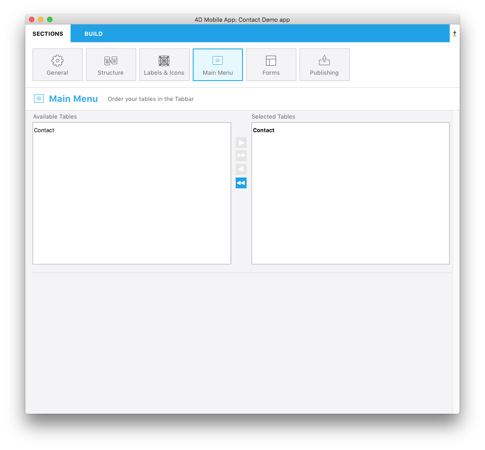
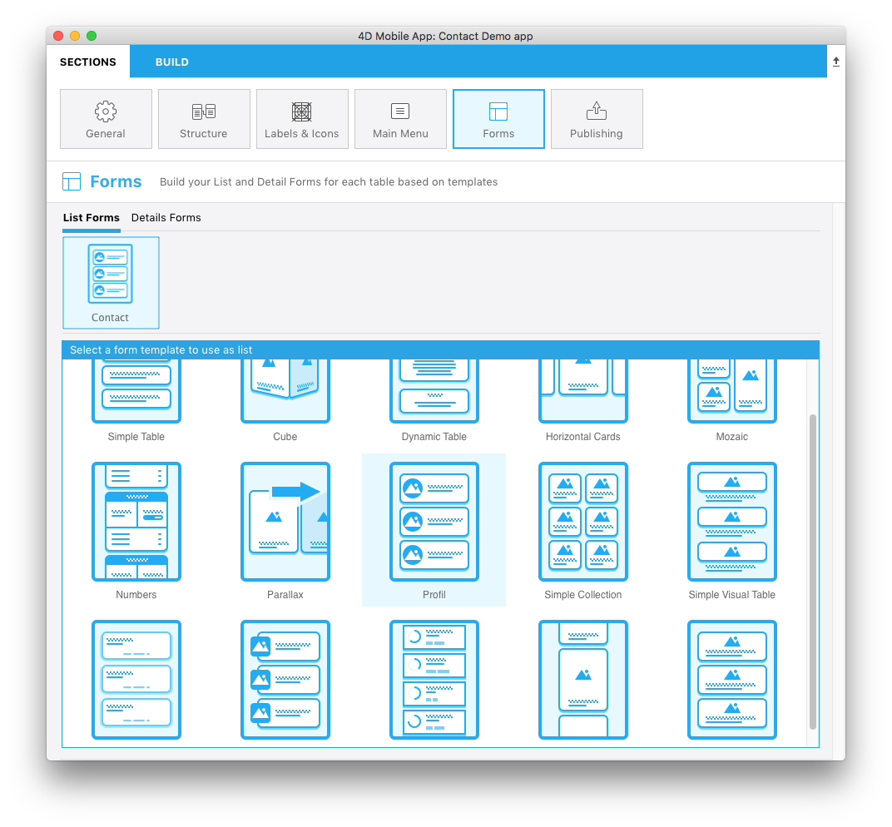
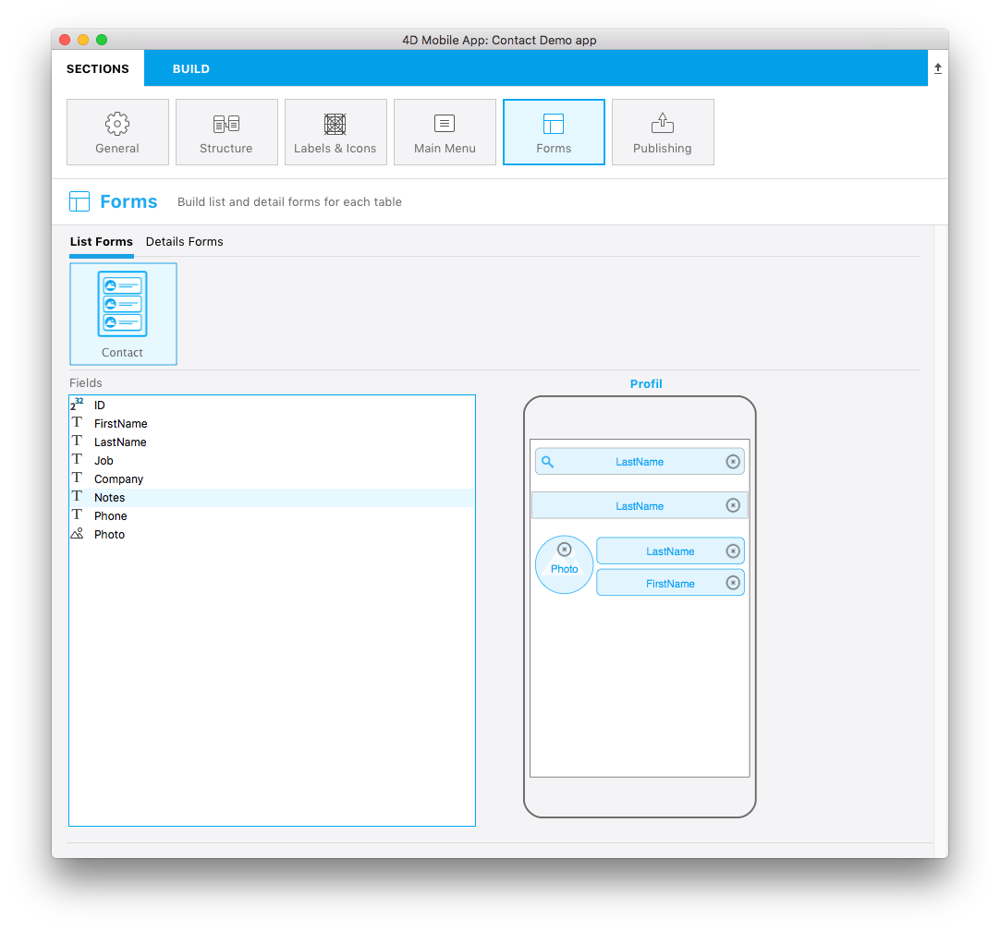
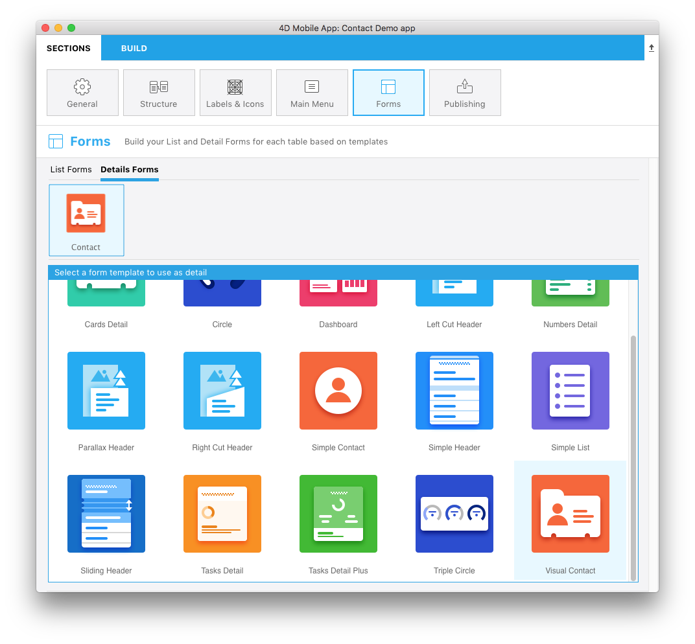
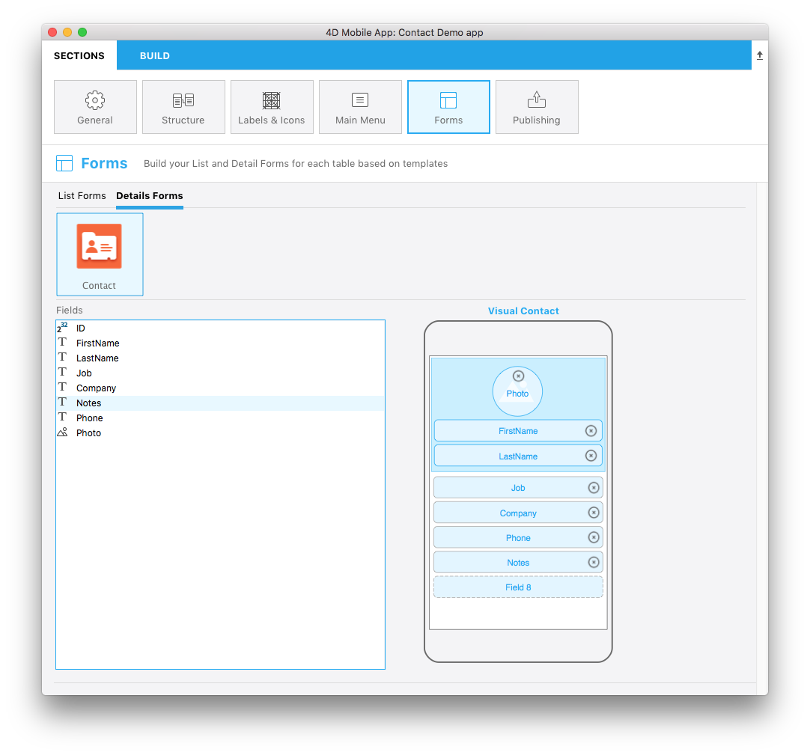

<b>OBJECTIVES</b>

* Create your first app with 4D for iOS

<b>PREREQUISITES</b>

* 4D Server / 4D Developer v17 R2
* macOS version 10.13 (or later)
* Latest [Xcode](https://itunes.apple.com/us/app/xcode/id497799835) version installed on your Mac
* (optional - to automate app installation on your device) [Apple configurator 2](https://itunes.apple.com/us/app/apple-configurator-2/id1037126344) installed on your Mac

This tutorial will let you dive right into 4D for iOS development. It will allow you to quickly and easily create your first application.

<i>Scenario: You're a commercial business manager and you want to consult your contact information on the go.</i>

We're going to create an iPhone directory app to search for contact names from a list and then view the details of each contact. We'll call it "Contact". 

## STEP 1. Getting started
Download our Starter Project, which contains a database file and project icon, but no mobile project yet.

<a class="button"
href="../assets/contact-app/ContactStarter.zip">STARTER PROJECT</a>

 

## STEP 2. Creating the project

Let's start with a very simple structure using a single table. From 4D, go to <b>New > Mobile project</b>.

Give your project a name and click <b>Create</b>.

## STEP 3. Opening the Project Editor

Welcome to 4D for iOS! The Welcome screen displays the main app-creation stages of this magnificent tool. 🙂

Click <b>Continue</b>.

## STEP 4. Sections - General

Here, you'll configure your app's primary information:

* <b>Organization:</b> Enter the name of your company and the application's identifier (ex. “My Company” and com.MyCompany).
* <b>Product:</b> Enter your app's name. Let’s call this one "Contact".
* <b>ID:</b> (Bundle ID) is automatically generated as a composition of your organization identifier and product name.
* <b>Version:</b> Leave the version as 1.0 and define your app's copyright. It's highly recommended to use the formats provided by 4D for iOS.
* <b>Icons:</b> Drag and drop an icon for your app into the icon area.
* <b>Developer:</b> This is automatically filled from the user name on your computer. Copy/paste your developer team reference (from your developer account) into the Team field. You can also leave it empty to build your application on the Simulator only.

## STEP 5. Sections - Structure

This is where you'll define a subset of your data (the database tables and fields) to expose to mobile devices.

For our example, select <b>ID</b>, <b>First Name</b>, <b>Last Name</b>, <b>Job</b>, <b>Company</b>, <b>Phone</b>, <b>Notes</b> and <b>Photo</b>.

<b>NOTE</b>

* We highly recommend publishing your primary key in order to identify each record of your database.

## STEP 6. Sections - Icons & Labels

Now it's time to define some labels and icons for the selected tables and fields.

<b>Table Properties:</b>
* Define a short and a long label for your Contact table
* Click on the icon field. The icon library will appear and you can select an icon to illustrate the Contacts table.
You can also opt to leave the icon field empty. 4D for iOS will generate a default icon for you!

<b>Field Properties:</b>
* Define a short and a long label for your selected fields.
* Click on the icon field and select icons for each field. There are several options for field icons:
	* You can select an icon for each field,
	* If at least one icon has been defined and other fields are left empty, 4D for iOS will generate default icons for you
	* You can simply leave them empty to not display any field icons. 

## STEP 7. Sections - Main Menu

Next up is defining the order of the tables in the app's main menu.

* <b>Available Tables:</b> Displays the table(s) to be used.
* <b>Selected Tables:</b> Displays your app's menu items. Even though our example has only one item, you can drag and drop your items to reorder them.

## STEP 8. Sections - Forms

We're almost done, but first we need to decide how the app's layout. There are both List and Details forms to choose from.

* Select a list form template to display your table as a list. For our Contact app, let’s use the <b>Profile</b> template.

 
At this point, the bottom of the configuration window has changed from template selection to content definition.
 
* Drag and drop the fields you want displayed onto the template, <i>i.e.</i>, Last Name into the search and Title fields. The Search and Section fields are optional, leave the Section field empty for the moment.

And finally, we'll define the detail form. 
* Select a template that is best suited for your app. For our Contact app, let’s use the <b>Visual Contact</b>template.

* Drag and drop the content onto the appropriate places on the detail form template, <i>i.e.</i>, First Name, Last Name, and Photo.

## STEP 9. Build the app

Now the fun part! It's time to build your app and test it on the Simulator to see the final result!

* Click the <b>Build</b> tab.
* Select a device to use as a Simulator by clicking on the device button.
* Click  <b>Build and Run</b>.
* Wait a few seconds and …. voila! Your iOS app is alive!

## STEP 10. Where to go from here?

We've covered basic app creation in this tutorial, and you should now be able to create simple apps on your own. But wait - there’s more! In the next tutorial, you’ll learn how to build an even more complex app.
Click on <b>Final Project</b> below to download the final Contact app.

<a class="button"
href="../assets/contact-app/ContactFinal.zip">FINAL PROJECT</a>

