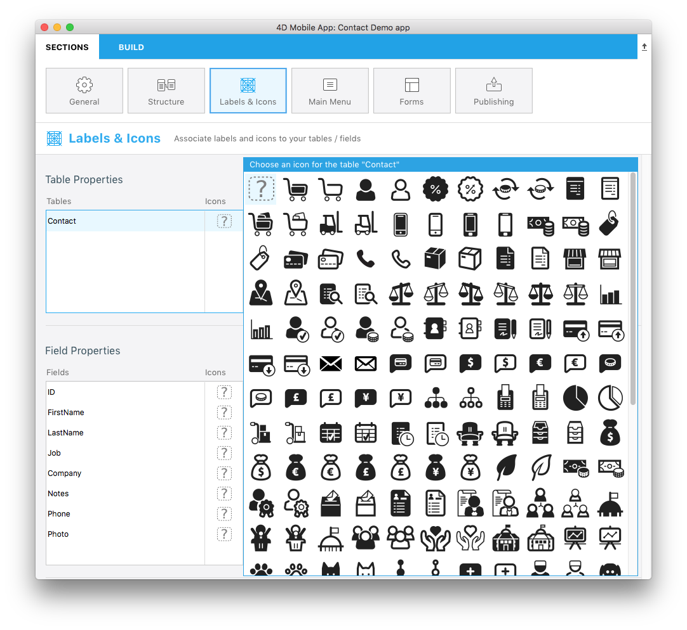

**OBJECTIVES**

* Use your own icons in 4D for iOS projects

**PREREQUISITES**

* Click [here](prerequisites.html) to see what you'll need to get started!

4D for iOS already provides number of icons from the Labels & Icons section for your Tables and Fields.

We want you to have the best app creation experience with 4D for iOS so now you can create and use you own icons in your iOS projects.

Let see how to make that !

