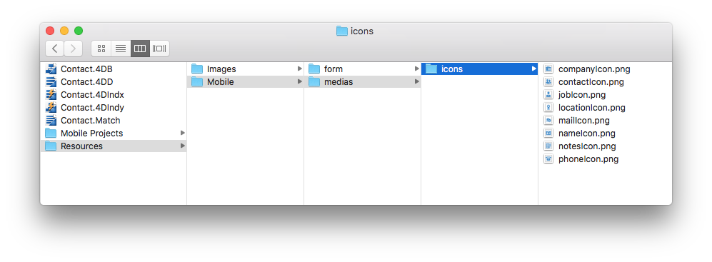

First, create a .../Resources/Mobile/medias/icons folder next to the Contact.4dbase data and drag and drop the downloaded icons in it.

I put a blue color to make the difference between embeded and custom icons in the icon library.

