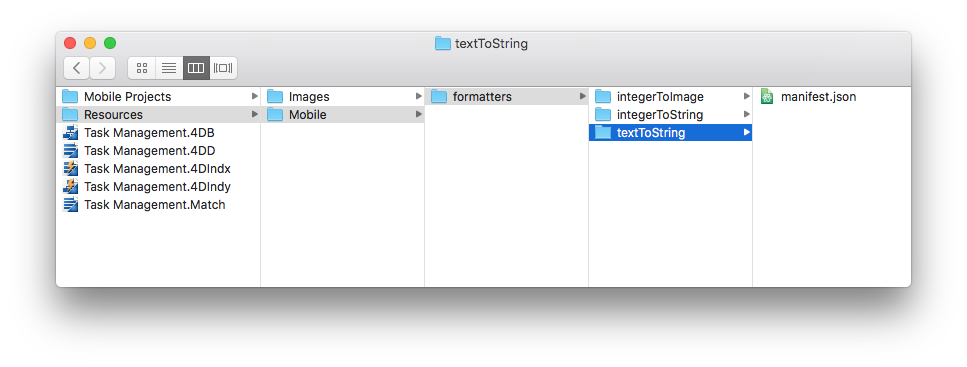
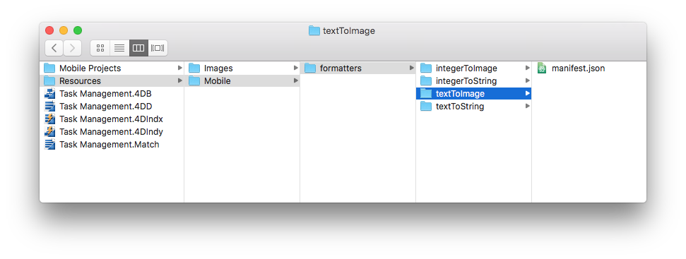

> **OBJECTIVES**
>
> Create your first data formatters.

> **PREREQUISITES**
>
> Click [here](prerequisites.html) to see what you'll need to get started!

In this tutorial, we'll guide you through the creation of various formatter examples.

## Download the Starter Project

To begin, download the **Starter Project**, which includes:

* **integerToImage_Images** and **textToImage_Images** folders that contain images (to use later for formatters that include images)
* A **Task Management.4dbase** file (with a ready to use mobile app project)

<div markdown="1" style="text-align: center; margin-top: 20px; margin-bottom: 20px">
<a class="button"
href="https://github.com/4d-for-ios/tutorial-CustomDataFormatter/archive/66d7eea49bc3353f73dbf784ee06283b3a332d0b.zip">CUSTOM FORMATTER STARTER PROJECT</a>
</div>

You're now ready to create your first formatters!

## Create the formatters folder

First, create a *Task Management.4dbase/Resources/Mobile/formatters* folder.


## Integer formatters

### Integer to string

* Create an **integerToString** folder in the formatters folder you've just created.
* Then create a **manifest.json** file in the **integerToString** folder.


Let's look at the contents of the **manifest.json** file:

```json
{
   "name": "integerToString",

   "type": ["integer"],

   "binding": "localizedText",

   "choiceList": {"0":"UX designer","1":"Developer","2":"QA","3":"Product Owner"}
}
```

1. **name**: the name of the formatter
2. **type**: the 4D format type you want to use
3. **binding**: can be **localized text** for strings or **imageNamed** for images
4. **choiceList**: mapped values

### Integer to image

* Create an **integerToImage** folder in the **formatters** folder you've created.

* Create a **manifest.json** file in the **integerToImage** folder.


* Then create an **Images** folder in the **integerToImage** folder. You can add the images from the **integerToImage_Images** in the StarterProject.zip to this new folder.


Let's look at the contents of the **manifest.json** file:


```json
{
	"name": "integerToImage",

   "type": ["integer"],

   "binding": "imageNamed",

   "choiceList": {"0":"todo.png","1":"inprogress.png","2":"pending.png","3":"done.png"},

   "assets": {
      "size": {
         "width": 40, "height": 40
      }
	}
}
```
1. **name**: the name of the formatter
2. **type** : the 4D format type you want to use
3. **binding**: can be **localized text** for strings or **imageNamed** for images
4. **choiceList**: mapped values
5. **assets**: adjust the display size (width and height)

## Text formatters

### Text to string

* Create a **textToString** folder in the formatters folder you've just created.

* Create a **manifest.json** file in the **textToString** folder.



Let's look at the contents of the **manifest.json** file:

```json
{
	"name": "textToString",

   "type": ["text"],

   "binding": "localizedText",

   "choiceList": {"FRA":"France","MAR":"Morocco","USA":"United States","AUS":"Australia"}
}
```

1. **name**: the name of the formatter
2. **type**: the 4D format type you want to use
3. **binding**: can be **localized text** for strings or **imageNamed** for images
4. **choiceList**: mapped values

### Text to image

* Create a **textToImage** folder in the formatters folder you've just created.

* Create a **manifest.json** file in the **textToImage** folder.



* Then create an **Images** folder in the **textToImage** folder. You can add the images from the **textToImage_Images** in the StarterProject.zip to this new folder.


Let's look at the contents of the **manifest.json** file:

```json
{
	"name": "textToImage",

   "type": ["integer"],

   "binding": "imageNamed",

   "choiceList": ["image1.png","image2.png","image3.png"],

   "assets": {
  "size": {
   "width": 40, "height": 40
		}
	}
}

```
## Dark mode support

Whether your device is in dark or light mode, whether you're working on iOS or Android, you can easily use the custom data formatters containing images. The pictures will be adapted depending on the phone's color mode.

### Tintable color

To optimize the color contrast of your images on your app and display them in black and white, depending on the color mode (light or dark), you can set the image format as follows, :

```json
{
   "name": "textToImage",
   "type": ["text"],
   "binding": "imageNamed",
   "choiceList": {"car":"car.png","plane":"plane.png","bus":"bus.png"},
   "assets": {
     "size": 54, 
     "tintable": true
     }
}
```

### Optimized dark mode picture

If you want to display colored pictures adapted to your color mode, you need to have two pictures: one for the light mode, and one for the dark mode suffixed with ```_dark```, as follows:

```json
{
   "name": "textToImage",
   "type": ["text"],
   "binding": "imageNamed",
   "choiceList": {"car":"car.png","plane":"plane.png","bus":"bus.png"},
   "assets": {
     "size": 54
   }
}
```


## Open mobile project

Open the Task Management.4dbase with 4D and go to File > open > Mobile Project... to open the **Tasks**

Next, go to the **Labels & Icons section** in the project editor. All of your formatters are available for the different field types you  previously defined in the different formatter manifest.json files:

* Select the **integerToString** formatter for the **Job field**
* Select the **textToString** formatter for the **Country field**
* Select the **integerToImage** formatter for the **Task Status**
* Select the **textToImage** formatter for the **Manager**


## Build your 4D for iOS app

Build your 4D of iOS app and you'll see that your data formatter is well applied depending on the credit limit.


Click on **FORMATTER FINAL** below to download the completed formatter template folder.

<div markdown="1" style="text-align: center; margin-top: 20px">

<a class="button"
href="https://github.com/4d-for-ios/tutorial-CustomDataFormatter/releases/latest/download/tutorial-CustomDataFormatter.zip">FORMATTER FINAL</a>
</div>
