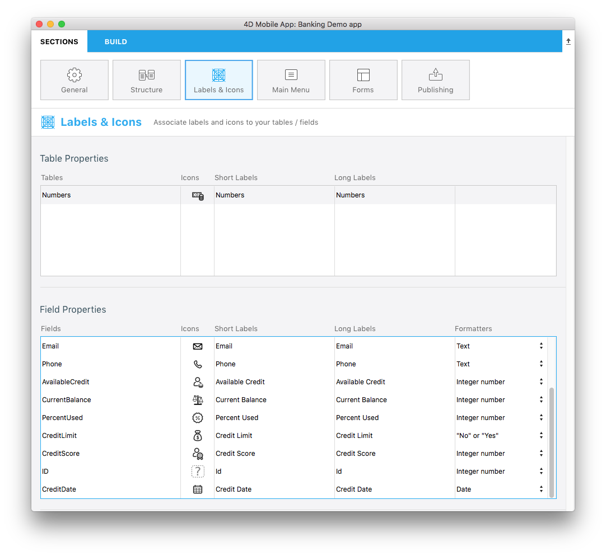
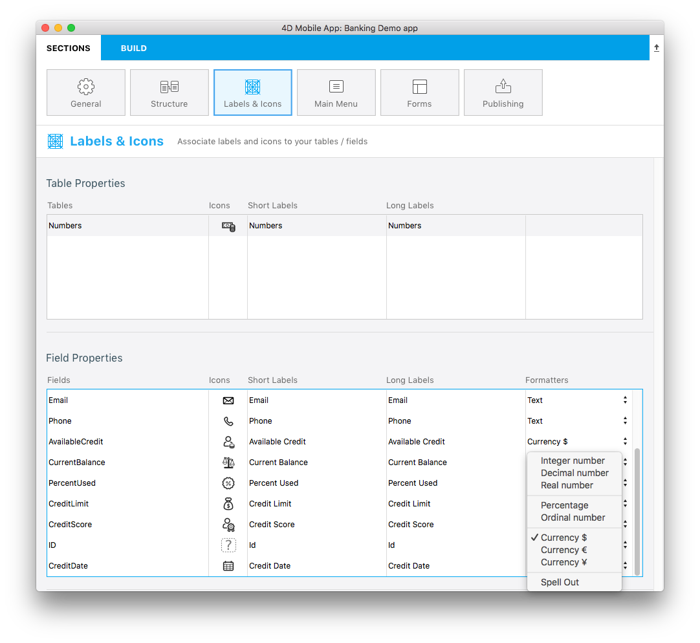
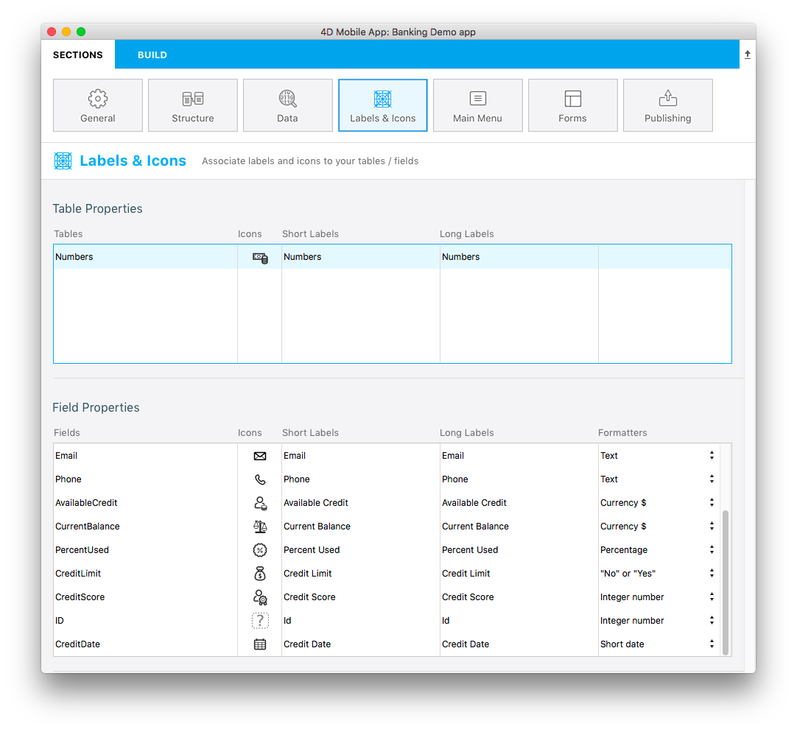

The R3 version includes a new concept : Data formatting !

You can now choose pre-packaged formats from the Labels & Icons section.

Let's start downloading the Starter Project :

<a class="button"
href="../assets/custom-detailform/CustomDetailFormStarterProject.zip">DATA FORMATTER STARTER PROJECT</a>

## Open mobile project

Go straight to the Labels & Icons section. You will see that a new Formatters column is available in the Field Properties :

From there you can select specific formats depeding on your needs. Let define set Available Credit as a Currency :

Let's so the same for all other fields :

* Set Current Balance as a **Currency $**
* Set Percent Used as a **Percentage**
* Set Credit Limit as a **No or Yes**
* Set Credit Date as a **Short Date**

## Build and Run your project

Here is the final result in you iOS app with Tasks lisform and Numbers detailform selected.

You are done ! Your field are well formated depending on what is defined in the Labels and Icons section.

