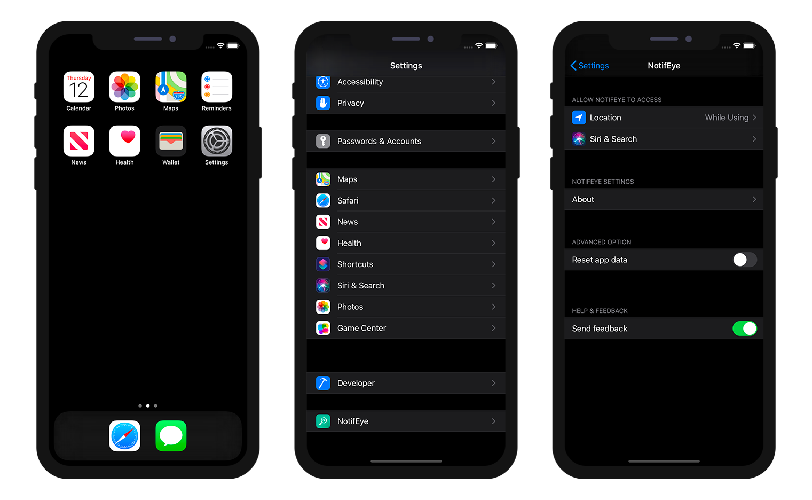

From your app if you have a crash, you can display, edit and send feedback. 

For that:
* Go to your iPhone Settings
* find your app scrolling down
* Switch on the feedback

From here, the only thing you have to do is opening again your app. An action sheet will appear to allow you :
* Sends messages
* Suggest an improvement
* Show current log
* Report a problem

