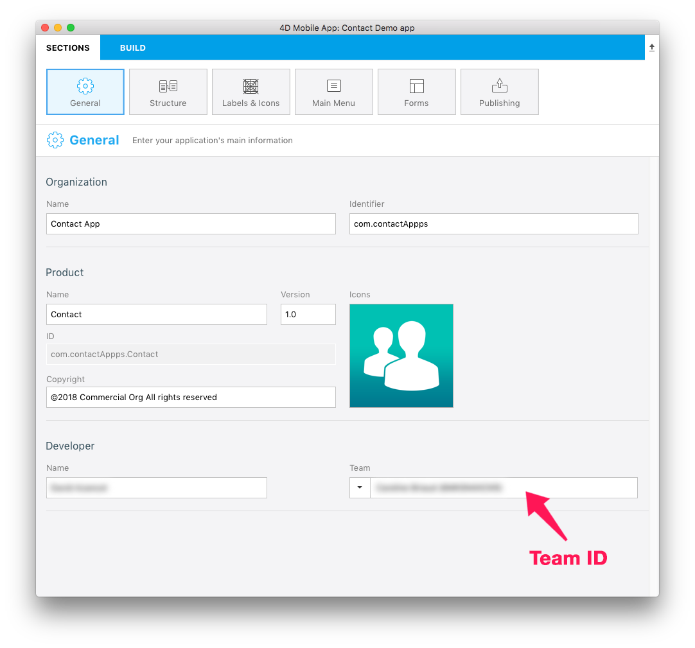
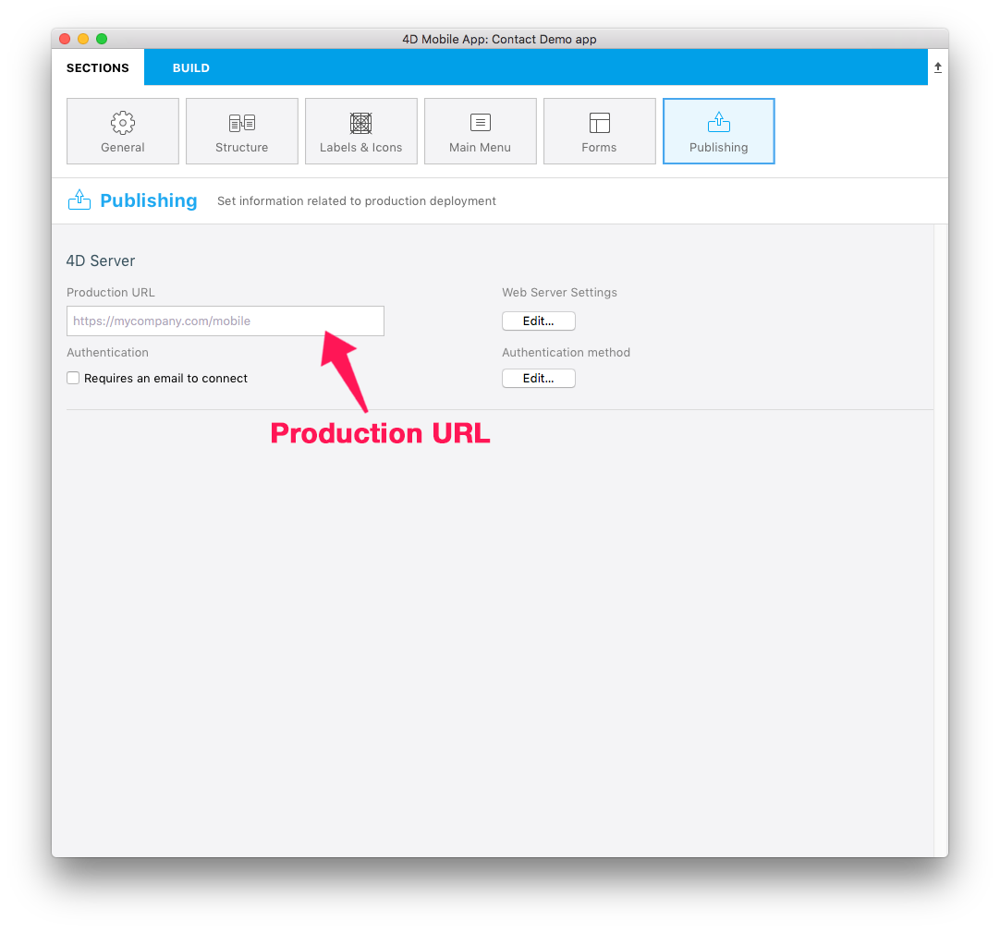

<b>OBJECTIVES</b>

* Archive and upload your project to App Store Connect

## STEP 1. Xcode configuration
* If you have chosen an Apple Developer Account as an individual, your account is immediately available. 
* If your have chosen an Apple Developer Account as an organization, you must wait for Apple validation.
* When your account is accessible, add it to Xcode in Preferences > Accounts.
* Xcode will automatically install the necessary provisioning and certificates. 

## STEP 2. Get your Team ID

* Log into your Apple Developer Account. You can find your Team ID in Membership.

## STEP 3. 4D for iOS configuration

* Launch 4D for iOS

* On the SECTIONS tab:

<b>General: Enter your Team ID</b>

<b>Publishing: Enter your production URL</b> 

(HTTPS is mandatory for deployment).

 
* On the BUILD tab:

<b>Build and Run: Build your Project</b>

## STEP 4. Open your project with Xcode 

* From the 4D for iOS Project Editor's BUILD tab, click on Project > Open the project with Xcode

## STEP 5. Archive your project from Xcode

* From Xcode go to the simulator Menu and select <b>Generic iOS Device</b>.

* Then from the menu, click on Product and select <b>Archive</b>

## STEP 6. Validate your project

* At the end of the archive process, the Organizer window appears with the archive you have just created.

* Click on the <b>Validate</b> button to start the validation process.

* The first step is selecting the App Store distribution options.

* Then you need to re-sign your app. Let Xcode manage this by  checking the <b>Automatically manage signing</b> option.

* Review your app's content.

* If your project passes the validation process, you should see this message:

If an error occurs a message will be displayed. These errors must be resolved before attempting the validation process again.

* Click <b>Done</b>. This will return you to the Organizer window.

## STEP 7. Upload to App Store

Once the validation process has been completed, you're ready to add your app to the App Store.   

* Click the <b>Upload to App Store</b> button.

* When your project has been successfully uploaded, you'll see this window:

## STEP 8. Select the build for the App Store 

* From App Store Connect > App Store > iOS App, select your app and click the <b>+</b> button that appears in the Build section

* Select the build you want to submit and click <b>Done</b>.

* Finally, click on the <b>Submit for Review</b> button.

## STEP 9. Submit for Review

* The final step to submitting your app for review is answering a few quick questions about your app. 

* When you've finished with the questions, click <b>Submit</b>.

* The average App Store review time is around two days!
