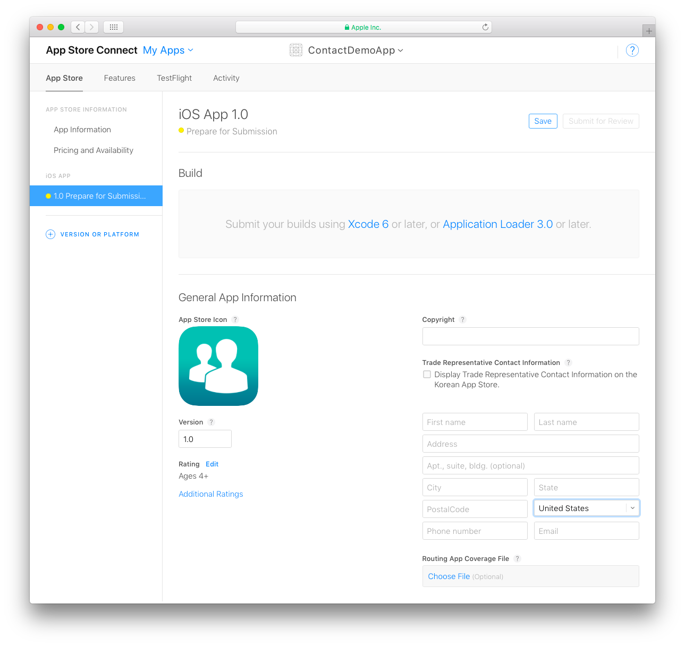

**OBJECTIVES**

* Create an App ID on your Developer Account
* Create your app in App Store Connect

	
**PREREQUISITES**

[Apple Developer Program for organization](register-apple-developer-program-organization.html) or [individual](register-apple-developer-program-individual.html)

## STEP 1. Create an App ID

#### What is an App ID ?

*An App ID is a two-part string used to identify one or more apps from a single development team. The string consists of a Team ID and a Bundle ID search string, with a period (.) separating the two parts (ex: TeamID.BundleID).*

**NOTE**
 
* If you have chosen an Apple Developer Account as an individual, your account is available immediately and you can create your App ID.

* If you have chosen an Apple Developer Account as an organization, you must wait for Apple validation to create your App ID.

* To create your App ID, go to your developer account and select [Certificates, IDs & Profile](https://developer.apple.com/account/ios/identifier/bundle)

* Click the + sign next to *Register iOS App IDs* to add a new App ID. 

* Define your app's Name and Bundle ID. 

* Define the App Services to include in your app

* Confirm your App ID by clicking **Register**.

## STEP 2. Sign in to App Store Connect

* Sign in to your [App Store Connect Account](https://appstoreconnect.apple.com)

* Click on **My Apps**.

## STEP 3. Create a new iOS App

Click the **+** sign in the top left corner to create a new iOS App. 

Add the following information:

* **Platforms**: Select iOS.
* **Name**: The name of your app.
* **Primary language**: The main language for your app.
* **Bundle ID**: Select your App Bundle ID from the dropdown list.
* **SKU**: A unique ID for your app (this stays private and is not seen by users)
* **Limit User Access (optional)**: Allows you to limit access to your app to users with App Manager, Developer, Marketer, or Sales roles.

**NOTE**

If your Bundle ID is not available, it may already be used by another app in the App Store. You'll need to change yours in your Xcode project.

## STEP 4. App information

From App Store Connect > App Information:
* Define your app's Privacy Policy URL (optional).
* Enter a subtitle for your app. This will appear below your app's name throughout the App Store in iOS 11.
* Select a primary and secondary (optional) category for your app to appear in.

## STEP 5. Pricing and Availability

This is where you define the price for your app.

**TIPS**

You can define limited-time discounts by specifying start and end dates.

## STEP 6. Prepare for Submission

Add all of the assets for your app to appear in the App Store in **Version Information**:

* Add your app screenshots. Screenshots for the iPhone 5.5" Super Retina Display and iPad 12.9" Retina Display are mandatory. For more details, see [Screenshot specifications](https://help.apple.com/app-store-connect/#/devd274dd925).

**TIPS**

You can generate all of your screenshots in Simulator (File > New Screen Shot).

* Scroll down and define the **Keywords** and complete the **Description** (this is what users will see in the App Store).

* You can share updates about your app, including new promotions or in-app purchases, upcoming features or content, limited- time sales, or other events within your app in also add a **Promotional Text** that will appear above your description on the App Store (for customers with devices running iOS 11 or later).

* Enter a **Support URL** that includes support information for your app. This URL will be visible on the App Store.

* **Marketing URL** is optional. This can direct users to a marketing website for your app.	

In the **iOS App section**:

Locate your build versions in **Build**.

* In **General App Information** area, enter the Copyright, Version, and Trade Representative Contact Information for your app.

* Your app icon is included in the generated 4D for iOS project.

* Rating is a required property used by the App Store's parental controls. Click Edit and select the appropriate age category for your app.

The **App Review Information** and **Version Release** sections include information required by the App Store. The information provided here will not be seen by users.

* **App Review Information**: Confidential contact and security information. 
* **Version Release**: Specifies an automatic or manual publication.

* Finally, click **Save**.

