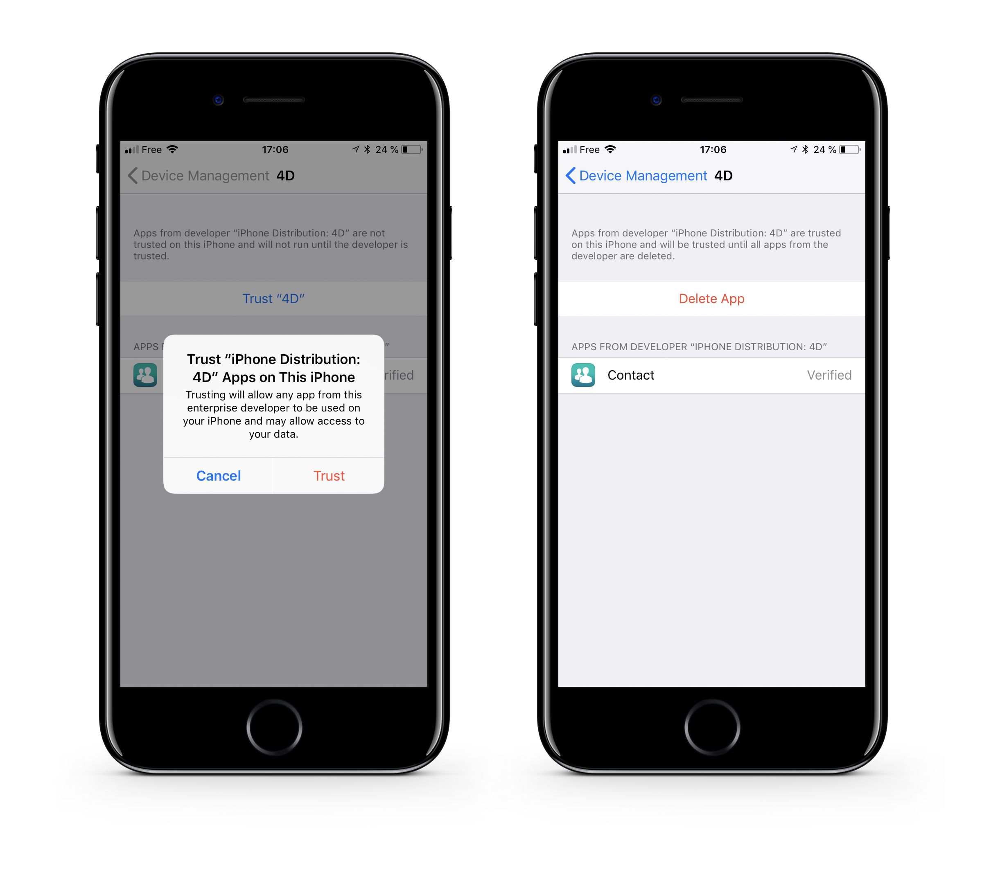

<div markdown="1" class = "objectives">

**OBJECTIVES**

* Upload your app to a secured server
</div>

## STEP 1. Upload your app

<div markdown="1" class = "tips">

**TIP**

You can use any cloud storage service to distribute your app as soon as it is secured (Dropbox, Google Drive, etc.).
</div>

Upload your app files to a secured server:

* assets (display-image and full-size-image)
* manifest.plist file
* .ipa file

<div markdown="1" class = "tips">

**NOTE**

Your asset and ipa URLs must match the URLs defined in your manifest.plist file.
</div>


## STEP 2. Create the installation link

* Create an ITMS Serices link (iTUnes Music Store) with the full web address of your manifest file as a parameter:

```
itms-services://?action=download-manifest&url=https://mywebserver.com/manifest.plist

```

* This link can be used when sending emails, embedded in an html page, or even within a QR code.

Here is a simple example:


*The QR Code used for this documentation is not active.*

## STEP 3. Install your enterprise app on iOS

* Install the app by clicking on the link or scanning a QR Code


* When you first open an enterprise app that you've manually installed, a notification will be displayed stating that the developer of the app isn't trusted on your device. 

* Ignore this message and click **Cancel**.

* In Settings > General > Profiles or Profiles & Device Management, in the "Enterprise App" heading, the profile for the developer is listed.


* Tap the name of the developer profile to establish trust for this developer.



* You can then go to your app and open it.

Congratulations ... you can now distribute your first app in-house!
