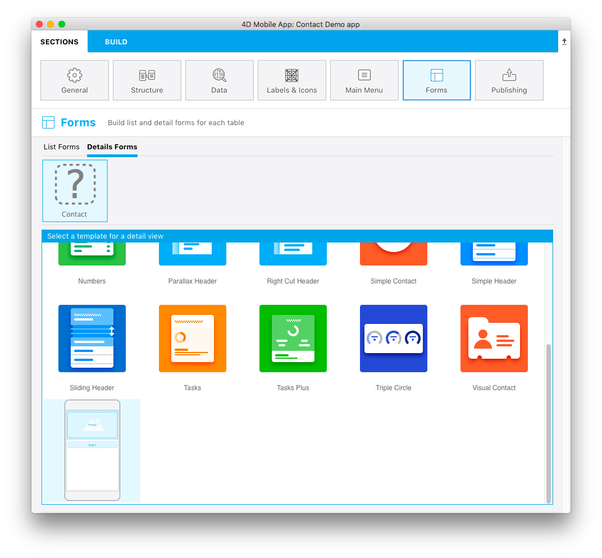

You can create your own template icon. 

This icon must be 160x160px and have to be named **layoutIconx2.png**

This icon will be used:
* on top of table name when the template has been selected
* in the template selector window in the **Forms section**

If this icon is missing in your custom template folder the template.svg file (that we are going to study later) will be displayed in the template selector window and a icon with a question mark will be displayed on top of each table that have a missing custom template icon.

For this example I produced the List form template icon with Photoshop but you can use any other software for image authoring or picture retouching.

