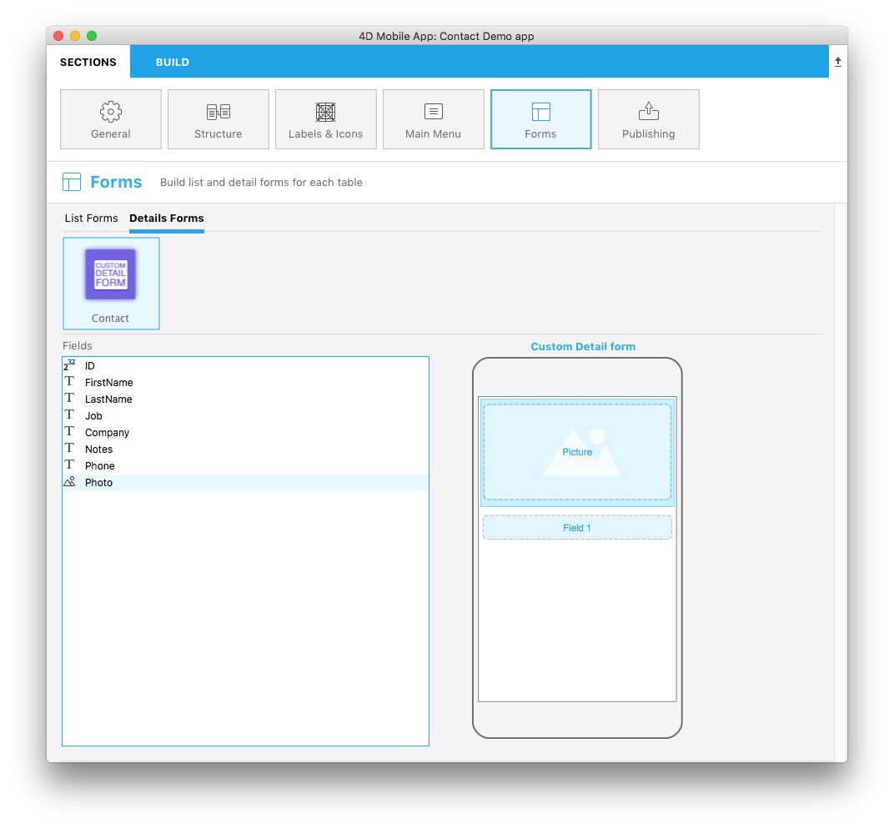
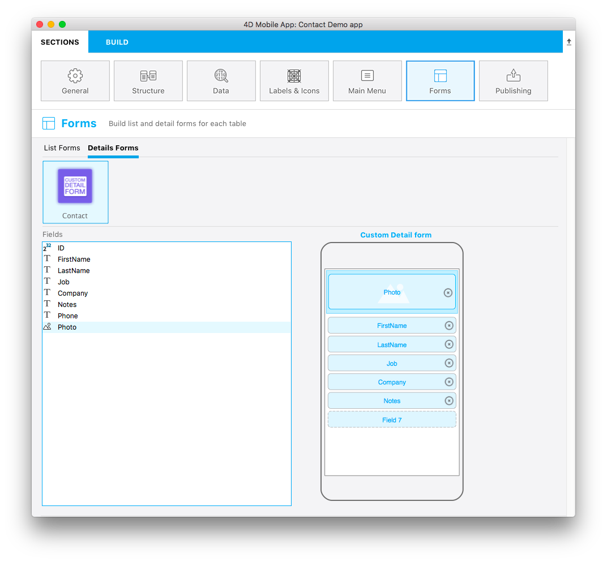

The template.svg file is a basic template representation. In this svg file you will have to define areas for you to be able to add fields to your custom list form from the project editor.


Here what we want to get :



This template has the particularity to have dynamic field number : this means that this template a will allow you to add an **image** as well as between **0 and 8 fields** depending on your needs. So when you build your detail form in the Forms section and drag and drop a field, an new empty field appears below the previous one, for you to add a new field:




Open this file with your favorite code editor.

Let’s focus on the different parts of your svg file and what you'll need to edit.

## Title
```
<title>Custom Detail form</title>
```

Add your template title here.

## ios:values

```
ios:values="f1,f2,f3,f4,f5,f6,f7,f8,f9"
```

**f1,f2,f3,f4,f5,f6,f7,f8,f9 IDs** refer to avaiblable fields to be displayed in your detail form : will allow you to drag and drop as many fields as you defined.

## Areas position, height and width and type
You will be able to define position, height and width for all your fields like for the [Custom list view tutorial](creating-custom-listform.html).

### Duplicated field properties

```
//1
<g id="f" visibility="hidden" ios:dy="35">

//2
<rect class="bg field" x="14" y="0" width="238" height="30"/>

//3
<textArea id="f.label" class="label" x="14" y="8" width="238">field[n]</textArea>

//4
<rect id="f" class="droppable field multivalued" x="14" y="0" width="238" height="30" stroke-dasharray="5,2" ios:type="0,1,2,4,8,9,11,25,35"/>

//5
<use id="f.cancel" x="224" y="1" xlink:href="#cancel" visibility="hidden"/>
</g>
```

1. Entire area y position
2. Area background position, height and width
3. Define the text area position and width 
4. Define the droppable field position, height and width as well as accepted fields types (all types are accepted here)
5. Define a cancel button that will be displayed to delete current content

<div markdown="1" class = "tips">

**NOTE**

* All types are available [here](http://doc.4d.com/4Dv17/4D/17/Field-and-Variable-Types.302-3729410.en.html)
</div>

<div markdown="1" class = "tips">

**TIP**

* To make field type definition easier, 4D for iOS allows your to include field types with **positive values** and also exclude field types with **negative values**. For example ```ios:type=“-3,-4"``` will allow you to drag and drop every field exept images and dates.

</div>


### Image field area

```
//1
<g transform="translate(0,60)">

//2
<rect class="bg field" x="15" y="0" width="236" height="65"/>

//3
<path class="picture" transform="translate(10 0) scale(6)"/>

//4
<textArea id="f1.label" class="label" x="15" y="25" width="236">$4DEVAL(:C991("picture"))</textArea>

//5
<rect id="f1" class="droppable field" x="15" y="0" width="236" height="65" stroke-dasharray="5,2" ios:type="3" ios:bind="fields[0]"/>

//6
<use id="f1.cancel" x="222" y="20" xlink:href="#cancel" visibility="hidden"/>
</g>
```

1. Entire area y position
2. Area background position, height and width
3. Icon to display an image in the imageField
4. Define the text area position and width 
5. Define the droppable field position, height and width as well as accepted fields types (here 3 is an image)
6. Define a cancel button that will be displayed to delete current content


### Field to be duplicated

```
//1
<g id="multivalued">

//2
<g transform="translate(0,140)">

//3
<rect class="bg field" x="14" y="0" width="238" height="30"/>

//4
<textArea id="f2.label" class="label" x="14" y="8" width="238">$4DEVAL(:C991("field[n]"))1</textArea>

//5
<rect id="f2" class="droppable field multivalued" x="14" y="0" width="238" height="30" stroke-dasharray="5,2" ios:type="0,1,2,4,8,9,11,25,35" ios:bind="fields[1]"/>

//6
<use id="f2.cancel" x="224" y="1" xlink:href="#cancel" visibility="hidden"/>
</g>
</g>
```

1. Mulitvaluated ID to for the field to be duplicated
2. Entire area y position
3. Area background position, height and width
4. Define the text area position and width 
5. Define the droppable field position, height and width as well as accepted fields types (all types are accepted here)
6. Define a cancel button that will be displayed to delete current content


Now that you have an **icon**, a **basic template description** in the manifest.json file and your **svg file** let's move to the fun part with Xcode !

