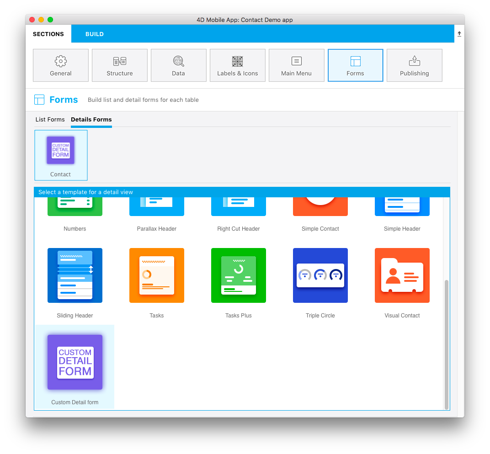

**OBJECTIVES**

* Create your first list form template

**PREREQUISITES**

* Click [here](prerequisites.html) to see what you'll need to get started!

In this tutorial, we'll guide you through the creation of a detail form template. It will display an **image header**, as well as **title and content fields** that will be duplicated in the generated iOS app.

## Download the Starter Project

To begin, download the **Starter Project**, which includes:
* A **Custom Detail form** folder (custom Detail form template folder)
* A **Contact.4dbase** file (Contact demo database with a ready to use mobile app project)

<a class="button"
href="../assets/custom-detailform/CustomDetailFormStarterProject.zip">CUSTOM DETAIL FORM STARTER PROJECT</a>

You are now ready to create your first detail form template !

## Add a detail form template to your mobile project

First, create a .../Resources/Mobile/form/detail folder next to the Contact.4dbase data and drag and drop the **Custom Detail form** folder in it.

Then open the Contact.4dbase with 4D. and go to File > open > Mobile Project... to open the **Contact Demo App** 

Finally go to the **Forms section** in the project editor. You will see that the Custom Detail form template has been successfully added to the Detail form template list !

Now let's focus on the **Custom Detail form** folder content.

## Detail form template folder content

* **a layoutIconx2.png** icon in 160x160px that will be displayed in the project editor when you select your custom template among others
* **a manifest.json** file that includes a basic description of the template
* **a template.svg** file that will be the representation of your template that will be display when you define your listForm content and where you will drag and drop your fields
* Source folder that includes the **storyboard** (graphical interface) and **swift** file (code for the form)

What are those files, what it is used for and how to customize it ?