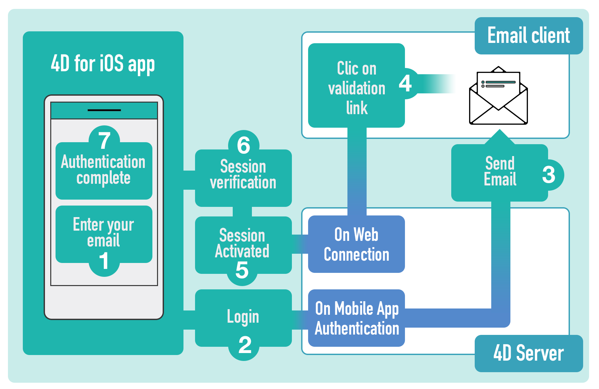

> **OBJECTIVES**
>
>Integrate email confirmation to authenticate mobile app users

> **PREREQUISITES**
>
> The [4D Mobile App Server](https://github.com/4d-for-ios/4D-Mobile-App-Server) component that allows email authentication is integrated in 4D mono and 4D server 18R4.

Let your customers and clients feel comfortable logging into their app using the email authentication!

It provides a way to verify that an email comes from whom it claims to be from, and will allow to block harmful or fraudulent uses of email.

In short, the principle is the following:

### 1. Activate the login form 

You integrate a login form into your app, from the project editor in the Publishing section.


### 2. Enter your email address

An email is required when the app is launched. When a user enters their email and clicks on the Login button, the On Mobile app Authentication is called and the user's session status should be updated to a "pending" status. A validation email is then sent to the user.

### 3. Check your mailbox

When the validation email is available, the user only needs to click on the validation link. This will call the On Web Connection database method and update the user's session status from "pending" to "accepted".

### 4. Go back to your app

Once the validation is done, the user can reopen their app and click on the Login button. The On Mobile App Authentication is called again but this time, the user's session status is "accepted", so the access is granted!

That’s quite simple, right?

So, to make the validation process easier and secure, 4D for iOS handles:



But let's figure out how this works, using our special component!


# Using the component

## A component to deal with email authentication

A toolbox component has been developed to help you manage several processes: the 4D Mobile App Server Component.

Let's see how to use it!

## On Mobile App Authentification

Call the Mobile **App Email Checker** method in the **On Mobile App Authentification database** method with the information provided by the mobile application:

```4d
C_OBJECT($0)
C_OBJECT($1)
$0:= Mobile App Email Checker ($1)

```

## Mobile App Active Session

Call the **Activate sessions** method in the **On Web Connection** database method with the Session ID parameter retrieved from the URL:

```4d
C_TEXT($1)
Case of 
: (Mobile App Active Session($1).success)
    //add log if you want
End case 

```

Its as simple as that!
You will find more information about this component in the [documentation](https://github.com/4d-for-ios/4D-Mobile-App-Server/blob/master/Documentation/Methods/Mobile%20App%20Email%20Checker.md), especially about resources you may use, like html templates and settings that you may want to define.


# Without the component

We will see here a basic example without using the component.

To do so, here is the code you can use:

## On Mobile App Authentication


```4d
C_OBJECT($0;$1;$response;$request;$email;$status)

  // parameters settings come from the mobile app
$request:=$1

  // Create an email with an activation URL
$mail:=New object
$mail.from:="myapplication@gmail.com"
$mail.to:=$request.email  // email entered by the user on their smartphone
$mail.subject:="Login confirmation"
$mail.htmlBody:="<a href=\"https://myserverapplication/activation/"+$request.session.id \
+"\">Click Here to confirm your email.</a>\"<br>"

  // Send mail
$smtp:=New object("host";"smtp.gmail.com";"user";"myapplication@gmail.com";"password";"xxx")
$transporter:=SMTP New transporter($smtp)
$status:=$transporter.send($mail)

  // Configure response for 4D for iOS
$response:=New object

  // Declare that the current session is being verified
$response.verify:=True

  // Check if the email was successsfully sent
If ($status.success)
	  //create a share object to contain our sessions, accessible from all processes
	If (Storage.pendingSessions=Null)
		Use (Storage)
			Storage.pendingSessions:=New shared object
		End use 
	End if 
	
	Use (Storage.pendingSessions)
		  //Add a session to our session lists
		Storage.pendingSessions[$request.session.id]:=$request.team.id+"."+$request.application.id
	End use 
	
	$response.success:=True
	$response.statusText:="Please check your mail box"
Else 
	  // Display an error message on the smatphone
	$response.statusText:="The mail is not sent please try again later"
	$response.success:=False
End if 

$0:=$response

```

## On Web connection

This method will allow you activate the session after clicking on the link in the confirmation email.

```4d
C_TEXT($1;$2;$3;$4;$5;$6)

C_TEXT($token;$session)
C_OBJECT($sessionFile;$sessionObject)

If ($1="/activation/@")
	$token:=Substring($1;13)
End if 


  //get session from ID received from URL
If (Storage.pendingSessions#Null)
	$session:=Storage.pendingSessions[$token]
End if 

If ($session#"")
	  //get session folder
	$sessionFile:=Folder(fk mobileApps folder).folder($session).file($token)
	$sessionObject:=JSON Parse($sessionFile.getText())
	  //update status value
	$sessionObject.status:="accepted"
	$sessionFile.setText(JSON Stringify($sessionObject))
	Use (Storage.pendingSessions)
		  //delete pending session
		OB REMOVE(Storage.pendingSessions;$token)
	End use 
	
	/*
		The MOBILE APP REFRESH SESSIONS command checks all mobile
		application session files located in the MobileApps folder of the server, 
		and updates existing session contents in memory for any edited files.
	*/

	MOBILE APP REFRESH SESSIONS
	
	WEB SEND TEXT("You are successfully authenticated")
Else 
	WEB SEND TEXT("Invalid session")
End if 
```

And that's it !

## Where to go from here?

We've covered basic email validation in this tutorial. You should now be able to easily access your 4D for iOS app !
