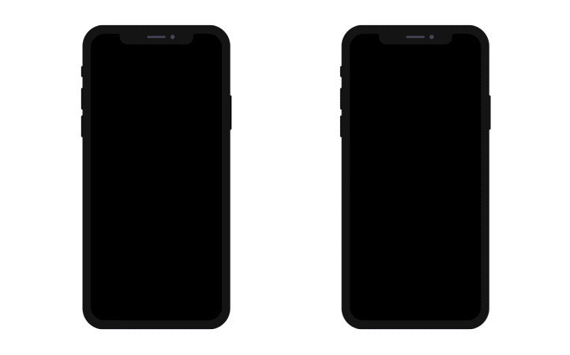

> **OBJECTIVES**
>
> Share iOS app content using Deep Linking.

> **PREREQUISITES**
>
> An Apple Developer account.

4D v18 R5 includes a new feature! You're now able to share a content that you're currently viewing with all your collegues. But how does it work?



There are two ways to implement deep linking in iOS: **URL scheme** and **Universal Links**. While URL schemes are a well-known method for deep linking, Universal links are the new means for Apple to easily connect your webpage and your app under the same link.

Here's a comparision between the two options available in the project editor:

## URL Scheme

| PROS  | CONS | 
|---------------|----------------| 
|Easy to implement|Always requires permission|
|No extra backend required|Doesn't work if the app isn't installed|
|      			|Doesn't work under Android|

## Universal links

| PROS  | CONS | 
|---------------|----------------| 
|Doesn't require permission|Static backend with SSL needed|
|Doesn't open the browser|More complex to implement|
|Compatible with Android|   |
|Fallback URL if the app isn't installed|   |

# CUSTOM URL SCHEME

## AN OLD BUT EFFICIENT APPROACH

At the simplest level, URL schemes allow users to open an app from other apps. 

But the true power of URL schemes is in the ability to perform specific actions when opening your app.

## CUSTOM URL SCHEME IN THE PROJECT EDITOR

It's very simple to include an URL scheme to your 4D for iOS app:

1. Select the **Share** predefined action from the **Action** section and select the scope: 
    *   entity - to share content from a detail form  
    *   table - to share a list form
2. Activate the **Deep Linking** feature in the **Publishing** section of the project editor
3. The URL Scheme information is automatically filled in with the app name that you previously defined in the **General** section. However, you can still edit it:


4. Fill in your **On Mobile App Action** method 
5. Build your app
6. And that's it!

You're now able to share the content that you're currently viewing (whether it's a list or detail form) with everyone else!

Here's an example of the **On Mobile App Action** method:

```4d

var $1 : Object  // Informations provided by mobile application
var $0 : Object  // Informations returned to mobile application

var $action : Object
$action:=MobileAppServer.Action.new($1)

Case of 

    : ($1.action="shareContact")
        
        $0:=$action.shareContext()

    Else 
        
        $0:=New object("success"; False;"statusText"; "Unknown action send to server")

End case 

```

## USING URL SCHEMES IN YOUR 4D FOR iOS APP
 
1. Click on the **Action** button to display all your currently available actions 
2. Select the **Share** action that you previously defined in the project editor
3. A new view appears, allowing you to share content
4. Select the share method you want to use 
5. Send it!

# UNIVERSAL LINKS

## A MORE MODERN APPROACH

Universal links provide several key benefits that aren't available with custom URL schemes. More specifically, universal links are:

* **Unique**: Unlike custom URL schemes, universal links can’t be claimed by other apps because they use standard HTTP or HTTPS links to your website.

* **Secure**: When users install your app, iOS verifies that your website allows your app to open URLs on its behalf. Only you can create and upload the file granting this permission to your web server, to make sure the association of your website with your app is secure.

* **Flexible**: Universal links work even when your app is not installed. In this case, tapping a link to your website opens the content in Safari.

* **Simple**: A single URL works for both your website and your app.

* **Private**: Other apps can communicate with your app with no need to know if your app is installed.

## UNIVERSAL LINKS IN THE PROJECT EDITOR

To include Universal links into your app, the process is quite similiar to the URL Schemes process:

1. Select the **Share** predefined action from the **Action** section and select the scope: 
    *   entity - to share a content from a detail form 
    *   table - to share a list form
2. Activate the **Deep Linking** feature in the **Publishing** section in the project editor
3. Enter your website URL in the **Universal links** field
4. Fill in your **On Mobile App Action** method 
5. Build your app
6. Trigger universal inks from the the **On Web Connection** method.

Here's an example of the **On Web Connection** method:

```4d

Var $1; $2; $3; $4; $5; $6 : Text
Var $handler : Object

$handler:=MobileAppServer.WebHandler.new()
Case of
    : ($handler.handle($1; $2; $3; $4; $5; $6))
        // Managed by default mobile code
    Else
        // Your web code
End case

```


# PUSH NOTIFICATION

One of the great things about Deep Linking is that it is completely compatible with [push notifications](push-notification.html). This means that you can send Deep links to your users and lead them directly to the right page.

As you can see, this feature opens a large range of possibilities to use 4D for iOS with minimal effort.

Deep linking is an essential feature in today’s apps, especially since users consume content faster and faster. This feature brings them directly to the desired location. So we would strongly recommend you to use it in your 4D for iOS apps.

The documentation is [here](https://github.com/4d-for-ios/4D-Mobile-App-Server/blob/18R4/Documentation/Classes/PushNotification.md) to help you manage your push notifications and Deep linking.

## MobileApps folder

Whether you're working on Windows or on macOS, you need to copy the 4DBASE/MobileApps/ID.BundleID/manifest.json file from your Design database to your production database.  


