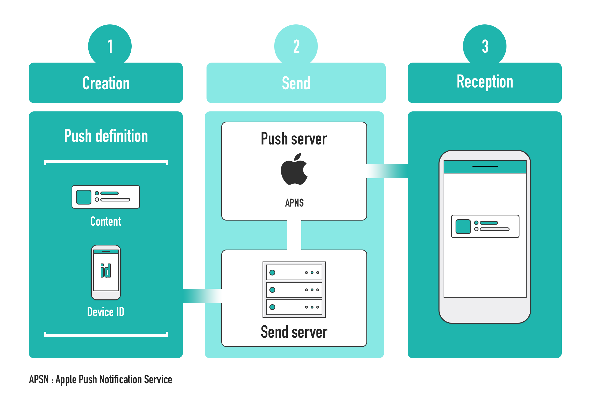
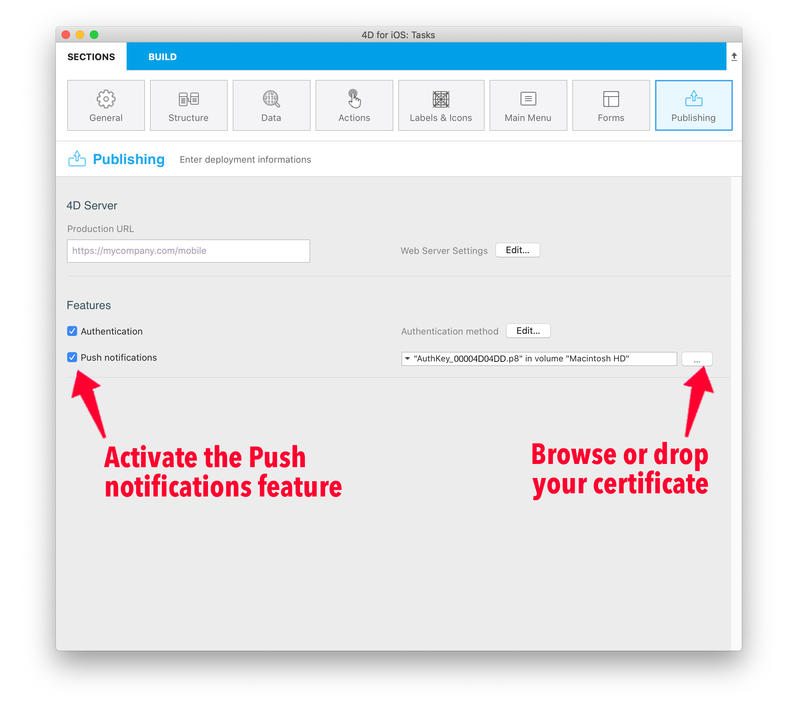
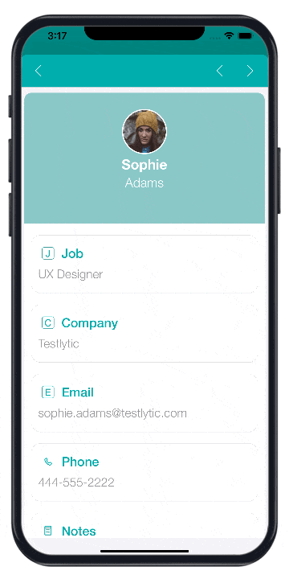

> **OBJECTIVES**
>
> Integrate push notification to your 4d for iOS apps

> **PREREQUISITES**
>
> The [4D Mobile App Server](https://github.com/4d-for-ios/4D-Mobile-App-Server) component that allows to send push notifications is integrated in 4D single-user and 4D Server.

## What is a push notification?

On a mobile phone, a push notification is an alert message, received via an application, that you can open, delete, allow or block. It can be very useful for example to notify your app users that a new version is available.

But what about the architecture to implement, in order to integrate this functionality into a mobile application? And what is the process of a push notification, from creation to display on the user's mobile?

## Technical architecture

Here are the different elements needed to create, send and receive a mobile push notification:



## Prerequisites

In order to send push notifications, an AuthKey_XXXYYY.p8 authentication file from Apple is required.

* First, go to Apple developer account page, sign in, then select Certificates, IDs & Profiles.

* You will then be able to generate your push certificate and to download it.

* Finally, activate the Push notification feature integrate your certificate in your 4D for iOS project from the Publishing section.



You can find more information about this process [here](https://github.com/4d-for-ios/4D-Mobile-App-Server/blob/master/Documentation/Classes/PushNotification.md) in the component documentation.

## Basic example to manage your push notifications

Here is an example to send a push notification to ```test@4d.com```:

```4d

$pushNotification:=MobileAppServer.PushNotification.new() 
$notification:=New object 
$notification.title:="This is title" 
$notification.body:="Here is the content of this notification" 
$response:=$pushNotification.send($notification;"test@4d.com")

```

It's as simple as that!

## Push notification with data synchronization

With a push notification, you can also launch a synchronization to update your data.

For example, if your application has a delivery tracking option, the delivery information will be updated in the database thanks to a notification sent to the customer. This notification, containing a request to synchronize the data, will enable the customer to get the modified data on their smartphone.

To do so in the 4D Mobile App Server component, you need to specify whether or not you want to force data synchronization in your push notification.
Therefore, simply provide the `dataSynchro` boolean value in the `userInfo` object.

### Data synchronization with a notification opening a record

By default, a notification opening a record automatically triggers a data synchronization.

For example, in a Contact app, if a contact’s specific information (*i.e.* a contact’s record, such as the address or the phone number) has been modified, the user receives a notification that automatically opens the relevant record and synchronizes the data contained in the record. When the user opens the notification, the contact’s information is fully updated.

Here's an example of the default behaviour, a `dataSynchro` request with the `open()` method:

*Note that for `open()` method exclusively, this is the default behaviour. As a result, if you don't specify the `dataSynchro` boolean value, it is `true` by default.*

```4d

$pushNotification:=MobileAppServer.PushNotification.new()

$notification:=New object
$notification.title:="This is title" 
$notification.body:="Here is the content of this notification" 

$entity:=ds.Employees.get("456456")
$response:=$pushNotification.open($entity; $notification; $recipients)

```

However, you can also choose not to force a data synchronization, by preventing `dataSynchro`:

```4D 

$pushNotification:=MobileAppServer.PushNotification.new()

$notification:=New object
$notification.title:="This is title" 
$notification.body:="Here is the content of this notification" 
$notification.userInfo:=New object("dataSynchro"; False)

$entity:=ds.Employees.get("456456")
$response:=$pushNotification.open($entity; $notification; $recipients)

```
### Data synchronization with a simple notification

You can also request a synchronization for a simple notification without opening a specific record. For example, some new entries have been added. You can then inform your user and update the data with no manipulation on their part.

Here is a code example that you can also use with other methods, as long as you fill the `userInfo` object with `dataSynchro` value.

```4d

$pushNotification:=MobileAppServer.PushNotification.new()

$notification:=New object
$notification.title:="This is title" 
$notification.body:="Here is the content of this notification" 
$notification.userInfo:=New object("dataSynchro"; True)

$response:=$pushNotification.send($notification; $recipients)

```


## Windows Configuration

Windows users need to download the [last CURL version](https://curl.se/download.html) to work on the variables of the environment of their machine. Or they can insert curl.exe in the Resources folder of their production database.

## MobileApps folder

Whether you're working on Windows or on macOS, you need to copy the 4DBASE/MobileApps/ID.BundleID/AuthKey_XXXX.P8 and 
4DBASE/MobileApps/ID.BundleID/manifest.json files from your Design database to your production database.  

## Where to go from here?

The component that handles and makes the process easier is also available [here](https://github.com/4d-for-ios/4D-Mobile-App-Server/blob/master/Documentation/Classes/PushNotification.md), in order to adapt the push notifications to your own needs. Feel free to use it and to pick the most relevant aspects for your app. And of course, all contributors are welcome to this project, through feedback, bug reports and even better: pull requests.


