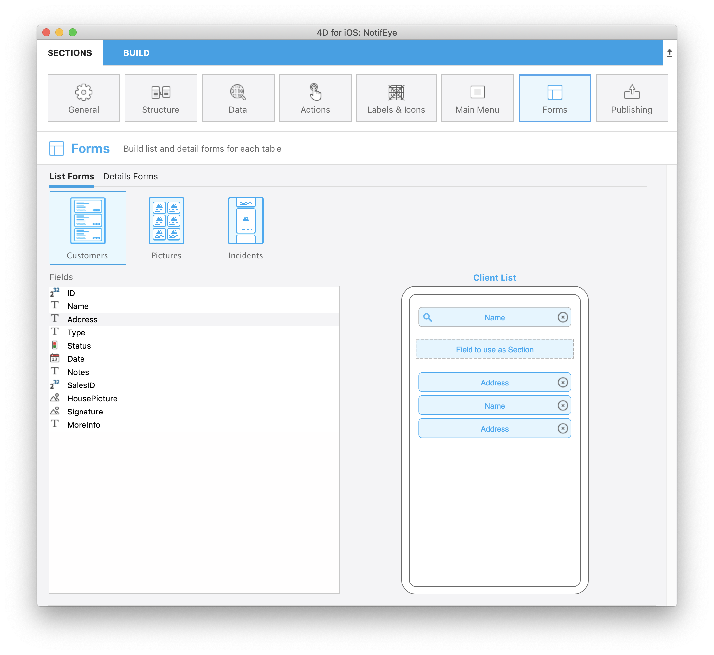
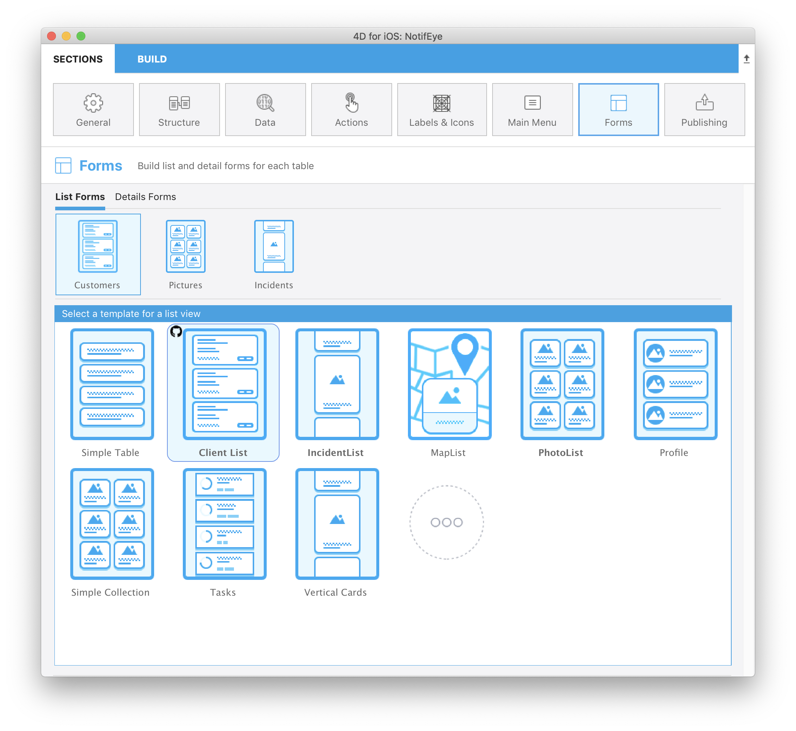

::: tip OBJECTIVES
Dowload a template from the gallery and improve it
:::

## Install a template from the Gallery

Go to the form section and select on one of your table to choose a List Form. 

As you can see, a “More” icon is available at the bottom.

Just click on that icon to display the entire list.

Then, the only thing you have to do is selecting the template that suits your needs and 4D for iOS will handle all the installation process to help you work faster and more efficiently.

Select the Client List template.

As you can see the template is included automatically in your project and you can directly start working on it without waiting.

A github icon is displayed at the top left of your template icon in the Forms template picker to indicate that it comes from Github.

As you can see, it is very simple to include new templates in your project and you can directly start working on it without waiting.

So now that you have download your template, you may want to make some improvement for the template to fit perfectly your needs.

