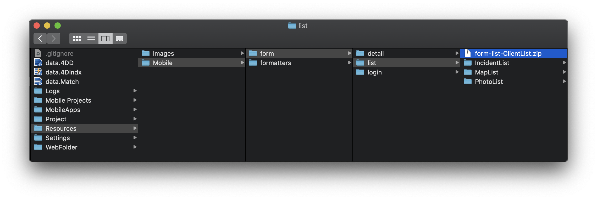
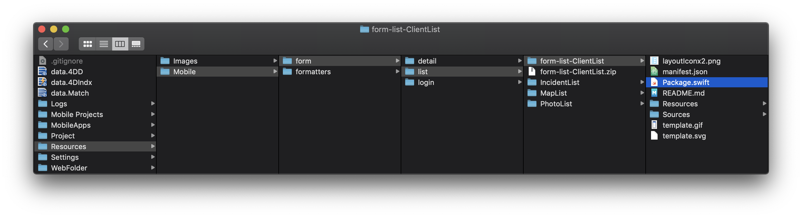

> **OBJECTIVES**
>
> Open and update a template from the gallery and improve it

## Open a template 

To modify a template that have downloaded from the Gallery :

* The first thing you'll need to do is going to your *YourDatabase.4dbase/Resources/Mobile/form/list* folder.

* From here, you can see the template you have just downloaded previously is availble.
* Unzip and opent it
* Then double click on the package.swift file.

* This will automatically open in Xcode with all sources to allow you modifying your template.

## Update your template 

From here you will be able to add swift code and optimize your stroybord template.

So easy to use !

Let's for example update the FIELD_1_LABEL color and font using the Attributes inspector.

Then after you've done your template improvements, you can use your template selecting it from the Forms template picker in the project editor.

## Share your template 

When your template is ready and you added significat improvements, you probably want to share it. 

A sharing button is directly accessible at the bottom of the template Gallery picker!

All the sharing process is detailed on the contribution page for you to help you in the sharing process and where good proctices are described.

## Where to go from here?

You could try following the [contribution guide](https://github.com/4d-go-mobile/gallery/blob/master/.github/CONTRIBUTING.md#how-do-you-add-a-package) to share your templates in github and make them appear in the project editor.

