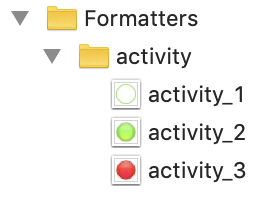

# Image data formatter

## Define an "image named" formatter
  
```json
{
	"name": "activity",
	"bindingType " :"imageNamed",
	"valueType" : ["boolean","real", "integer"],
	"choiceList": {
	  "1": "activity_green_idle.png", 
	  "2": "activity_green.png", 
	  "3": "activity_red.png"
	}
}
```

### Change the ouput image size

You can specify a size for generated assets using

```json
{
   "name": "activity",
	…
	"assets": {
		"size": 22
	}
}
```

This could be useful for vectorial image format such as svg.

## iOS assets

iOS compatible assets are created using the provided images in `choiceList`.


 
Access the image using swift code: `UIImage(named: "activity_2”)`

## Storyboard binding

In user defined runtime attributes on label.

| Key path  |  Type |  Value |
|----------|:-------------:|------:|
| bindTo.record.field name |  String | imageNamed,activity |

