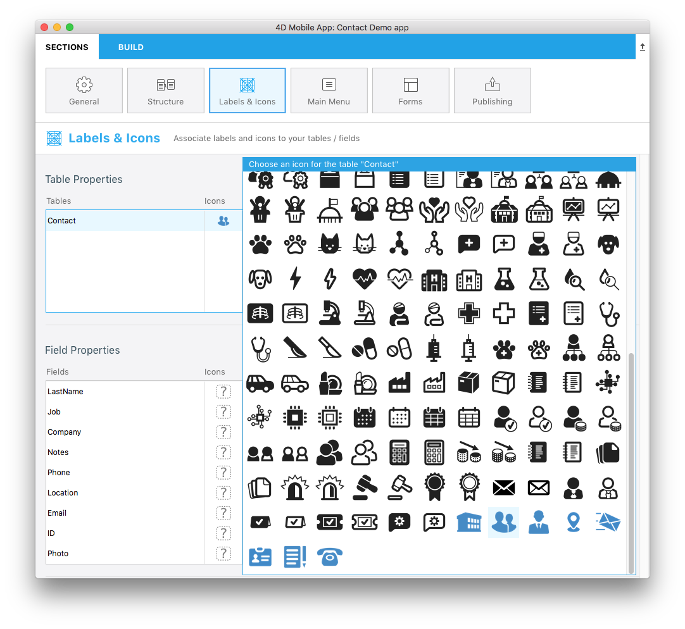
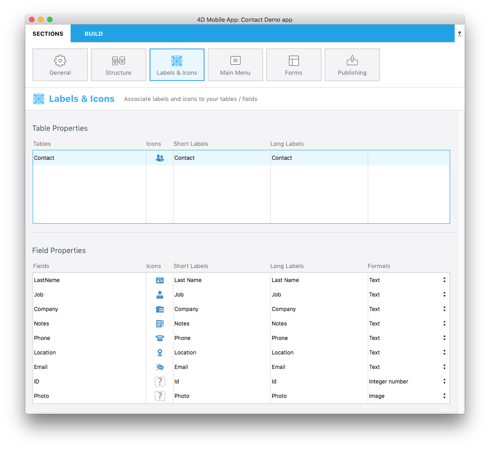
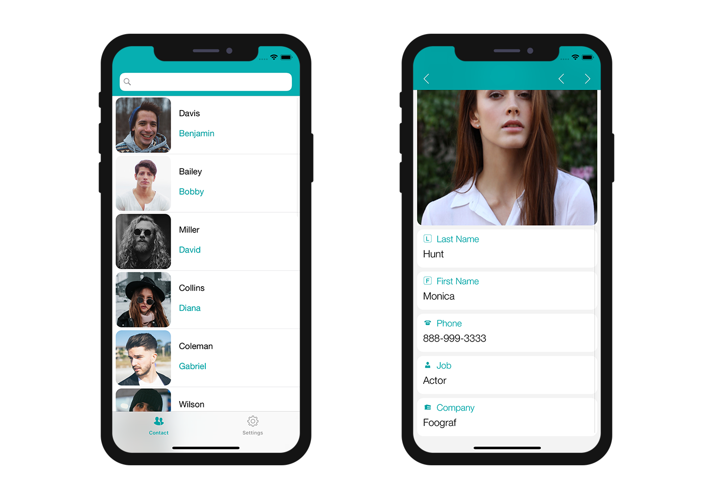

**OBJECTIVES**

* Use your own icons in 4D for iOS projects

**PREREQUISITES**

* Click [here](prerequisites.html) to see what you'll need to get started!

4D for iOS already provides number of icons from the Labels & Icons section for your Tables and Fields.

We want you to have the best app creation experience with 4D for iOS so now you can create and use you own icons in your iOS projects.

Let see how to make that !

## Create your own icon

You can use all icon formats (svg or png is recommended to preserve transparence) and sizes you want and include it in your project. 

It's also highly recommended to have black icons color to visualize them in the project editor.
For this tutorial, you can download the following icons :

<a class="button"
href="../assets/custom-icons/Custom-Icons.zip">CUSTOM ICONS</a>

## Include your icon in the project

First, create a .../Resources/Mobile/medias/icons folder next to the Contact.4dbase data and drag and drop the downloaded icons in it.

I put a blue color to make the difference between embeded and custom icons in the icon library.

## Select your icon

Open you project and go straight to the Labels & Icons section.

Clic on the contact table icon. As you can see all icons that dragged are available.

Select the contact icon :

Select adapted icons for your fields :

Here is the final result :

