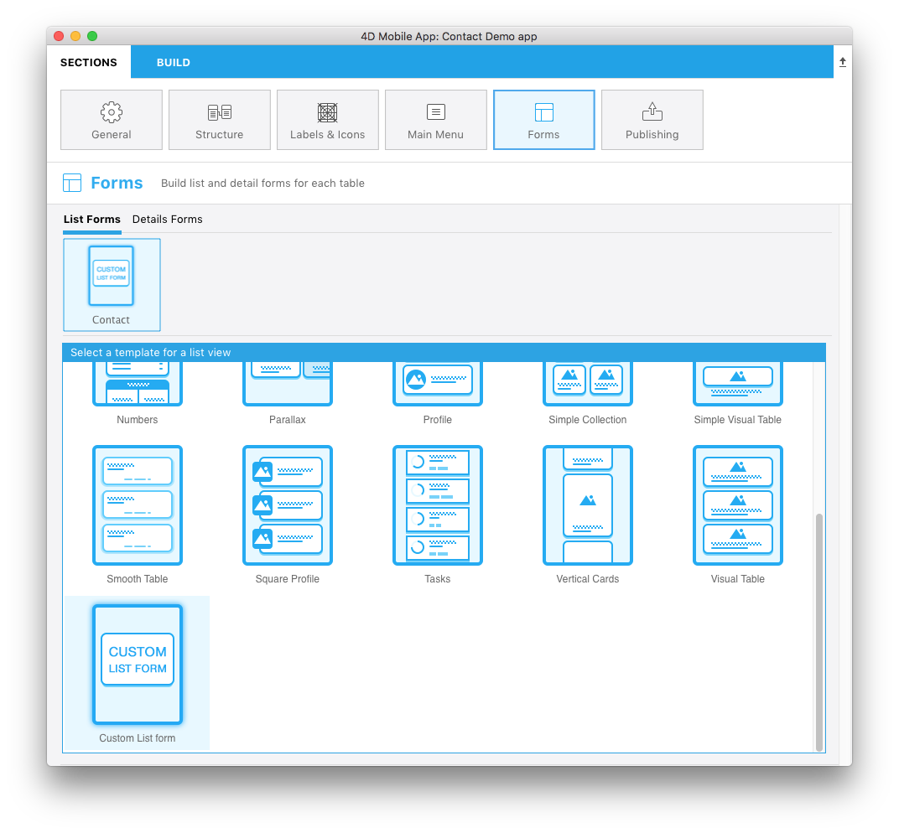

**OBJECTIVES**

* Create your first custom list form

**PREREQUISITES**

* Click [here](prerequisites.html) to see what you'll need to get started!

In this tutorial, we'll cover nearly all aspects of creating a list form template, like creating a custom list form with a **searchBar** and a table displaying an **image**, a **title** and a **subtitle** for each cell.

## Download the Starter Project

Before we begin, be sure to download the **Starter Project** which includes:
* A **Custom list form** folder 
* A **Contact.4dbase** file (a demo database with a ready-to-use mobile app project)

<a class="button"
href="../assets/custom-listform/CustomListFormStarterProject.zip">CUSTOM LISTFORM STARTER PROJECT</a>

You are now ready to create your first custom list form template!

## Add a custom list form template to your mobile project

The first thing you'll need to do is create a .../Resources/Mobile/form/list folder next to the Contact.4dbase file. Then drag and drop your **custom list form** folder into it.

Next, open the Contact.4dbase file with 4D. (File > open > Mobile Project > **Contact Demo App**) 

Finally, in the **Forms section** of the project editor, you'll see that your custom list form template has been successfully added to the list of available list form templates!

Now let's focus on the contents of the **Custom list form** folder.

## Custom template content

In this folder, you'll find:
* **a layoutIconx2.png** icon in 160x160px (it'll be displayed in the project editor when you select your custom template)
* **a manifest.json file** (includes a basic description of the template)
* **a template.svg file** (the visual representation of your template displayed when you define your list form content)
* Source folder including the **storyboard** (graphical interface) and **swift** file (code for the form)

What are these files, what it are they used for, and how can you customize them?