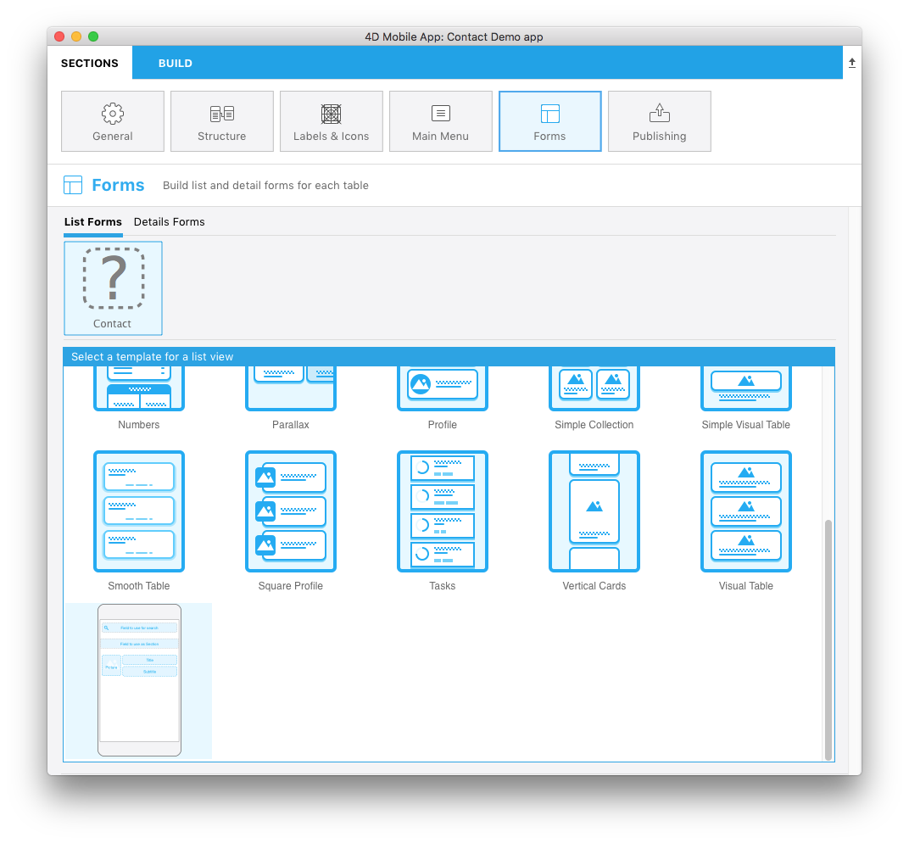

You can create your own template icon. 

This icon must be 160px x 160px and must be named **layoutIconx2.png**.

This icon will be used:
* Above the table name when the template has been selected
* In the template selector window in the **Forms section**

If this icon is missing in your custom template folder, the **template.svg** file (we're going to learn about this later) will be displayed in the template selector window and a icon with a question mark will be displayed above each table that's missing a custom template icon.

We've used Photoshop to create the list form template icon in our example, but you can use any image software.

