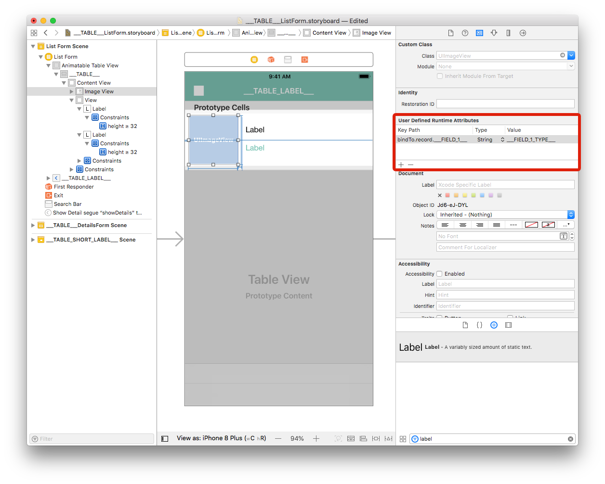
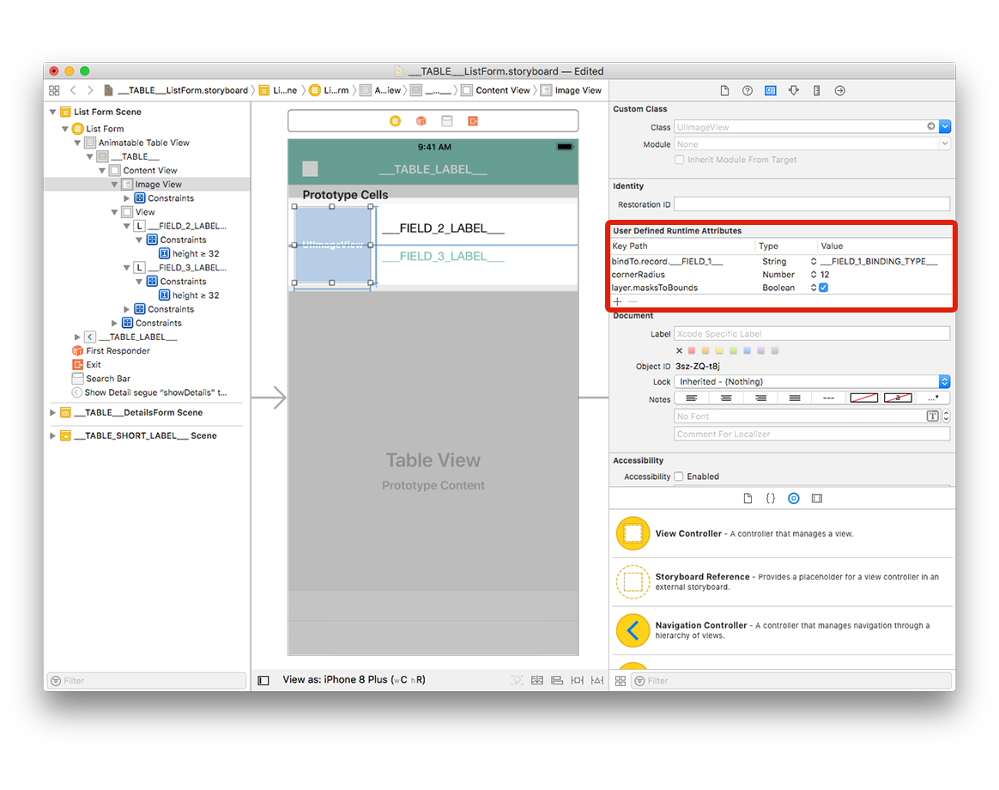
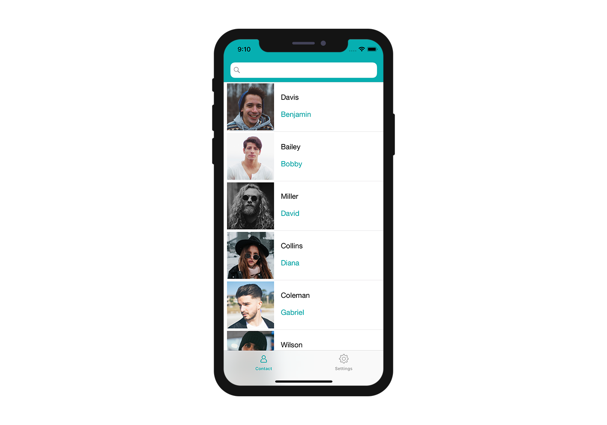

Now it's time to create your iOS list form interface with Xcode!

Here's the result we want to achieve:


For each cell, we're going to add a:
* Profile image
* Title 
* Subtitle

## Open the storyboard file with Xcode

First, open your storyboard file in Xcode.


It's quite empty, so let's add some content!


## Add an Image View

From the **Object library**, drag and drop an  **Image View** into a cell. You can search for "Image View" in the search bar at the bottom of the Object Library.


From the **Size inspector panel** (on the right side of the Interface Builder window), set the Image View Width value to 110 and the Height value to 110. Then set the X value to 8 and the Y value to 3.


Next, add a constraint (Leading: 8) by clicking on the **Add New Constraints button** (at the bottom of the Interface Builder window). Add width and height constraints too, as shown:


Finally, click on the **Align button** (at the bottom of the Interface Builder window) and check the "Vertically in Container" checkbox.


Your Image View is now well positioned!


Now let's work on the cell's labels.


## Add title and subtitle labels

Let's begin by **adding a View**. Search for "View" in the **Object library** and drag it into the cell container.


From the **Size inspector panel** (on the right side of the Interface Builder window), set the View Width value to 277 and the Height value to 94. Then set the X value to 126 and the Y value to 10.


For the Image View, add four constraints by clicking on the **Add New Constraints button** (Trailing: 11, Leading: 8, Top: 11, and Bottom: 10.67) for the view to be well positioned, as shown:


Drag and drop a label into the View you just added from the Object Library.


From the **Size inspector panel**, set the Label View Width value to 269 and the Height value to 32. Then set the X value to 8 and the Y value to 8.

**Duplicate the label** and in the **Size inspector panel**, set the X value to 8 and the Y value to 48.


Select both labels add four constraints by clicking on the **Add New Constraints button** (Trailing: 0, Leading: 8, Top: 8, and Bottom: Multiple) as shown:


With a label selected, double-click on the **Height constraint** to edit it. 


Change the relation from Equal to **Greater Than or Equal** so it can have a variable height (to handle multiline labels). 


Repeat the process for the second label.


## Label customization

From the attribute inspector (on the right side of the Interface Builder window),  you can customize your label's font colors. Let's make the second label **Dark Grey Color** :


You can also select the dominant color for your app:


From the attribute inspector, you can also customize the font. Select both labels and select Font > Custom > **Helvetica Neue**:


To complete the customizations, select both labels and **enter 0 for Lines** in the inspector window. This allows the number of lines to be unlimited.


<div markdown="1" class = "tips">

**NOTE**

* The provided storyboard is optimized to have a **variable cell height** depending on the contents of each cell.


</div>


## How to get data into your cells

### Image View
Select your Image View and go to **Identity inspector** > User Defined Runtime Attributes. Click the **+ button** to add a row.


* **Key Path**: Begin with bindTo to activate binding on the component. Enter ```bindTo.record.___FIELD_1___```
* **Type**: Always ```String``` 
* **Value**: The attribute name. Enter ```___FIELD_1_BINDING_TYPE___```



### Labels

Select the first label and add a row in the Defined Runtime Attributes:

* **Key Path**: ```bindTo.record.___FIELD_2___```
* **Type**: ```String``` 
* **Value**: ```___FIELD_2_BINDING_TYPE___```


Select the second label and add a row in the Defined Runtime Attributes:

* **Key Path**: ```bindTo.record.___FIELD_3___```
* **Type**: ```String``` 
* **Value**: ```___FIELD_3_BINDING_TYPE___```


You can change the **storyboard display labels** to have better visibility: 
* Double-click the first label to edit it and enter ```___FIELD_2_LABEL___```
* Double-click the second label to edit it and enter ```___FIELD_3_LABEL___```


Go to your project editor, select your list form template from the Forms section, then select Build and Run.

Here is the simulator result :


## Customize your app

The last step is adding a corner radius to the Image View to have a better design.

Select your Image View and add the two following lines in the User Defined Runtime Attributes:

* **Key Path**: ```cornerRadius```
* **Type**: ```Number``` 
* **Value**: ```12```

and

* **Key Path**: ```layer.masksToBounds```
* **Type**: ```Boolean``` 
* **Value**: Check the box




You can now build your project from the project editor!




## Where to go from here?

In this tutorial, we've covered the basics for creating list form templates. You are now able to create simple templates on your own using the Starter Project ressources. But wait - there’s more! In the next tutorial, you’ll learn how to build detail form templates!
Click on **Final Project** below to download the completed template list folder.

<div markdown="1" style="text-align: center; margin-top: 20px">
<a class="button"
href="../assets/custom-listform/CustomListFormFinalTemplate.zip">CUSTOM LISTFORM FINAL TEMPLATE</a>
</div>


