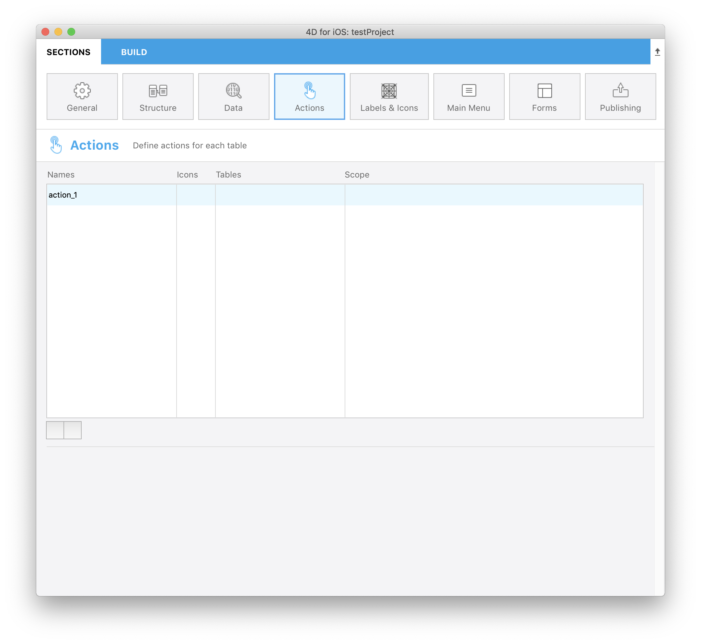
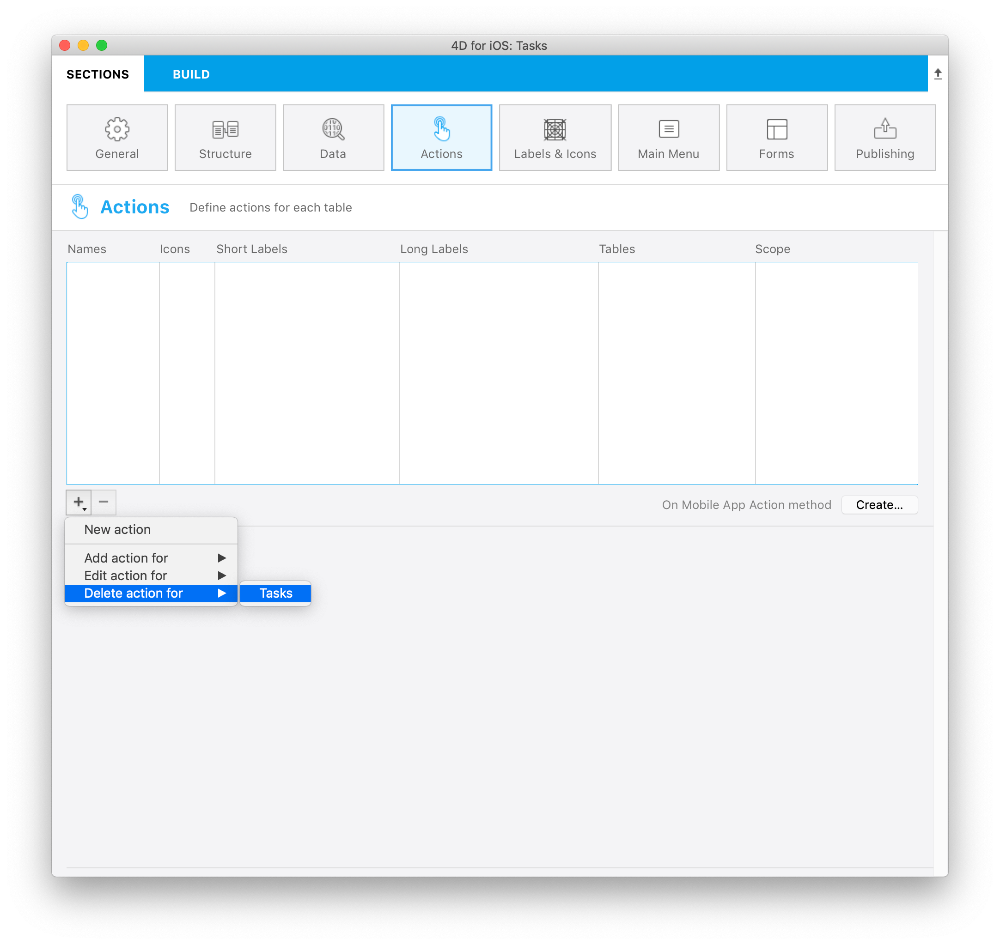
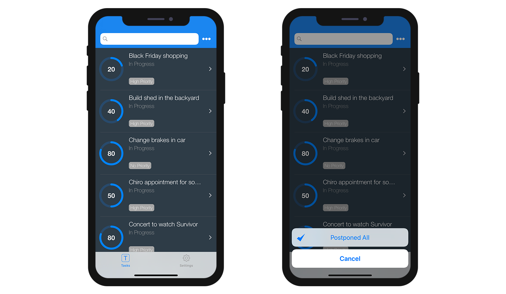
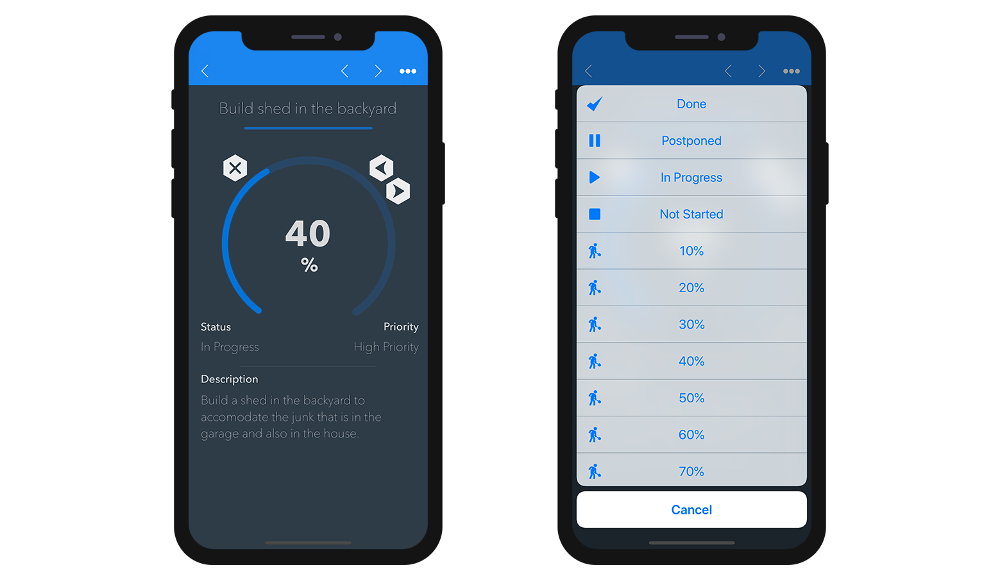

This section allows you to:

* create actions in order to execute 4D code from your iOS app.
* define and add parameters to your actions.

## Project editor Side

### Create your action

You can create a new action by clicking on the Plus button under the Action table. A new line should appear in the Actions table.

Then the first thing you need to do is to define the following information:

* **Names:** action name to use in the [On Mobile App Action](https://livedoc.4d.com/4D-Language-Reference-17-R5/Database-Methods/On-Mobile-App-Action-database-method.301-4286697.en.html) Database method to trigger your 4D code.
* **Icons:** icon to choose from your icon library. You can also add your own icon by following this [tutorial](using-icons.html).
* **Short and long Labels:** action labels to display in your app
* **Table:** table on which you want to apply the action.
* **Scope:** use the action for an **entity** or for a **table**.

<<<<<<< HEAD
A new database method [On Mobile App Action](https://livedoc.4d.com/4D-Language-Reference-17-R5/Database-Methods/On-Mobile-App-Action-database-method.301-4286697.en.html) is available to call all your 4D methods.
=======
### Add parameters to your action

Since **17R6** you are able to add **action parameters** and **edit** data directly from your app.

Indeed, for each parameter, you will be able to edit the following properties:

* Name
* Long label
* Short label
* Format
* Choice list
* Input constaints (define a max or min values)
* Placeholder
* Mandatory field definition
* Default value

Here are the different **Formats** you can select for a parameter:

<table>

<tr>
<th colspan="2"  style="text-align:center">TEXT</th>
</tr><tr style="text-align:center">
<th>Format</th><th>Description</th>
</tr><tr>
<td>Capitalized Text</td><td>Capitalize the first letter of a string</td>
</tr><tr>
<td>Mail address</td><td>Optimized iOS keyboard for email entry</td>
</tr><tr>
<td>Phone Number</td><td>iOS Keypad for entering telephone numbers.</td>
</tr><tr>
<td>Account</td><td></td>
</tr><tr>
<td>Password</td><td>Keyboard handling and hiding passwords</td>
</tr><tr>
<td>URL</td><td>Optimized iOS keyboard for URL entry</td>
</tr><tr>
<td>Zip code</td><td>Optimized iOS keyboard for Zip code entry</td>
</tr><tr>
<td>Text area</td><td>Includes several lines of text in fields</td>
</tr>
<tr>
<td colspan="2"></td>
</tr>

<tr>
<th colspan="2" style="text-align:center">NUMBER</th>
</tr><tr style="text-align:center">
<th>Format</th><th>Description</th>
</tr><tr>
<td>Integer</td><td>Numbers without decimals</td>
</tr><tr>
<td>Scientific</td><td>Scientific Notation</td>
</tr><tr>
<td>Percentage</td><td>Percent Notation</td>
</tr><tr>
<td>Energy</td><td>Energy Notation</td>
</tr><tr>
<td>Mass</td><td></td>
</tr><tr>
<td>Spell Out</td><td>Convert numbers into stings</td>
</tr>
<tr>
<td colspan="2"></td>
</tr>

<tr>
<th colspan="2" style="text-align:center">DATE</th>
</tr><tr style="text-align:center">
<th>Format</th><th>Description</th>
</tr><tr>
<td>Short Date</td><td></td>
</tr><tr>
<td>Medium Date</td><td></td>
</tr><tr>
<td>Long Date</td><td></td>
</tr>
<tr>
<td colspan="2"></td>
</tr>

<tr>
<th colspan="2" style="text-align:center">TIME</th>
</tr><tr style="text-align:center">
<th>Format</th><th>Description</th>
</tr><tr>
<td>Hour</td><td></td>
</tr><tr>
<td>Duration</td><td></td>
</tr>

</table>

### Presets actions

4D for iOS includes three presets actions to manage your app content:

* Edit action
* Add action
* Delete action

#### 1. Add action

4D for iOS makes **Edit actions** creation process very simple.

The only thing you need to do is to select the **Edit action for** option accessible from the **Plus button** at the bottom of your Actions table. 

Then just **select the table** you want to link to this add action. And this is it! 

This will **automatically create** all the parameters for you in the Project Editor. In the generated app, this will allow you to edit each field value.

For those kind of action, you will see that all **properties** are already filled in for your convenience at the right side of the parameter's list.

#### 2. Edit action

**Add actions** creation follows the same process than for Edit actions. The only difference is that you will not be able to define default values from the Actions section for those actions.

#### 3. Delete action

**Delete actions** creation follows the same process than for Edit actions. The only difference is, as it name implies, that action allows you to delete an entity.

To create a Delete action, select the **Delete action for** option accessible from the **Plus button** at the bottom of your Actions table.

Needless to say that this type of action shall be used with caution.

For Edit and Add actions you are free to adjust:

* The parameters by adding or removing a parameter using the **Plus and Minus buttons** at the bottom of the Action parameters list.
* The poperties by defining them as you wish. 

### On Mobile App Action

A new database method [On Mobile App Action](https://livedoc.4d.com/4D-Language-Reference-17-R5/Database-Methods/On-Mobile-App-Action-database-method.301-4286697.en.html) is available to call all your 4D methods. 

Just clic on Create button after having created all your actions from the Actions section to automatically generate a Case of in the On Mobile App Actions that includes all your action names.
>>>>>>> feature/actionparameters

## iOS app Side

In your iOS app, actions can be available in different ways in your List forms and Detail forms, depending on the templates you select in the Forms section. 

### Table List forms

* **Entity action:** swipe left on a cell to display available actions in a List form. A "More" button is displayed if you define more than 3 actions per entity.

* **Table actions:** a generic actions button is available in the navigation bar to display a list of table actions.

### Collection List forms

* **Entity action:** depending on the template, actions are displayed by clicking on a generic button or by maintaing the pressure on a cell.

* **Table actions:** as for Table List forms, a generic Actions button is available in the navigation bar to display a list of table actions.

### Detail forms

As for Table actions in List forms, a generic Actions button is available in the navigation bar to display all your entity actions in a list. 

### Edition forms

If you have created an Edit or an Add action, as soon as you select it from the action list, an **Edition form** will appear.

From here, you can:

* edit all you fields selecting them
* validate or cancel your modifications using the **Done** or **Cancel** buttons available in the navigation bar.

For your convenience, the Edition form includes **special features**:

* The keyboard type depends on the selected parameter type in the Action section.
* Go to next or previous record using arrow on top of the keyboard.
* Close iOS Keyboard by touching anywhere out of a field.
* Indicate the user that a value is not a proper value.
* The view focus on mandatory fields that are empty when the user taps on Done button.

## Where to Go From Here?

* A [tutorial](actions-getting-started.html) is available to guide you through the **action definition process**.

* Another [tutorial](action-custom-template.html) will guide you through the **action TAG integration** for custom templates.

* A last [tutorial](using-parameters.html) will guide you through the **action parameters definition**.