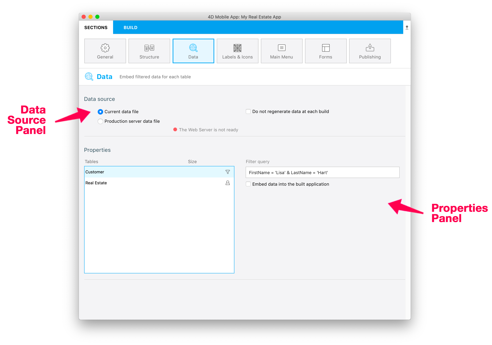
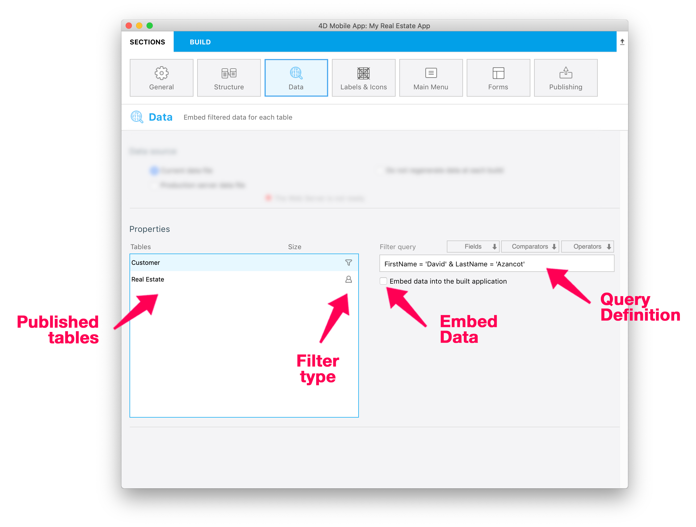

This section allows you to:
* define the data to include in your app (**Current data file** or **Production server data file**),
* automatically **regenerate data** each time you build your app or generate it manually, and
* filter data to vizualize in your app depending on **general filter queries** or **user information**. 




## Data source panel


This panel allows you to define your **data source**. You can choose to get data from the **Current data file** or from a **Production server**.

To secure access to the production server, a **key file** must be generated from the production server and physically communicated to the developer. This key file key.mobileapp is available next to data in the MobileApps folder. Then the developer can select this key file from the project editor to access to the production server data.

The **Production URL** must be entered from the **Publishing section** if you choose to get data from your production server. 

Here, you can also check if the server is available and activate it if necessary.

<div markdown="1" class = "tips">

**NOTE**

* Tips are available to help you ensure the server works correctly.
* You can directly access the Publishing panel to define your production URL.
* To access production server data, a key file is required for secure communications.

</div>

You can also define whether or not you want to **Regenerate data systematically** at each build. 

When the **Do not regenerate data at each build** option is checked, you can save a considerable amount of time building your app. You can always generate your data manually by clicking on the **Regenerate button**.


## Properties panel



In this panel, you can define all the filters for each table based on **defined filter queries** or based on **user parameters**.

### Filtering with query filters

You can define filters per table which depend on field values:

* First, enter your query in the dedicated field by typing it directly in the query field. You can also compose your query using fields, comparators, and operators which are available just above the query field when it's in focus. This can be helpfull defining your query

* Then, you need to validate your query. This must be done each time you modify it (a query that has been edited and not validated appears in red in the project editor).

* Finally, check the **Embed data into the built application** option to embed the data into the application when it's built. Leave unchecked if you don't want the data embedded.

When a query filter is valid, a funnel icon appears indicating that the defined filter is based on a defined filter query.

<div markdown="1" class = "tips">

**EXAMPLE** 

In the **Filter query** field enter:

```FirstName = 'Lisa' & LastName = 'Hart'```

*This query allows you to display only the records that include "Lisa" as FirstName and "Hart" as LastName*

</div>


### Filtering with user information filters

You can define filters depending on user information which you define in the Mobile App Authentication method:

* As with query filters, you first need to define your query in the appropriate field.

* To specify that the query depends on user information, just add ":" and the `userinfo` object key.

* Then, validate your query. This must be done each time you modify it.

* Once your query filter is validated, a button appears to allow you to add information about users in the [On Mobile App Authentication](http://doc.4d.com/4Dv17R3/4D/17-R3/On-Mobile-App-Authentication-database-method.301-3906587.en.html) method.


When a query filter is valid, a user icon appears to indicate that the defined filter is based on user information.


<div markdown="1" class = "tips">

**EXAMPLE:**

In the **Filter query** field enter:

CityName = :city

In the [On Mobile App Authentication](http://doc.4d.com/4Dv17R3/4D/17-R3/On-Mobile-App-Authentication-database-method.301-3906587.en.html) database method, enter:

```$response.userInfo:=New object("city";"Paris")```


*This query allows you to display only the records which include "Paris" as CityName*

</div>

<div markdown="1" class = "tips">

**NOTE:**

You'll find all the rules about query syntax in the [4D documentation](http://livedoc.4d.com/4D-Language-Reference-17-R3/ORDA-DataClass/dataClassquery.301-3907505.en.html).

</div>


