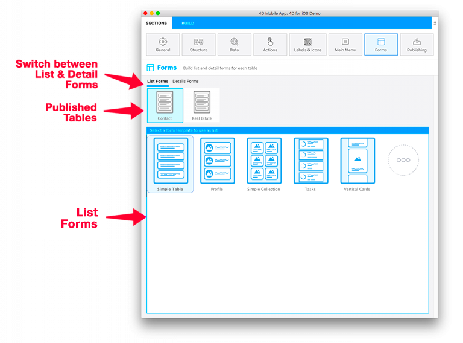
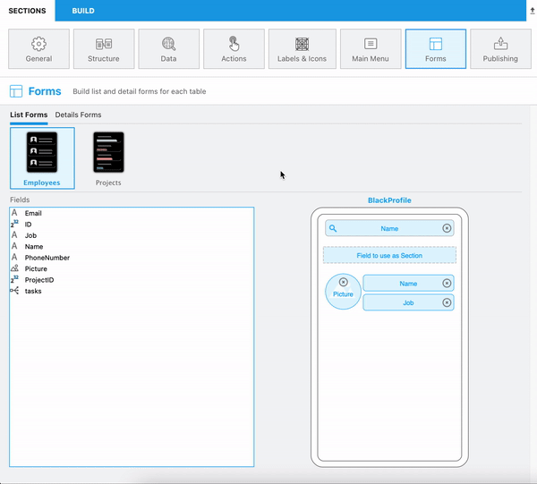
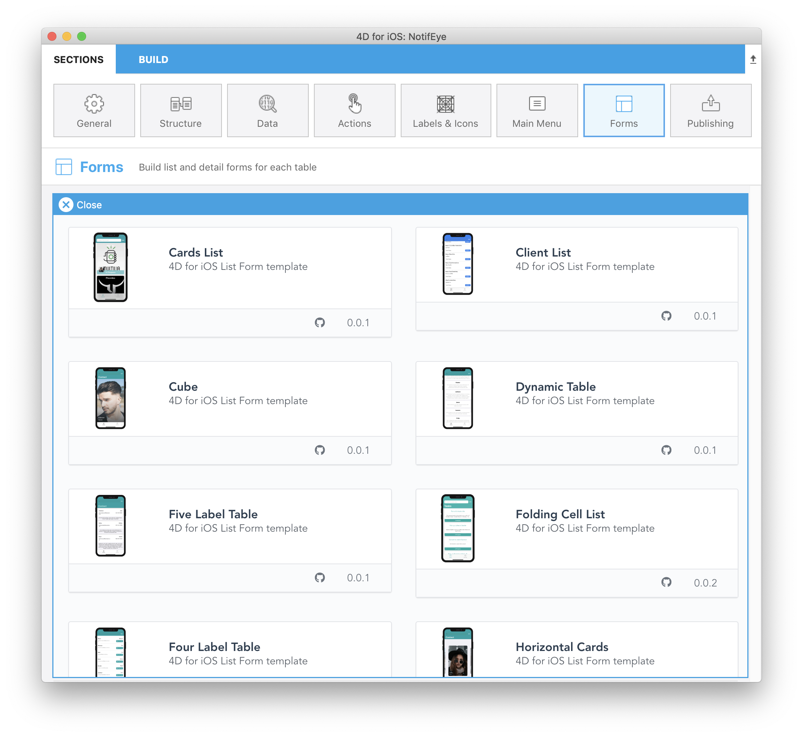

The Forms section allows you to select both list and detail form templates for each table.

4D for iOS provides various templates with custom transition effects to build fresh and modern iOS applications.

Here's the breakdown of this screen, from top to bottom:

* **List and Detail Forms:** Allows switching between list and detail form definitions for each table.
* **Published tables:** Displays all tables published in the Structure section. 
* **Available Forms:** Allows switching between template selection and content definition.

## List Form definition

Simple, empty templates are used by default for an app's list and detail forms.

Select a template for your first table.
Once done, the content definition screen appears.
You can then drag and drop the fields from the Fields list directly onto the Model displayed on the right.
Most of the list forms include optional Search and Section fields.

About the Search field, R6 version add a really nice feature with the Barcode search feature.

To activate it, just click on the magnifying glass and check the **Barcode Scanner** option !

This feature will allow two things :

* Filtering a list form scanning a Barcode that contains a text value. This will fill the Search Bar and open the detail form if there is only one value left after filtering.
* Displaying specific list and detail forms just by scanning a barcode whose values are URL Schemes or Universal Links after [Deep linking](deep-linking) feature activation.

## Detail Form definition

As with the List Form definition, select a template and add your fields onto your detail form.

You have several ways to add your fields in Detail forms:

* You can drag and drop fields anywhere into the SVG view to add it and display it just after the last field added or between any other fields that are already displayed.

* Double-click on a field. Your field will be added at the end of the list.

* Right-clicking on one the field that is available in the Fields table at the left: this will display a menu that will allow you to add all missing fields to your Detail forms.

You can add as many fields for most of the detail form available.

And at any moment, you can reorder your field selecting it and drop it at any place in your detail form.

> **TIPS**
>
> * Want to change the template for your list or detail form? 
>
> * Field types are automatically recognized, saved, and placed in the appropriate areas for you (depending on the template and field types) when you change templates.

## Gallery

You probably noticed that, when you want to select a template in the form section, a "More" icon is available for both list and detail forms since 4D v18R3.

Just click on that icon to display the entire list.

Then, the only thing you have to do is selecting the template that suits your needs and 4D for iOS will handle all the installation process to help you work faster and more efficiently.

So you can directly start working on the template, as it is ready-to-use.

> **TIPS**
>
> The Gallery is also available [online](https://4d-for-ios.github.io/gallery/).

## Where to go from here?

Next step, you chose a template that suits your needs, but in case something is missing, a [tutorial](gallery-template-update.html) will help you making **template update**.
