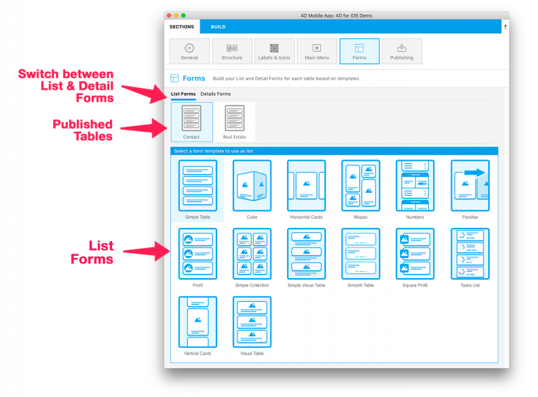
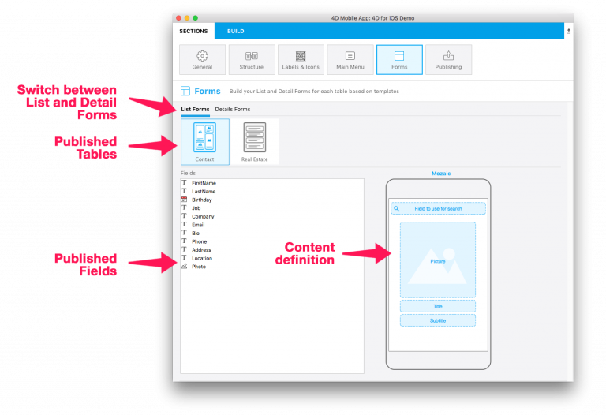
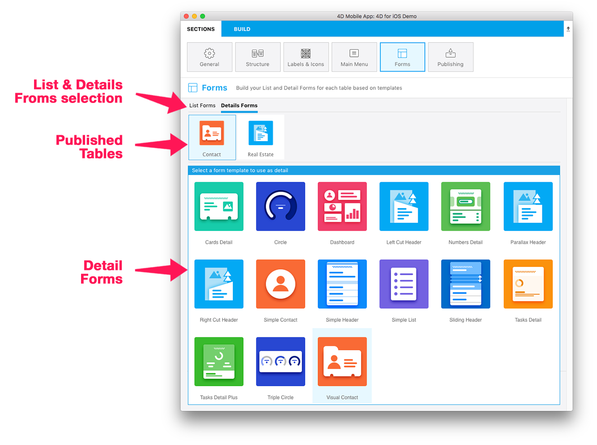
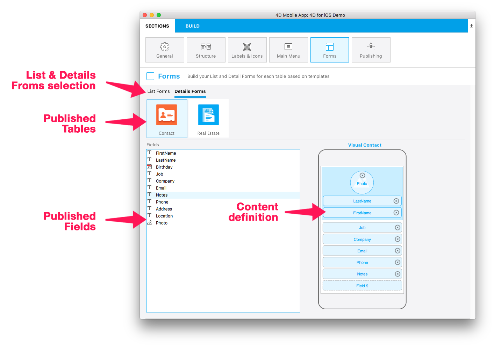

The Forms section allows you to select both list and detail form templates for each table.

4D for iOS provides various templates with custom transition effects to build fresh and modern iOS applications.

Here's the breakdown of this screen, from top to bottom:

* <b>List and Detail Forms:</b> Allows switching between list and detail form definitions for each table.
* <b>Published tables:</b> Displays all tables published in the Structure section. 
* <b>Available Forms:</b> Allows switching between template selection and content definition.

## List Form definition

Simple, empty templates are used by default for an app's list and detail forms.

Select a template for your first table.
Once done, the content definition screen appears.
You can then drag and drop the fields from the Fields list directly onto the Model displayed on the right.
Most of the list forms include optional Search and Section fields.

## Detail Form definition

As with the List Form definition, select a template and drag and drop your fields onto your detail form.

You can add as few as 2 or as many as 10 fields for most of the List Forms.

<b>TIPS</b>

Want to change the template for your list or detail form? 

Field types are automatically recognized, saved, and placed in the appropriate areas for you (depending on the template and field types) when you change templates.

