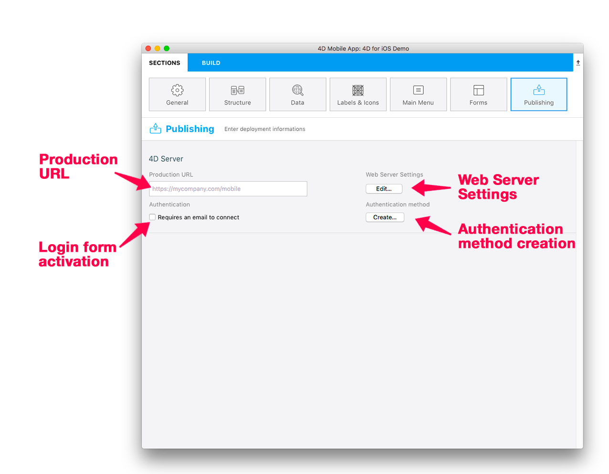

This is where you define or create your app's:
* Web Server Settings
* Authentication Mode 
* Authentication Method




## Web Server Settings


 <div markdown="1" class = "tips">
<b>NOTE</b>

* The Simulator works in localhost (127.0.0.1 or localhost)
* If the production URL is defined, both HTTP and HTTPS are accepted. Otherwise, the IP Address is used.
* If both HTTP and HTTPS are activated, HTTP is used.
</div>


* Activate and define your HTTPS and/or HTTP port, if you haven't already done so. You can do this by clicking on the <b>Edit</b> button.

* Activating the HTTPS port requires certificate installation to work properly. You can also create certificates with 4D, but strictly for test purposes.


## Authentication

<b>Authorized User:</b> Check the <b>Requires an email to connect</b> option to display a login form when the app starts.

<b>Guest:</b> Leave the <b>Requires an email to connect</b> option unchecked. No login form will appear when the app starts.


## Authentication Method


### On Mobile App Authentication Database Method

* <b>Development</b>: The authentication method allows you to use the app locally. 
* <b>Deployment</b>: You must create/edit the <i>On Mobile App Authentication</i> database method to authorize specific emails or devices, even when in Guest mode.

A template is available which will:
* Grant access (<i>i.e.</i>, email to specific domains) 
* Obtain all necessary information about the session, as well as user information (email address, app information, device, team ID, etc.)

You can customize this method according to your needs! 


### Session management

A session file is created and stored next to the current data file in the MobileApps folder when a user opens the app for the first time. 

They are then organized and grouped by app folder. The Team ID and app bundle ID are concatenated to create app folder names.

Here is an example of a 4D for iOS generated session file:

```json
{
"application":{
"id":"com.contactApp.Contact",
"name":"Contact",
"version":"1.0.0"
},
"team":{
"id":"UTT7VDX8W5"
},
"language":{
"id":"en_US",
"code":"en",
"region":"US"
},
"email":"",
"device":{
"description":"iPhone X",
"version":"11.3",
"id":"0DC5132E-1EF4-407C-A832-5FE33D818AF3",
"simulator":true
},
"send":"link",
"session":{
"id":"7023d9205074199d1c16fc00d24354e778137675",
"ip":"::ffff:192.168.5.4"
},
"status":"accepted",
"token":"eyJhcHBOYW1lSUQiOiJjb20uY29udGFjdEFwcC5Db250YWN0IiwiaWQiOiI3MDIzZDkyMDUwNzQxOTlkMWMxNmZjMDBkMjQzNTRlNzc4MTM3Njc1IiwidGVhbUlEIjoiVVRUN1ZEWDhXNSJ9"
}

```

### Mobile Session management Component

You can download the MOBILE SESSION MANAGEMENT component to manage easily mobile sessions.

<div markdown="1" style="text-align: center; margin-top: 20px">
<a class="button"
href="../assets/session-management/MOBILE-SESSION-MANAGEMENT.zip">MOBILE SESSION MANAGEMENT component</a>
</div>

* Create a <b>Components</b> Folder next to data
* Put the <b>MOBILE SESSION MANAGEMENT</b> component in it
* From 4D click on the <b>Execute</b> button and execute the MOBILE APP SESSION MANAGEMENT Method
* A new window will appear 


* The Apps menu displays all your available apps with your Team ID and app bundle ID
* You can change and define the status for each device : accepted or pending
* Right click on a session to reveal the session file in the Finder or delete it


* The <b>Push</b> button will allow 4D to update the session in memory
* The <b>Refresh</b> button updates the session list 


## How it looks on a device


A Settings screen is available from the tab bar. You can also find it from the More tab if necessary (<i>i.e.</i>, your application has more than four tables).

Settings allows you to:
* Reload data
* Define your server URL
* Log out (if connected as an Authorized User).


