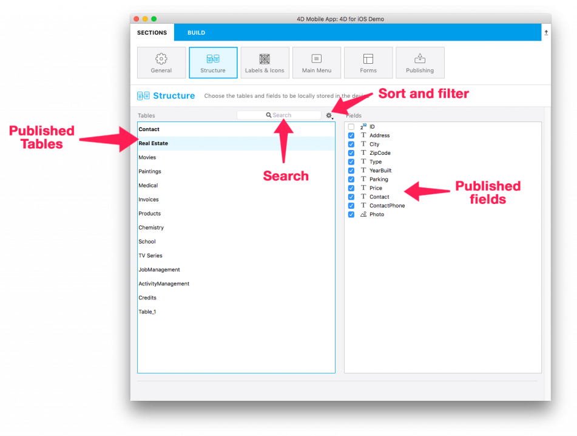

This section displays all of your database tables and fields exposed by 4D Mobile Service.

Here, you can define a subset of your physical structure to replicate for mobile devices by selecting specific tables and fields. The selected:

* tables will be automatically added to the tabs of your app.
* fields will be available later when it's time to define your list and detail forms.
 
 

**NOTE**

* We recommend publishing your primary key in order to identify each record of your database.

To help you define your app's structure, multiple filters and a search engine are available to make it easy to select your tables and field.

**TIPS**

You can publish a selection of fields by pressing the spacebar rather than selecting them one by one.

