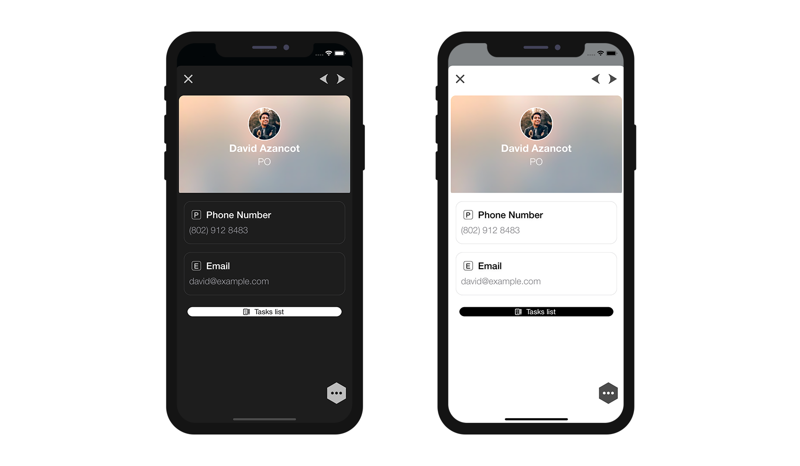

As we have seen with all previous tutorials, 4D for iOS give you the freedom to create lots of custom things !

As for custom templates, custom formatter, you can create custom Relation Buttons.

For that nothing is simplier ! You just have to drop your custom button in your custom template.


Let's get started by downloading the Starter Project that includes:

* a database with its mobile project
* a standard Relation button


<div markdown="1" style="text-align: center; margin-top: 20px; margin-bottom: 20px">
<a class="button"
href="../assets/en/relations/TimerKeeper.4dbase.zip">N TO ONE STARTER PROJECT</a>
</div>

## Include the button

The first step is including the button.xib button into your custom template so 4D for iOS can use it.

To use the button, you just have to drop it in ```YourDatabase.4dbase/Resources/Mobile/form/detail/BlackVisual Contact``` folder.


First step done!

## Modify the button

Open the .xib file with Xcode. 

It should look like that :


And from the attribute inspector, you could change for example:

* colors and fonts
* the button style
* the button size...

Let's change the button color and button label font !

### Custom colors and fonts

Select the button and change the color and font from the attribute inspector. Lets put a white background color and a black text with helvetica Neue Light font to get this result:


The iOS should look like that in your simulator:


### Button round corners

Let's add some round corners to the relationButton !

For that open the Identity Inspector.

Select your Butto nand add the two following lines in the User Defined Runtime Attributes:

* **Key Path**: ```cornerRadius```

* **Type**: ```Number``` 

* **Value**: ```12```

and

* **Key Path**: ```layer.masksToBounds```

* **Type**: ```Boolean``` 

* **Value**: Check the box


You can now build your project from the project editor!

You should have this now to see the result !



### Size and constraints

Keep in mind that if you **add constraits** into your button, you will also have to modifiy the xib xml file to **add some TAGS** as for custom Detail form templates. This allows the button to be well duplicated when several relation are available in the same detail view.

What a piece of luck we plan to add some constraints !

#### Add constraints

For this tutorial, we are just going to add a button height because we want it to be bigger in the screen.

1. Select the button
2. Delete leading and trailing constraints
3. Add a height of 107
4. Add a width of 250


5. Horizontal align the button in the container


You should get this result:


### Add TAGS

Each storyboard element has a Object ID. For example, if you select Field View 2 and go to the **Identity inspector**, you'll see its Object ID:


In order to tell the project editor that all of the elements included in this view will be duplicated, we need to add TAG to each element and constraints.

The process is a little bit tricky... Let's begin by opening the storyboard file with your favorite code editor!

#### Add tag to Horizontal constraint

1. Select it from the Storyboard to get the Object ID


2. Search for this ID in the xml file and put TAG-RL-003 (which was the old ID for trailing constraint)

3. Save the xml file 


4. Focus on the Storyboard to check if the constraint has been well updated


#### Add tag to width constraint

1. Select it from the Storyboard to get the Object ID


2. Search for this ID in the xml file and put TAG-RL-005 (which was the old ID for leading constraint)

3. Save the xml file 


4. Focus on the Storyboard to check if the constraint has been well updated


#### Add tag to height constraint

1. Select it from the Storyboard to get the Object ID


2. Search for this ID in the xml file and put TAG-RL-007

3. Save the xml file 


4. Focus on the Storyboard to check if the constraint has been well updated


And that's it ! your button is now fully duplicable !

## Where to go from here?

In this tutorial, we've covered the basics for creating custom relation buttons. Click on Final Project below to download the custom relation button.

<div markdown="1" style="text-align: center; margin-top: 20px; margin-bottom: 20px">
<a class="button"
href="../assets/en/relations/TimerKeeper.4dbase.zip">N TO ONE FINAL PROJECT</a>
</div>
