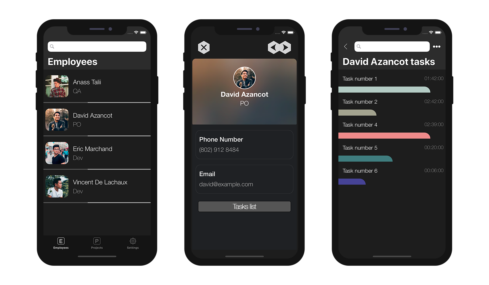

### Defining a title for your destination views

To keep track of the view you come from in your app, 4D for iOS allows you to define custom Title.

In this tutorial, we will use the following project:

<div markdown="1" style="text-align: center; margin-top: 20px; margin-bottom: 20px">
<a class="button"
href="https://github.com/4d-go-mobile/tutorial-OneToManyTitleDefinition/archive/4b831959e7efe4777071af0b2904d458918cfbc2.zip">TITLE DEFINITION STARTER PROJECT</a>
</div>

Now go straight to Open menu > Mobile project... select *Time Keeper* and go to the **Labels & Icons section**.

From here, open the relation tab to define the *tasks* relation title and enter the following line in the **Titles column**: ```%Name% tasks```


As you may have guessed, it will allow you to display **Employee's Name value** on the destination view depending on the Employee detail form you were on previously. 



This is a great way to keep track of the view you come from!

Now let's see how you can create and add your own Relation button in the next tutorial!
