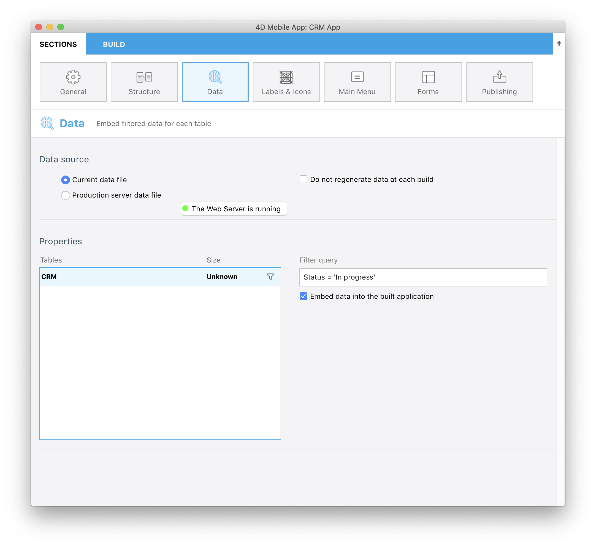

For now if you build the app you will see **all manager contracts and status** (Closed and Opened)

Like discussed earlier, we want the Account managers to access their in progress contracts logging into their mobile apps with their email.

* Go to the **Data section**
* Right click in the Filter query field to make **Field, Comparators and Operators buttons** appear.
* Click on **Fields button** and select **Status**
* Click on the **Comparators button** and select **Equal to**
* And you want to display Opened contract so enter **In progress**

```
Status = 'In progress'
```

* Remember to validate your query clicking on the **Validate Button**. If not you will not be able to build your app.



If you build your app, you will se that all Opened contacts are displayed in the simulator!

Not exactly what we are expecting! So we want now each Account manager to visualize all their in progress contracts so let's complete our query!


