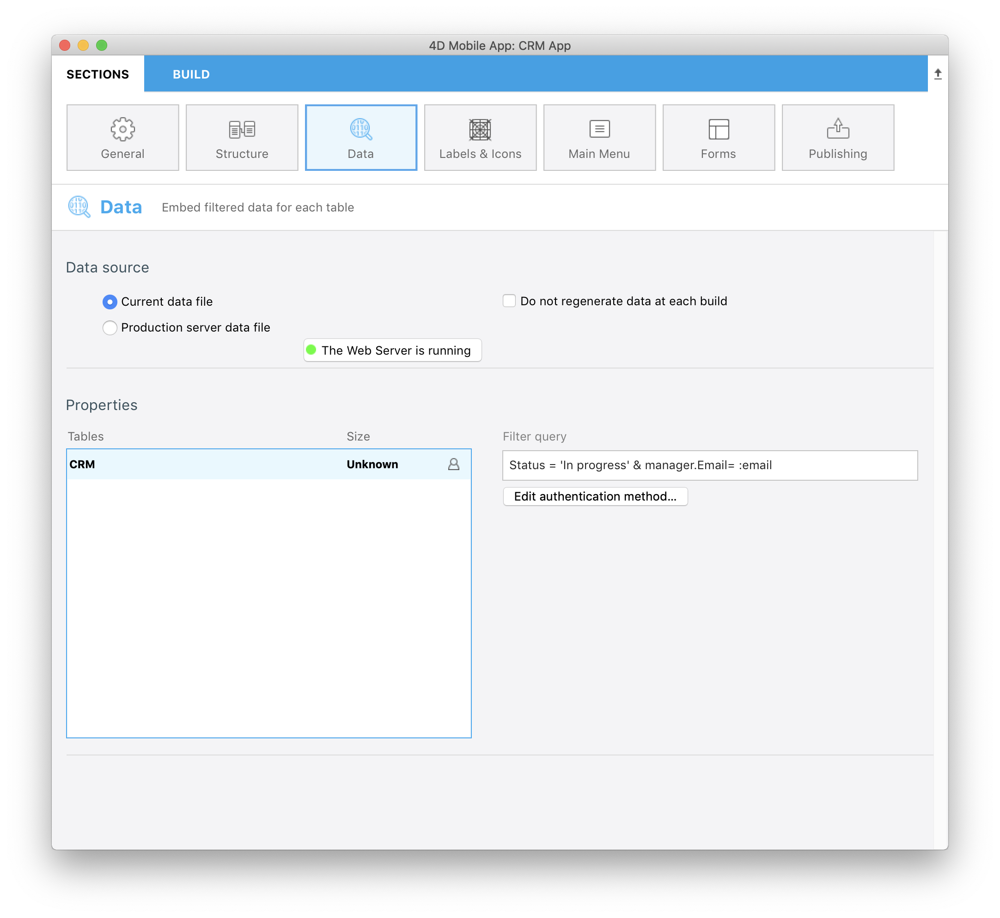
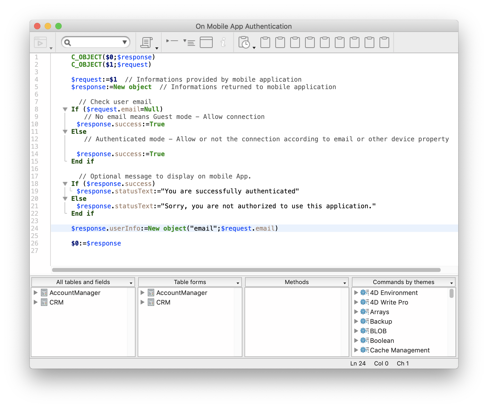

Now let's filter our app content depending on the account manager login email (user's information):

* Go to the **Data section**. 
* Right click in the **Filter query field** to make **Field, Comparators and Operators buttons** appear.
* Click on Operators button and select **AND**
* Now define which user information you want to get from the database method **:email** 

```
Status = 'In progress' & manager.Email = :email 
```

* Remember to validate the query clicking on the **Validate Button**. If not you will not be able to build your app.




This query will filter data depending on the **In Progress status** AND data depending on the **Account manager emails** accessible from the AccountManager table thanks to the Many-to-One relation name (manager).

<div markdown="1" class = "tips">

**NOTE**

* A **user icon** is displayed at the right of each table when a user's information filter is applied to it
* As soon as a query is based on user's informations and validated, you have to edit the **Mobile app authentication method**. To do so just right click on the **Edit authentication method** button to open the database method edition window.

</div>

Add the following line in the Database method :

```
$response.userInfo:=New object("email";$request.email)
```

This will allow to get the manager login email and display data depending on that criteria.



If you build your app and enter "michelle.simpson@mail.com" as login email, you will find all Michelle Simpson in progress contracts.


