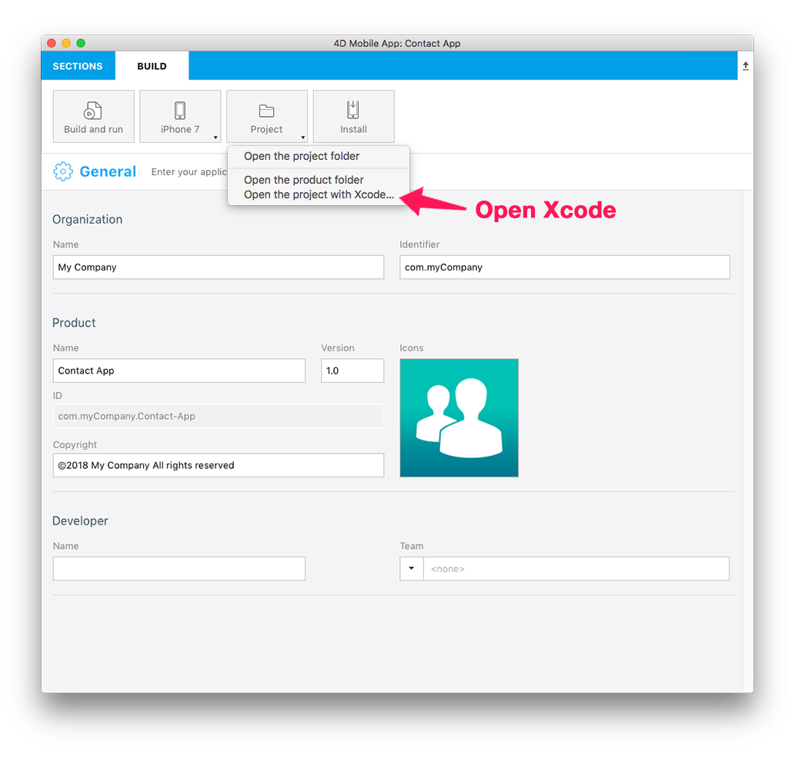
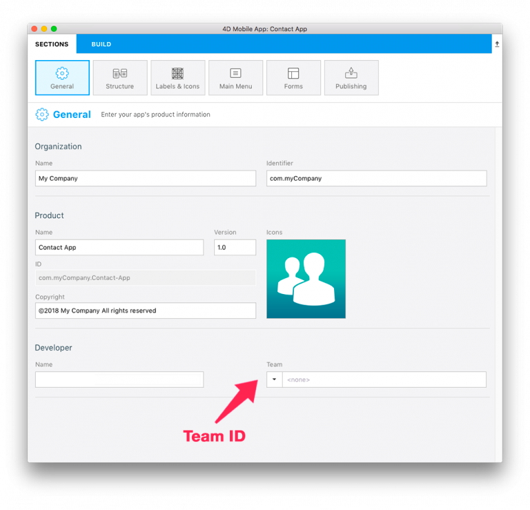
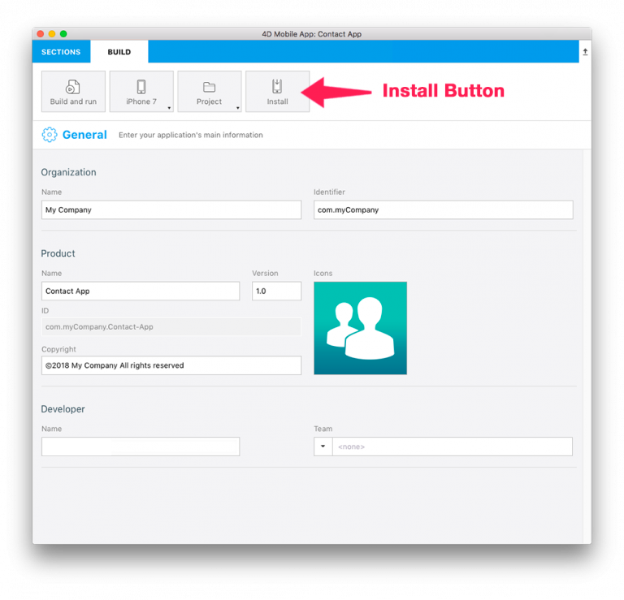

<b>OBJECTIVES</b>

* Install a 4D for iOS application on a connected device

<b>PREREQUISITES</b>

* Apple Developer Program
* Latest [Xcode](https://itunes.apple.com/us/app/xcode/id497799835) version installed on your Mac
* [Apple configurator 2](https://itunes.apple.com/us/app/apple-configurator-2/id1037126344) installed on your Mac to automate app installation (optional)

Depending on your objectives and preferences, you can choose to enroll in one of the following:
* [Free Apple Developer Program](free-developer-account.html): For testing only
* [Apple Developer Program for organization](register-apple-developer-program-organization.html) or [individual](register-apple-developer-program-individual.html): For an App Store Deployment
* [Apple Enterprise Developer Program](register-apple-developer-enterprise-program.html): To deploy your app in-house

Let's go through the process...

## STEP 1. Account creation

* <b>Apple ID</b>: Create your Apple ID. If you don’t already have one, click [here](https://appleid.apple.com/account#!&page=create).  

* <b>Developer Account</b>: Choose an Apple Developer Program (for organizations or individuals) for App Store deployment or the Apple Developer Enterprise Program (for in-house deployment).

## STEP 2. Xcode configuration

* <b>Developer Account</b>: In Xcode > Preferences > Accounts, add your Apple ID.
 

## STEP 3. Get your Team ID

* If your are using a [Free Apple Developer Program](free-developer-account.html) go to step 4.
* If your are using an [Apple Developer Program for organization](register-apple-developer-program-organization.html), [individual](register-apple-developer-program-individual.html) or an [Apple Enterprise Developer Program](register-apple-developer-enterprise-program.html) go to step 5.

## STEP 4. Team ID for Free account

###Let Xcode generate your provisioning profile and certificate  

* Open your current project from the BUILD tab.

 

* Verify that the <b>Automatically manage signing</b> option is checked and select the account you added [here](free-developer-account.html) from the Team dropdown list.

 

* Connect your device to your computer and select it from the top menu in Xcode.

 

* Xcode automatically generates the necessary provisioning profiles and certificates you'll need to build your app.

### Select your Team ID

* Reopen 4D for iOS in Sections > General and select your new Team ID in the Team popup.

 

* Go to STEP 6 to run your project on your device from the Project Editor.

## STEP 5. Team ID for paid subscription account

* <b>Team ID</b>: Go to Developer Account > Membership and get your Team ID.
 

* <b>4D for iOS</b>: Launch 4D for iOS in Sections > General and enter your Team ID.
 

* Go to STEP 6 to run your project on your device.

## STEP 6. Build

* When your app is ready, open the BUILD tab.
* Connect your device to your computer with a USB cable.
* From the BUILD tab, click on <b>Install</b>.

 

* The app is being installed on your device!

