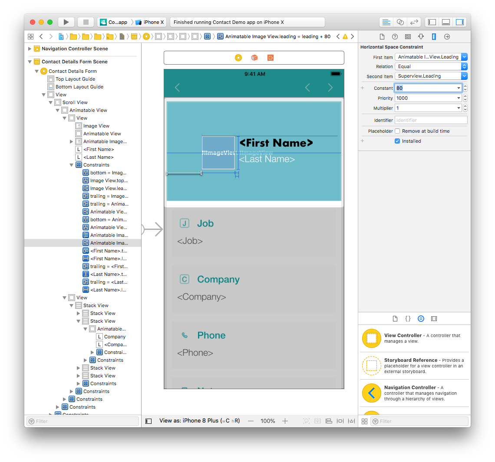

Vamos a hacer alguna modificación al Storyboard... de simples a complejos.

## PASO 1. Modificación simple de etiqueta

Comenzaremos por modificar la fuente y el color de una etiqueta:

* Abra el archivo *ContactDetailsForm.storyboard* desde la pestaña Navigation. 
* Haga clic en la etiqueta de Nombre (también puede seleccionarla en el generador de interfaces o en el panel izquierdo).
* Seleccione el panel Attributes inspector (Inspector de atributos) en el área Utility (área de funcionalidades).

* Cambie la fuente de Helvetica Neue Bold a Futura Bold. 

* También puede cambiar el color de la fuente desde el mismo panel.

## PASO 2. Cambiar la posición de la foto de perfil

Todas las plantillas de 4D for iOS tienen restricciones de uso para que los elementos de la aplicación se muestren correctamente en todos los dispositivos.

En el archivo *ContactDetailsForm.storyboard*, las etiquetas First Name, y Last Name están todas actualmente alineadas al centro.

Vamos a cambiarlo para que se vea así:

En primer lugar, alinee la imagen verticalmente y arrastre las etiquetas First Name y Last Name a la derecha de la imagen.

A continuación, seleccione la imagen y vaya al panel de atributos Size desde el área Utility. Cambiar el valor de X de 161.67 a 40.67 y el valor de Y de 28 a 79.

Como se puede ver, la posición ha cambiado pero Xcode muestra las líneas amarilla... ¿por qué? Estas líneas amarillas representan las restricciones que no son válidas.

## PASO 3. Actualizar las limitaciones de foto de perfil

Para alinear verticalmente la imagen al centro en el Superview (la visiualización contiene la imagen), tenemos que eliminar las restricciones existentes y añadir nuevas.

La imagen tiene actualmente las siguientes restricciones: * Width Equals: un ancho fijo de 78 píxeles. * Height Equals: una altura fija de 78 píxeles. * Align Center X: centra la imagen en un eje horizontal previamente definido. * Top Space: un espacio fijo entre la parte superior de la imagen hasta la parte superior de la vista. * Bottom space to <first name>: El espacio anteriormente definido entre la etiqueta de nombre y la imagen.

Elimine todas las restricciones excepto Width y Height (se modificarán más tarde desde el inspector Size (de tamaño) en la sección Constraints (restricciones). El contorno de la imagen debe estar ahora en rojo porque faltan las restricciones.

Haga clic en el botón Align (en la parte inferior de la ventana Interface Builder) y marque la casilla **Vertically in Container**.

A continuación, haga clic en el botón **Add New Constraints** y añada una nueva restricción de espacio principal (la restricción de la izquierda).

En este punto, todas las restricciones de la foto de perfil deben ser azules.

¡Felicidades! Su foto de perfil está ahora bien posicionada con las restricciones correctas.
 

**CONSEJOS**

* Para crear una restricción entre dos vistas, presione Ctrl y arrastre una de las vistas a la otra. Cuando suelte el botón del ratón, el Interface Builder muestra un menú con una lista de posibles restricciones.

* Puede eliminar las restricciones o seleccionarlas desde el inspector Size o desde el Interface Builder.
 

## PASO 4. Actualizar la posición y las restricciones de etiquetas

#### Ahora, vamos a trabajar en la etiqueta de nombre First Name.

Empezaremos cambiando la posición y el ancho: * Seleccione la etiqueta First Name del Interface Builder. * Next, change the Width from 386 to 267 pixels. * Change the X value from 8 to 127 pixels and the Y value from 28 to 79 pixels.

Modify the remaining constraints: * Delete the leading and the bottom space constraints from the Size inspector. * Add a leading space constraint by clicking on the **Add New Constraints** button to position the First Name label to the right of the Profile picture. * Press Ctrl and drag the First Name label to the Profile picture. Select the top constraint in the menu to top align both elements.

#### Finally, we'll work on the Last Name label.

Change the position and width: * Select the Last Name label from the Interface Builder. * Change the width from 386 to 267 pixels. * Change the X value from 8 to 127 pixels and the Y value from 144.33 to 118.33 pixels.

Modify the remaining constraints: * Delete the leading space constraints from the Size inspector. * Add a leading space and top constraints by clicking on the Add New Constraints button.

Both of your name labels are now repostioned.

Let's see the results in the Simulator !

Hmmmm. That's not exactly the result we wanted ...

* Select the First Name and Last Name labels and change the alignment from center to left in the Attributes inspector. 

* Next, select the Profile picture and double click on the leading space constraint.

* Change the Constant value from 40.67 to 80 pixels.

Much better! Now all constraints are working and the labels aren't breaking other constraints.

As you can see, customizing your app is very simple!