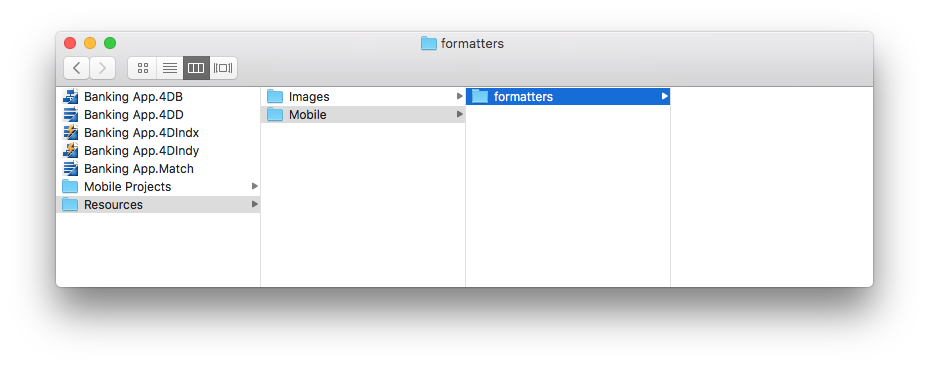

 

**OBJECTIVES**

* Create your first data formatters
 
 

**PREREQUISITES**

* Click [here](prerequisites.html) to see what you'll need to get started!
 

In this tutorial, we'll guide you through the creation of various formatter examples.

## Download the Starter Project

To begin, download the **Starter Project**, which includes: * An images folder containing **integerToImage_Images** and **textToImage_Images** folders (to use later for formatters that include images) * A **Task Management.4dbase** file (with a ready to use mobile app project)

  

    

<a class="button"
href="../assets/custom-formatter/CustomFormatterStarterProject.zip">CUSTOM FORMATTER STARTER PROJECT</a>

  

You're now ready to create your first formatters!

## Create the formatters folder

First, create a .../Resources/Mobile/formatters folder at the same level as the Task Management.4dbase data.

## Integer formatters

### Integer to string

* Create an **integerToString** folder in the formatters folder you've just created.

* Then create a **manifest.json** file in the **integerToString** folder.

* Let's look at the contents of the **manifest.json** file:

    {
        // 1
        "name": "integerToString",
    
        // 2
       "type": ["integer"],
    
       // 3
       "binding": "localizedText",
    
       // 4
       "choiceList": {"0":"UX designer","1":"Developer","2":"QA","3":"Product Owner"}
    }
    

1. **name**: the name of the formatter
2. **type**: the 4D format type you want to use
3. **binding**: can be **localized text** for strings or **imageNamed** for images
4. **choiceList**: mapped values

### Integer to image

* Create an **integerToImage** folder in the **formatters** folder you've created.

* Create a **manifest.json** file in the **integerToImage** folder.

* Then create an **Images** folder in the **integerToImage** folder. You can add the images from the **integerToImage_Images** in the StarterProject.zip to this new folder.
    
    

* Let's look at the contents of the **manifest.json** file:

    {
        // 1
        "name": "integerToImage",
    
        // 2
       "type": ["integer"],
    
        // 3
       "binding": "imageNamed",
    
        // 4 
       "choiceList": {"0":"todo.png","1":"inprogress.png","2":"pending.png","3":"done.png"},
    
        // 5
       "assets": {
      "size": {
       "width": 40, "height": 40
            }
        }
    }
    

1. **name**: the name of the formatter
2. **type** : the 4D format type you want to use 
3. **binding**: can be **localized text** for strings or **imageNamed** for images
4. **choiceList**: mapped values
5. **assets**: adjust the display size (width and height)

## Text formatters

### Text to string

* Create a **textToString** folder in the formatters folder you've just created.

* Create a **manifest.json** file in the **textToString** folder.

* Let's look at the contents of the **manifest.json** file:

    {
        // 1
        "name": "integerToImage",
    
        // 2
       "type": ["text"],
    
       // 3
       "binding": "localizedText",
    
       // 4
       "choiceList": {"FRA":"France","MAR":"Morocco","USA":"United States","AUS":"Australia"}
    }
    

1. **name**: the name of the formatter
2. **type**: the 4D format type you want to use
3. **binding**: can be **localized text** for strings or **imageNamed** for images
4. **choiceList**: mapped values

### Text to image

* Create a **textToImage** folder in the formatters folder you've just created.

* Create a **manifest.json** file in the **integerToImage** folder.

* Then create an **Images** folder in the **textToImage** folder. You can add the images from the **textToImage_Images** in the StarterProject.zip to this new folder.

Let's look at the contents of the **manifest.json** file:

    {
        // 1
        "name": "textToImage",
    
        // 2
       "type": ["integer"],
    
       // 3
       "binding": "imageNamed",
    
       // 4
       "choiceList": ["image1.png","image2.png","image3.png"],
    
        // 5
       "assets": {
      "size": {
       "width": 40, "height": 40
            }
        }
    }
    

## Open mobile project

Open the Task Management.4dbase with 4D and go to File > open > Mobile Project... to open the **Tasks**

Next, go to the **Labels & Icons section** in the project editor. All of your formatters are available for the different field types you previously defined in the different formatter manifest.json files:

* Select the **integerToString** formatter for the **Job field**
* Select the **textToString** formatter for the **Country field**
* Select the **integerToImage** formatter for the **Task Status**
* Select the **textToImage** formatter for the **Manager**

## Build your 4D for iOS app

Build your 4D of iOS app and you'll see that your data formatter is well applied depending on the credit limit.

Click on **FORMATTER FINAL** below to download the completed formatter template folder.

  

    

<a class="button"
href="../assets/custom-formatter/CustomFormattersFinalProject.zip">FORMATTER FINAL</a>

  

