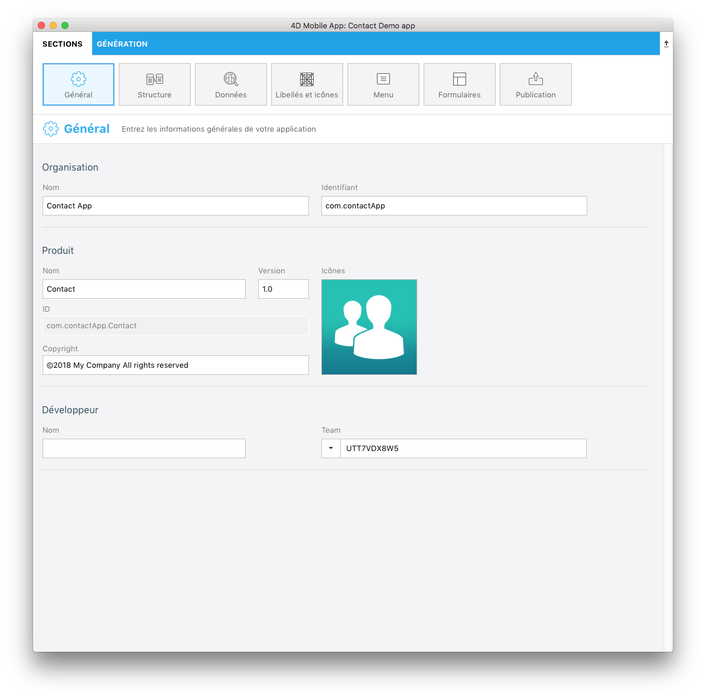
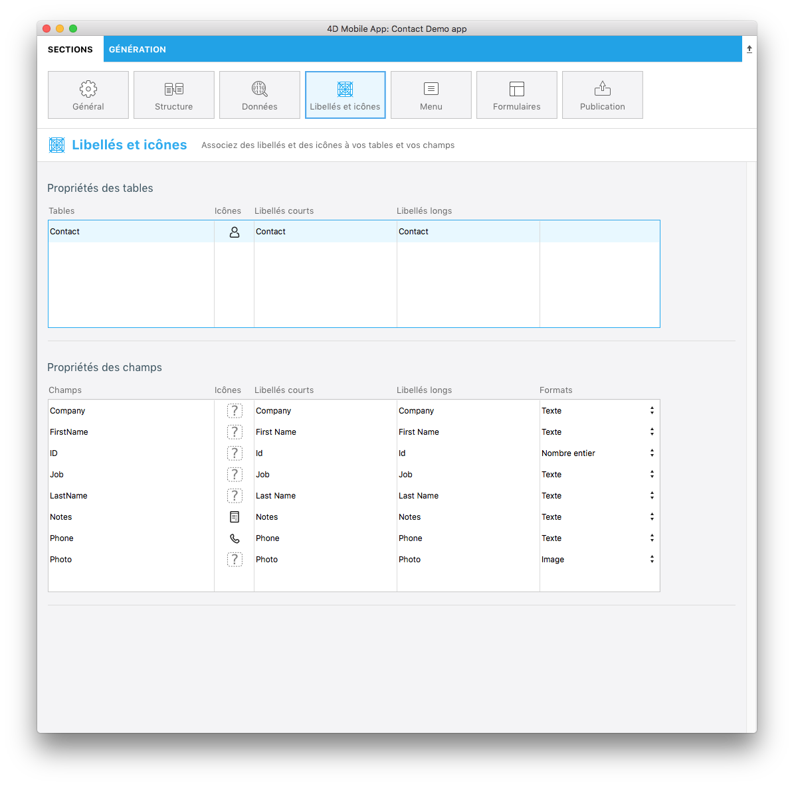
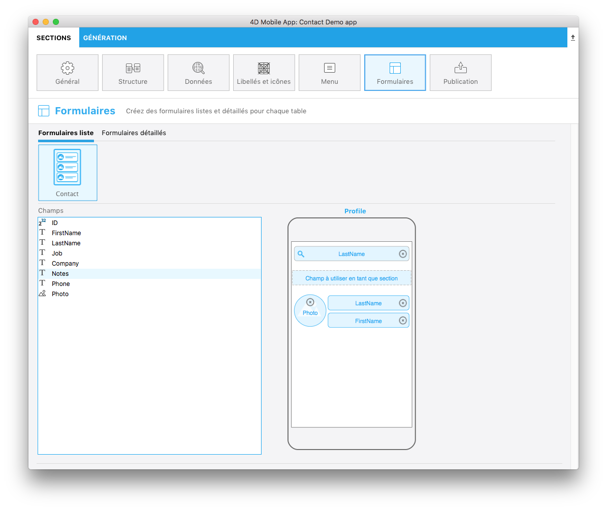
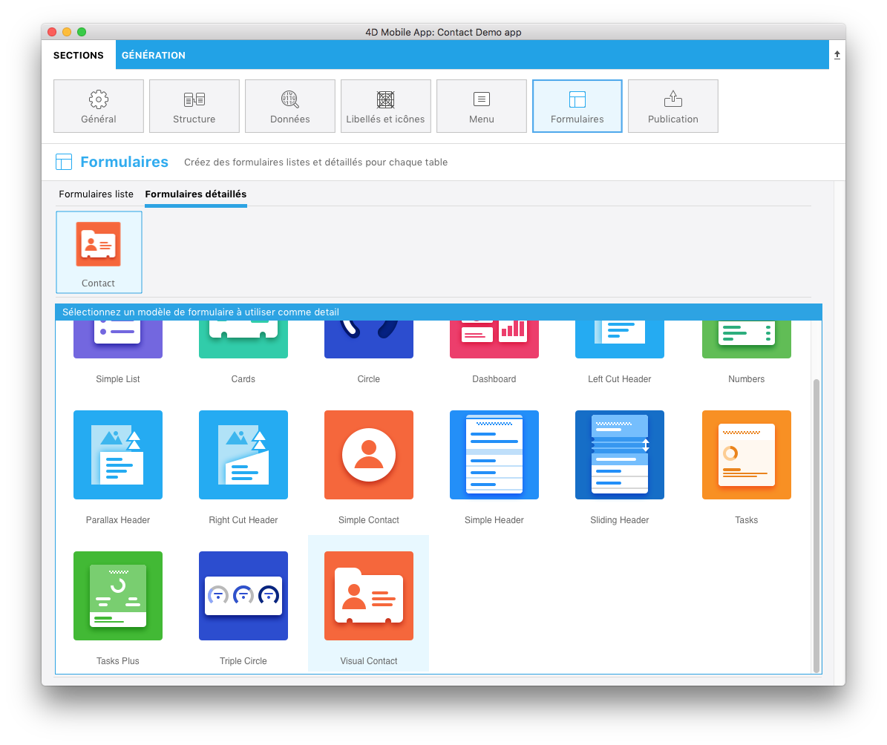

 

**OBJECTIFS**

* Créez votre première application avec 4D for iOS
 
 

**CONDITIONS PRÉALABLES**

* Cliquez [ici](prerequisites.html) pour commencer !
 

Ce tutoriel vous permettra de vous lancer directement dans le développement de 4D for iOS. Il vous permettra de créer, rapidement et facilement, votre première application.

*Scénario : Vous êtes un directeur commercial et vous souhaitez consulter votre liste de contacts durant vos déplacements.*

Nous allons créer une application de répertoire pour iPhone afin de rechercher des contacts dans une liste et d'afficher leurs coordonnées. Nous l’appellerons « Contacts ».

## ÉTAPE 1. Prise en main

Téléchargez notre projet Prise en main qui contient un fichier de base de données et l'icône du projet, mais qui n'inclut pas encore de projet mobile.

  

    

<a class="button"
href="../assets/contact-app/ContactStarter.zip">PROJET STARTER</a>

  

## ÉTAPE 2. Création du projet

Commençons par une structure très simple à l’aide d’une seule table. Dans 4D, allez à **Nouveau > Projet mobile**.

Nommez votre projet puis cliquez sur **Créer**.

## ÉTAPE 3. L’éditeur de projet

Bienvenue dans 4D for iOS ! L’écran d’accueil affiche les principales étapes de création d'applications de ce superbe outil. 🙂

Cliquez sur **Continuer**.

## ÉTAPE 4. Sections - Général

Vous pourrez configurer ici les informations primaires de votre application :

* **Organisation:** Entrez le nom de votre entreprise ainsi que l'identifiant de l’application (ex. « Mon entreprise » et com.MonEntreprise).
* **Produit :** Entrez le nom de votre application. Appelons-la « Contacts ».
* **ID:** (Bundle ID) généré automatiquement et composé de l’identifiant de votre entreprise et du nom de votre produit.
* **Version :** Laissez la version 1.0 inchangée et définissez les droits d’auteur de votre application. Il est fortement recommandé d’utiliser les formats fournis par 4D for iOS.
* **Icônes:** Glissez et déposez une icône pour votre application dans la zone consacrée.
* **Développeur :** Cette sous-section est renseignée automatiquement à partir du nom d’utilisateur sur votre ordinateur. Copiez/collez la référence de votre équipe de développeurs (à partir de votre compte développeur) dans le champ "Team". Vous pouvez également laisser le champ vide pour générer votre application uniquement sur le Simulateur.

## ÉTAPE 5. Sections - Structure

C’est dans cette section que vous définirez un sous-ensemble de vos données (les tables et champs de la base de données) à présenter aux appareils mobiles.

Dans notre exemple, sélectionnez **ID**, **FirstName**, **Last Name**, **Job**, **Company**, **Phone**, **Notes** et **Photo**.
 

**NOTE**

* Nous vous recommandons vivement de publier votre clé primaire afin d’identifier chaque enregistrement de votre base.
 

## ÉTAPE 6. Sections - Libellés et icônes

Définissons maintenant certains libellés et icônes pour les tables et champs sélectionnés.

**Propriétés des tables :** * Définissez un libellé court et un libellé long pour votre table Contact * Cliquez sur le champ "Icônes". La bibliothèque d’icônes s’affiche et vous pouvez y sélectionner une icône pour illustrer la table Contact. Vous pouvez également choisir de laisser le champ "Icônes" vide. 4D for iOS génèrera pour vous une icône par défaut !

**Propriétés des champs :** * Définissez un libellé court et un libellé long pour les champs sélectionnés. * Cliquez sur le champ "Icônes" et sélectionnez des icônes pour chaque champ. Il existe plusieurs options pour les icônes de champs : * Vous pouvez choisir une icône pour chaque champ, * Si au moins une icône a été définie et si les autres champs sont laissés vides, 4D for iOS génèrera pour vous des icônes par défaut * Vous pouvez simplement les laisser vides pour qu'aucune icône de champ ne soit affichée.

## ÉTAPE 7. Sections - Menu

Définissons ensuite l'ordre des tables dans le menu de l'application.

* **Tables disponibles :** Affiche la ou les tables à utiliser.
* **Tables sélectionnées :** Affiche les éléments de menu de votre application. Notre exemple ne contient qu'un seul élément, mais il vous est possible de glisser et déposer vos éléments afin de les réordonner.

## ÉTAPE 8. Sections - Formulaires

Nous avons presque terminé, mais il faut d’abord décider de la mise en page de l’application. Il s'agit de faire un choix à partir des formulaires liste et des Formulaires détail.

* Sélectionnez un modèle de formulaire liste pour afficher votre table sous forme de liste. Pour notre application Contacts, nous allons utiliser le modèle **Profile**.

À ce stade, la partie inférieure de la fenêtre de configuration a changé, en passant de la sélection du modèle à la définition du contenu.

* Glissez et déposez les champs que vous souhaitez afficher sur le modèle, à savoir, Nom de famille dans le "Champ à utiliser pour la recherche" et le champ "Titre". Le "champ à utiliser pour la recherche" et le "champ à utiliser en tant que section" sont facultatifs. Pour le moment, laissez le "champ à utiliser en tant que section" vide.

Enfin, nous allons définir le formulaire détail. * Sélectionnez le modèle de formulaire qui convient le mieux à votre application. Pour notre application Contacts, nous allons utiliser le modèle **Visual Contact**.

* Glissez et déposez le contenu dans les endroits appropriés sur le modèle de formulaire Détail, à savoir, First Name, Last Name et Photo.

## ÉTAPE 9. Création de l’application

Et maintenant, la partie amusante ! Il est temps de créer votre application et de la tester sur le Simulateur pour voir le résultat final !

* Cliquez sur l’onglet **Génération**.
* Sélectionnez un appareil à utiliser en tant que Simulateur en cliquant sur le bouton appareil.
* Cliquez sur **Générer et exécuter**.
* Patientez quelques secondes et ... le tour est joué ! Votre application iOS est créée !

## ÉTAPE 10. Que faire ensuite ?

Nous avons fait le tour des bases de la création d’applications dans ce tutoriel, vous devriez maintenant être en mesure de créer, par vous-mêmes, de simples applications. Mais ce n'est fini ! Dans le prochain tutoriel, vous apprendrez comment construire une application encore plus complexe. Cliquez sur **Projet Final** ci-dessous pour télécharger l’application Contact finale.

  

    

<a class="button"
href="../assets/contact-app/ContactFinal.zip">PROJET FINAL</a>

  

