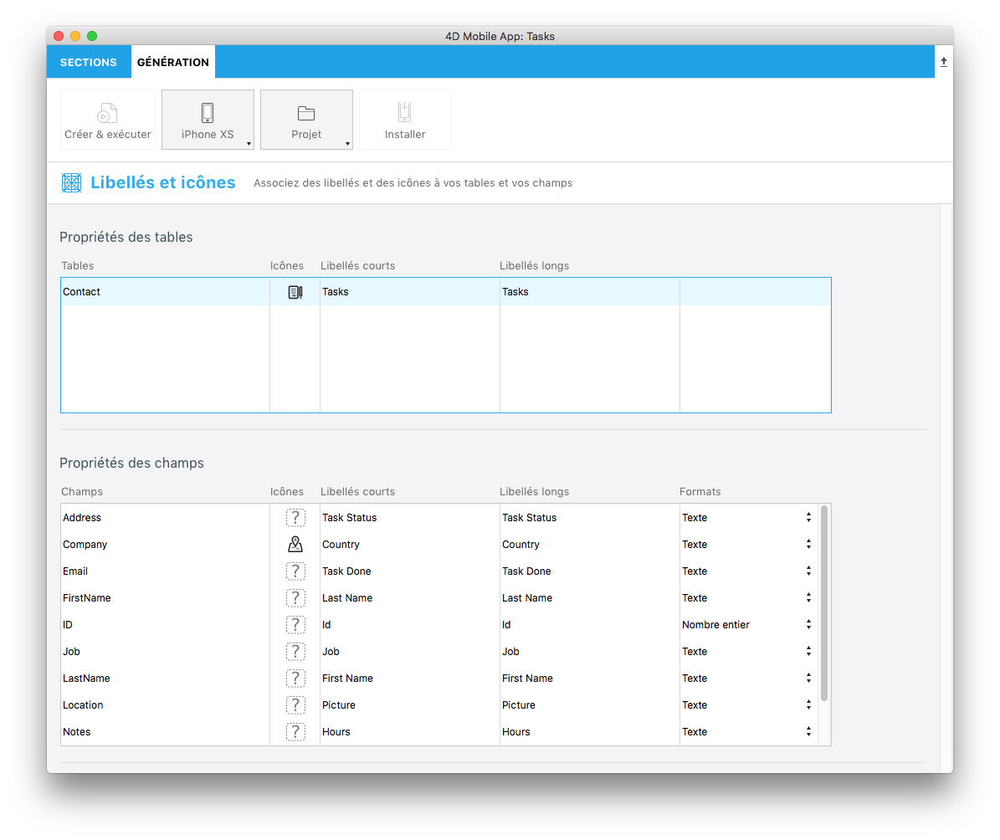

 

**OBJECTIFS**

* Créer vos premiers formats de données
 
 

**CONDITIONS PRÉALABLES**

* Cliquez [ici](prerequisites.html) pour commencer !
 

Dans ce didacticiel, nous vous guiderons dans la création de divers exemples de formats.

## Télécharger le projet Starter

Pour commencer, téléchargez le **Projet Starter**, qui comprend : * Deux dossiers d’images **integerToImage_Images** et **textToImage_Images** (à utiliser ultérieurement pour les formats qui incluent des images) * Un fichier **Task Management.4dbase** (avec un projet d’application mobile prêt à l’emploi)

  

    

<a class="button"
href="../assets/custom-formatter/CustomFormatterStarterProject.zip">PROJET STARTER - FORMAT PERSONNALISÉ</a>

  

Vous êtes maintenant prêt à créer vos premiers formats !

## Créer le dossier Formats

Premièrement, créez un dossier .../Resources/Mobile/Formats au même niveau que les données Task Management.4dbase.

## Formats des entiers

### Nombre entier vers chaîne

* Créez un dossier **integerToString** dans le dossier Formats que vous venez de créer.

* Créez ensuite un fichier **manifest.json** dans le dossier </strong> integerToString**.
</li> </ul> 
    
    
    
    * Regardons le contenu du fichier **manifest.json** :
    
        {
            // 1
            "name": "integerToString",
        
            // 2
           "type": ["integer"],
        
           // 3
           "binding": "localizedText",
        
           // 4
           "choiceList": {"0":"UX designer","1":"Developer","2":"QA","3":"Product Owner"}
        }
        
    
    1. **name** : le nom du format
    2. **type** : le type de format 4D que vous souhaitez utiliser
    3. **binding** : soit **localized text** pour les chaînes soit **imageNamed** pour les images
    4. **choiceList** : valeurs mappées
    
    ### Nombre entier vers image
    
    * Créez un dossier **integerToImage** dans le dossier **Formats** que vous venez de créer.
    
    * Créez un fichier **manifest.json** dans le dossier **integerToImage**.
    
    
    
    * Créez ensuite un dossier **Images** dans le dossier **integerToImage**. Vous pouvez ajouter les images depuis **integerToImage_Images** (dans StarterProject.zip) vers ce nouveau dossier.
        
        
    
    * Regardons le contenu du fichier **manifest.json** :
    
        {
            // 1
            "name": "integerToImage",
        
            // 2
           "type": ["integer"],
        
            // 3
           "binding": "imageNamed",
        
            // 4 
           "choiceList": {"0":"todo.png","1":"inprogress.png","2":"pending.png","3":"done.png"},
        
            // 5
           "assets": {
          "size": {
           "width": 40, "height": 40
                }
            }
        }
        
    
    1. **name** : le nom du format
    2. **type** : le type de format 4D que vous souhaitez utiliser 
    3. **binding** : soit **localized text** pour les chaînes soit **imageNamed** pour les images
    4. **choiceList** : valeurs mappées
    5. **assets** : ajuster la taille d'affichage (largeur et hauteur)
    
    ## Formats texte
    
    ### Texte vers chaîne
    
    * Créez un dossier **integerToString** dans le dossier Formats que vous venez de créer.
    
    * Créez un fichier **manifest.json** dans le dossier **textToString**.
    
    
    
    * Regardons le contenu du fichier **manifest.json** :
    
        {
            // 1
            "name": "integerToImage",
        
            // 2
           "type": ["text"],
        
           // 3
           "binding": "localizedText",
        
           // 4
           "choiceList": {"FRA":"France","MAR":"Morocco","USA":"United States","AUS":"Australia"}
        }
        
    
    1. **name** : le nom du format
    2. **type** : le type de format 4D que vous souhaitez utiliser
    3. **binding** : peut être **localized text** pour les chaînes ou **imageNamed** pour les images
    4. **choiceList**: valeurs mappées
    
    ### Texte vers image
    
    * Créez un dossier **textToImage** dans le dossier de formats que vous venez de créer.
    
    * Créez un fichier **manifest.json** dans le dossier **integerToImage**.
    
    
    
    * Créez ensuite un dossier **Images** dans le dossier **textToImage**. Vous pouvez ajouter les images depuis **textToImage_Images** du StarterProject.zip vers ce nouveau dossier.
    
    
    
    Regardons le contenu du fichier **manifest.json** :
    
        {
            // 1
            "name": "textToImage",
        
            // 2
           "type": ["integer"],
        
           // 3
           "binding": "imageNamed",
        
           // 4
           "choiceList": ["image1.png","image2.png","image3.png"],
        
            // 5
           "assets": {
          "size": {
           "width": 40, "height": 40
                }
            }
        }
        
    
    ## Ouvrir un projet mobile
    
    Ouvrez Task Management.4dbase avec 4D et allez dans Fichier > ouvrir > Projet mobile pour ouvrir **Tasks**
    
    Accédez ensuite à la section **Libellés et icônes** dans l'éditeur de projet. Tous vos formats sont disponibles pour les différents types de champs définis précédemment dans les fichiers de format manifest.json :
    
    * Sélectionnez le format **integerToString** pour **Job field**
    * Sélectionnez le format **textToString** pour **Country field**
    * Sélectionnez le format **integerToImage** pour **Task Status**
    * Sélectionnez le format **textToImage** pour **Manager**
    
    
    
    ## Créer votre application 4D for iOS
    
    Créez votre application 4D for iOS et vous constaterez que vos formats de données s'appliquent correctement en fonction du "credit limit".
    
    
    
    Cliquez sur le **FORMAT FINAL** ci-dessous pour télécharger le dossier définitif des modèles de formats.
    
    

      

        

<a class="button"
href="../assets/custom-formatter/CustomFormattersFinalProject.zip">FORMAT FINAL</a>

      

    
