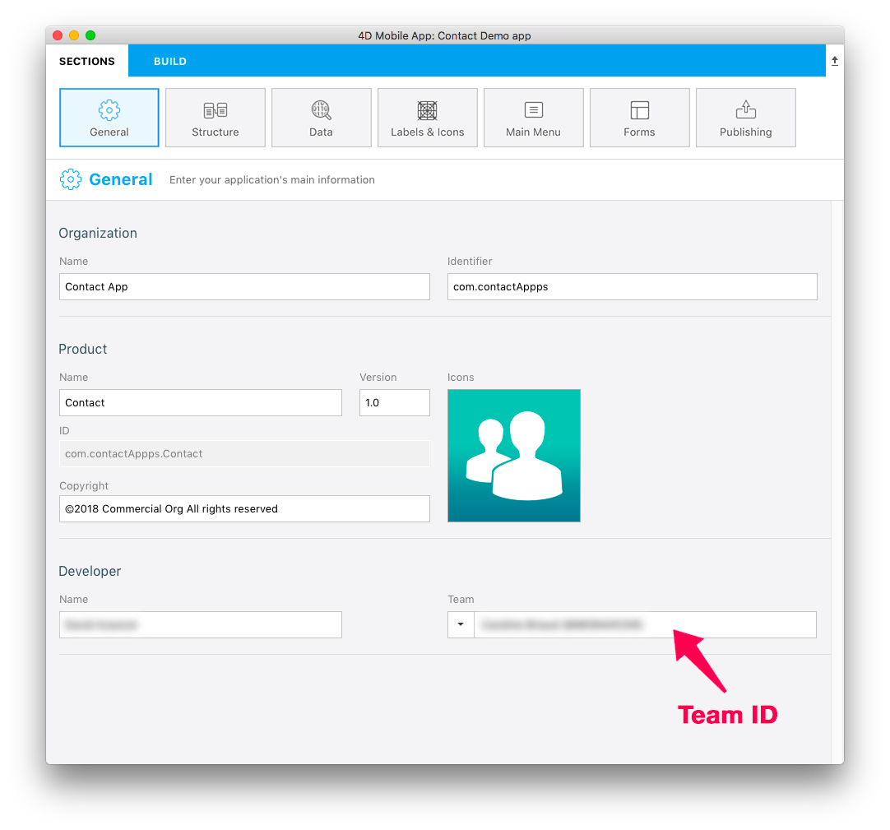

 

**OBJECTIFS**

* Archiver et publier votre projet App Store Connect
 

## ÉTAPE 1. Configurer Xcode

* Si vous avez choisi un compte Apple Developer, celui-ci est immédiatement disponible. 
* Si vos avez choisi un compte de développeur Apple en tant qu’organisation, vous devez attendre la validation d’Apple.
* Lorsque votre compte est accessible, ajoutez-le à Xcode dans Preferences > Accounts.
* Xcode installera automatiquement les certificats et les éléments de mise à disposition nécessaires. 

## ÉTAPE 2. Obtenir l'ID de votre équipe

* Connectez-vous à votre compte de développeur Apple. Vous pouvez trouver votre ID d’équipe dans Membership.

## ÉTAPE 3. Configurer 4D for iOS

* Lancez 4D for iOS

* Dans l’onglet SECTIONS :

**Général : Entrez votre ID d’équipe**

**Publication : Entrez votre URL de production**

(HTTPS est obligatoire pour le déploiement).

* Dans l’onglet GÉNÉRATION :

**Créer et exécuter : Créez votre projet**

## ÉTAPE 4. Ouvrir votre projet avec Xcode

* À partir de l’onglet GÉNÉRATION de l'éditeur de projet, cliquez sur Projet > Ouvrir le produit avec Xcode

## ÉTAPE 5. Archiver votre projet à partir de Xcode

* A partir de Xcode, accédez au Menu du simulateur et sélectionnez **Generic iOS Device**.

* Puis, dans le menu, cliquez sur Product et sélectionnez **Archive**

## ÉTAPE 6. Valider votre projet

* À la fin de l’archivage, la fenêtre de l’organisateur apparaît avec l’archive que vous venez de créer.

* Cliquez sur le bouton **Validate** pour démarrer le processus de validation.

* La première étape consiste à sélectionner les options de distribution de l'App Store.

* Ensuite, vous devez re-signer votre application. Laisser Xcode gérer cela en cochant l'option **Automatically manage signing**.

* Revoyez le contenu de votre application.

* Si votre projet réussit le processus de validation, le message suivant devrait s'afficher :

Si une erreur se produit, un message s’affichera. Ces erreurs doivent être résolues avant de recommencer le processus de validation.

* Cliquez sur **Done**. Cela vous renverra à la fenêtre de l’organisateur.

## ÉTAPE 7. Télécharger sur l’App Store

Une fois la validation terminée, vous êtes prêt à ajouter votre application à l’App Store.

* Cliquez sur le bouton **Upload to App Store**.

* Lorsque votre projet a été téléchargé avec succès, vous verrez cette fenêtre s'afficher :

## ÉTAPE 8. Sélectionner la version destinée à l’App Store

* Depuis l’App Store Connect > App Store > iOS App, sélectionnez votre application et cliquez sur le bouton **+** qui apparaît dans la section Build

* Sélectionnez la version que vous souhaitez envoyer et cliquez sur **Done**.

* Enfin, cliquez sur le bouton **Submit for Review**.

## ÉTAPE 9. Envoyer pour révision

* La dernière étape consiste à répondre à quelques questions sur votre application. 

* Une fois l'étape des réponses aux questions terminée, cliquez sur **Submit**.

* En moyenne, la durée de révision d'App Store est de deux jours !