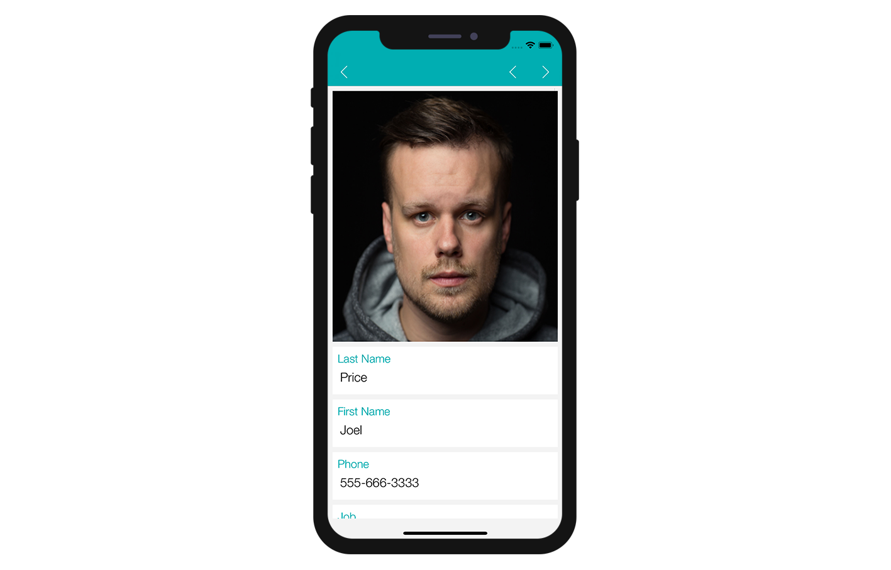

Il est temps de créer votre interface iOS de formulaire détaillé avec Xcode !

Voici le résultat que nous souhaitons obtenir :


Nous ajouterons à chaque cellule : * Une photo de profil en en-tête * Un champ à dupliquer

## Ouvrir le fichier storyboard avec Xcode

Dans un premier temps, ouvrez votre fichier storyboard dans Xcode.


Il est assez vide, nous allons donc y ajouter du contenu !

## Ajouter une "Scroll View"

Pour que notre formulaire détaillé soit déroulant, la première étape consiste à faire glisser et déposer une « Scroll View » (vue de défilement) depuis la **Bibliothèque d'objets**.


A partir du **Size inspector** (sur le côté droit de l’Interface Builder), définissez la largeur de la Scroll vue à 359 et la valeur de sa hauteur à 667. Définissez ensuite la valeur de X sur 8 et la valeur de Y sur 0.


Ajoutez ensuite quatre contraintes en cliquant sur le bouton **Add New Constraints** (Trailing: 8, Leading: 8, Top: 0, et Bottom: Multiple) comme suit :


## Ajouter une "Vertical Stack View"

Drag and drop a Vertical Stack View from the **Object library** in Scroll View. Then, from the **Size inspector panel** (on the right side of the Interface Builder window) set the Width value to 359 and the Height value to 202. Finally, set the X value to 0 and the Y value to 8.


Since the Stack View width and height are defined by the elements inside it, we will configure the size and contraints later.

## Add Views to the Stack Views

Drag and drop a view from the **Object library** to the Stack View you've just added to your storyboard. Let's name it **Field View 1**.


Then drag and drop another view from the **Object library** directly into the Document Outline at the same level as Field View 1 (to include it in the Stack View) and name it **Field View 2**.


To add space between the views, select your Stack View and set the spacing value to 8 (in the Attributes Inspector).


Select both **Field View 1** and **Field View 2** and in the **Size inspector panel** (on the right side of the Interface Builder window), set Width value to 359 and the Height value to 97.


Select **Field View 1** add three constraints by clicking on the **Add New Constraints button** (Trailing: 0, Leading: 0, and Top: 0):


For the Stack View to have the same width as the Scroll View, you need to add a contraint:

* Press Ctrl and drag the Stack View to the Scroll View. When you release the mouse button, the Interface Builder displays a menu with a list of possible constraints. Choose Equal Width!


Next, with the Stack View selected add four constraints by clicking on the **Add New Constraints button** (Trailing: 0, Leading: 0, Top: 8, and Bottom: 0) as shown below:


Here's what you'll see when constraints have been added :


Now that you have two views in your Stack View and you've defined constraints, let's focus on Field View 1.

## Add an Image View to Field View 1

From the **Object library**, drag and drop an **Image View** into Field View 1.


In the **Size inspector panel** (on the right side of the Interface Builder window), set the Image View Width value to 359 and the Height value to 97. Then set the X value to 0 and the Y value to 0.


Next, add four constraints by clicking on the **Add New Constraints button** (Trailing:0, Leading:0, Top:0, and Bottom:0) as shown below:


In the **Size inspector panel** change the Intrinsic Size from **Default** to **Placeholder**.


## Add Labels to Field View 2

### Title label

In the **Object library**, drag and drop a **Label** into Field View 2 and set the Width value to 343 and the Height value to 22. Then set the X value to 8 and the Y value to 8.


Double click on the label and name it "```___FIELD_LABEL___```". Then in the **attribute inspector** set the font to **Helvetica Neue Light 18.0** and the color to **BackgroundColor**:


### Content label

Duplicate the Title label and set the duplicate's Width value to 339 and the Height value to 44. Then set the X value to 12 and the Y value to 37.


Double click on the label and name it "```<___FIELD_LABEL___>```". Then from the **attribute inspector** set the font to **Helvetica Neue Light 20.0** and the color to **Black Color**:


Select the Content and Title labels and add four contraints by clicking on the **Add New Constraints button** (Trailing: 8, Leading: Multiple, Top: Multiple, and Bottom: Multiple) as shown below:


You're done with graphical elements! All of your constraints are well defined :)

## How to get data into your cells

### Image View

Select your Image View and go to **Identity inspector** > User Defined Runtime Attributes. Click the **+ button** to add a row.


* **Key Path**: Start with bindTo to activate binding on the component. Enter ```bindTo.record.___FIELD_1___```
* **Type**: Always ```String``` 
* **Value**: The attribute name. Enter ```___FIELD_1_BINDING_TYPE___```


### Labels

For the **first label** we are going to add several lines mainly to display icons:


You also need to set the Class to ```IconLabel``` and check the **Inherit Module From Target** checkbox as we can see below:


Select the **second label** and add a row in the Defined Runtime Attributes:

* **Key Path**: ```bindTo.record.___FIELD___```
* **Type**: ```String``` 
* **Value**: ```___FIELD_BINDING_TYPE___```


## Add TAGS to the cells to be duplicated

Field View 2 includes elements that will be duplicated so you can have as many field as you define in the project editor.

Each storyboard element has a Object ID. For example, if you select Field View 2 and go to the **Identity inspector**, you'll see its Object ID:


In order to tell the project editor that all of the elements included in this view will be duplicated, we need to add TAG to each element and constraints.

The process is a little bit tricky... Let's begin by opening the storyboard file with your favorite code editor!

### Field View 2

* Select **Field View 2** and get its Object ID from the Identity Inspector (on the right side of the Interface Builder window). In our project, Field View 2 ID is: **SiX-3H-lNB**.

* Search for this ID in the storyboard xml code and replace it with **TAG-FD-001** each time it appears. As you can see, this Object ID is mentioned several times so be careful!


Save the storyboard xml file. As you can see, the Field View 2 Object ID has changed in your storyboard in Xcode:


### First label

* Now, get the **first label** Object ID from the Identity Inspector and replace it with **TAG-FD-002** each time it appears in the storyboard xml code.


Done with the first label!

### Second label

* Next, get the **second label** Oject ID from the Identity Inspector and replace it with **TAG-FD-003** each time it appears in the storyboard xml code.


Voilà!

### Constraints

Both labels have constraints that we need to tag, too:


Just like View Field 2 and label, get all **7 Constraints** Object IDs from the Identity Inspector and replace them with: **TAG-FD-004**, **TAG-FD-005**, **TAG-FD-006**, **TAG-FD-007**, **TAG-FD-008**, **TAG-FD-009** and **TAG-FD-010**.

Go to your project editor and select your detail template from the Forms section, then click on Build.


Not bad for a first attempt! :)



Field View 2 is well duplicated! Let's see if we can make this app a bit more interesting!

### Customize your app

We're going to add a corner radius to the Image View, as well as Field View 2.

Select your Image View and add the two following lines in the User Defined Runtime Attributes:

* **Key Path**: ```cornerRadius```
* **Type**: ```Number``` 
* **Value**: ```12```

and

* **Key Path**: ```layer.masksToBounds```
* **Type**: ```Boolean``` 
* **Value**: Check the box


Next, select Field View 2 and add the following:

* **Key Path**: ```cornerRadius```
* **Type**: ```Number``` 
* **Value**: ```12```


You can now build your project from the project editor!


## Where to go from here?

In this tutorial, we've covered the basics for creating detail form templates. You can now create simple templates on your own using the Starter Project resources. Click on **Final Project** below to download the completed template folder.

<div style="text-align: center; margin-top: 20px">
  <p>
    

<a class="button"
href="../assets/custom-detailform/CustomDetailFormFinalTemplate.zip">CUSTOM DETAILFORM FINAL TEMPLATE</a>

  </p>
</div>