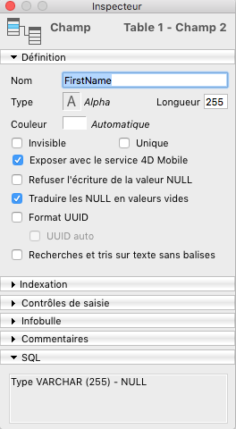
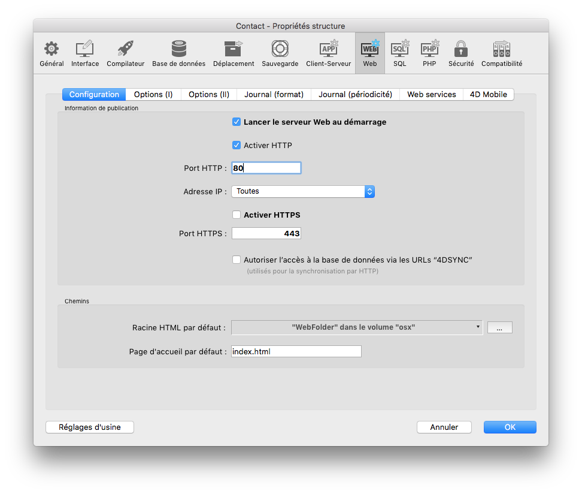

## Configuration logicielle requise

* 4D Developer Pro v17 R2 64 bits (développement)
* 4D Server v17 R2 64 bits (déploiement) 
* 4D for iOS en R2 v17 est conçu et certifié pour Xcode 9.4.1.
* La prochaine version (4D v17 R3) sera certifiée pour Xcode 10/Swift 4.2 (un macOS 10.13.6 ou 10.14 est requis)
* [Apple configurator 2](https://itunes.apple.com/us/app/apple-configurator-2/id1037126344) installé sur votre Mac (facultatif). Installez ce logiciel si vous souhaitez automatiser l’installation de l’application sur votre appareil.

## Configuration matérielle requise

* 8 Go de RAM (Minimum recommandé)

## Configuration

* Dans les propriétés de la base de 4D, affichez la page de compatibilité et cochez la case **Utiliser la notation objet pour accéder aux propriétés des objets (Unicode nécessaire).**

*Mode Unicode : permet d’activer ou de désactiver le mode Unicode pour la base de données courante.*

* Dans les Propriétés de la base 4D, affichez la page Web/4D Mobile et cochez la case **Activer le service 4D Mobile**.

* Les tables et les champs doivent être **Exposé[s] avec le service 4D Mobile**. Affichez l'Inspecteur de table dans l’éditeur de structure et sélectionnez la table à modifier. Par défaut, l'option **Exposer avec le service 4D Mobile** est cochée.

* Les ports HTTP et HTTPS doivent être correctement configurés. HTTPS est obligatoire pour le déploiement de 4D for iOS.

* Votre serveur Web doit être lancé. Il est accessible depuis le menu Exécution :

