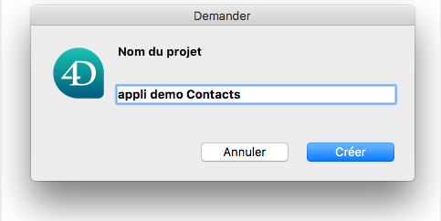

 

**OBJECTIFS**

* Se familiariser avec l’éditeur de projet
 
 

**CONDITIONS PRÉALABLES**

* Cliquez [ici](prerequisites.html) pour commencer !
 

Jetons un œil au fonctionnement de 4D for iOS.

Démarrez votre application 4D, ouvrez votre base, et cliquez sur **Nouveau > Projet mobile**.

Nommez votre projet puis cliquez sur **Créer**.

L'écran de bienvenue s’affiche automatiquement pour vous aider à comprendre les concepts de base de 4D for iOS. Vous pouvez cocher l'option **Ne plus afficher** si vous souhaitez que cette boîte de dialogue ne s'affiche plus. Cliquez sur **Continuer**.

Nous y sommes ! Il est maintenant temps de découvrir l'architecture et l'interface de 4D for iOS.

La fenêtre principale se compose de deux onglets :

## Sections

Dans l’onglet Sections, vous trouverez toutes les étapes nécessaires à la création de votre application 4D for iOS :

* Général
* Structure
* Libellés et icônes
* Menu
* Formulaires
* Publication

## Génération

The Build tab has four options:

* Build and Run 
* Simulator selection
* Project and product browser
* Install