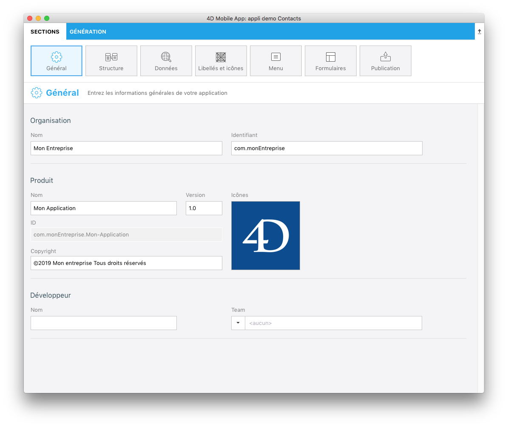

Cette section vous permet de définir les principales informations sur votre application.

* **Organisation :**Saisissez soit votre nom soit celui de votre entreprise.
* **Identifiant :** Saisissez l'identifiant Bundle de votre entreprise. Il servira à identifier votre application. Le nom de produit que vous entrez est concaténé afin de créer la valeur par défaut du « Bundle ID » à l'aide de la notation inversée du service de nom de domaine. Ce bundle ID doit être unique et propre à votre application.

Par exemple, si le nom de votre entreprise est « MaSociété » et le nom de votre application est « MonAppli », vous pouvez nommer l'identifiant de votre entreprise « com.MaSociété » et le bundle ID de votre application serait « com.MaSociété.MonAppli ».
 

**NOTE**

Des liens d’aide sont disponibles pour les champs "Nom" et "Identifiant".
 

* **Nom du produit :** Nom de votre application. Comme indiqué ci-dessus, le nom du produit est utilisé pour créer l'identifiant bundle. Ce "Bundle ID" doit être identique au Bundle ID que vous avez créé dans votre compte Apple Development.
* **Version :** Le numéro de version de votre application. Ajoutez des numéros dans un ordre séquentiel croissant à partir de 1.0.
* **Copyright :** Les droits d’auteur de votre application. 4D for iOS propose un format de droit d’auteur, mais vous pouvez créer votre propre format.
* **Icônes :** 4D for iOS vous permet de créer des icônes pour vos applications conformes aux directives d’Apple, de diverses manières, notammente par un glisser/déposer de vos icônes directement depuis votre ordinateur vers la zone consacrée à l’icône. 4D for iOS génèrera pour vous tous les formats requis !
 

**CONSEILS**

* Si vous avez déjà une icône pour votre application de bureau, vous pouvez la glisser et déposer directement dans la zone consacrée à l’icône.

* **Petit tour de magie :** 4D for iOS détermine automatiquement la couleur dominante de l’icône de votre application et l’utilise pour générer un jeu de couleurs personnalisé pour votre application !
 

* **Développeur :**Ce champ est renseigné automatiquement avec le nom de votre compte utilisateur.
* **Team :** "Team ID" de votre compte Developer.