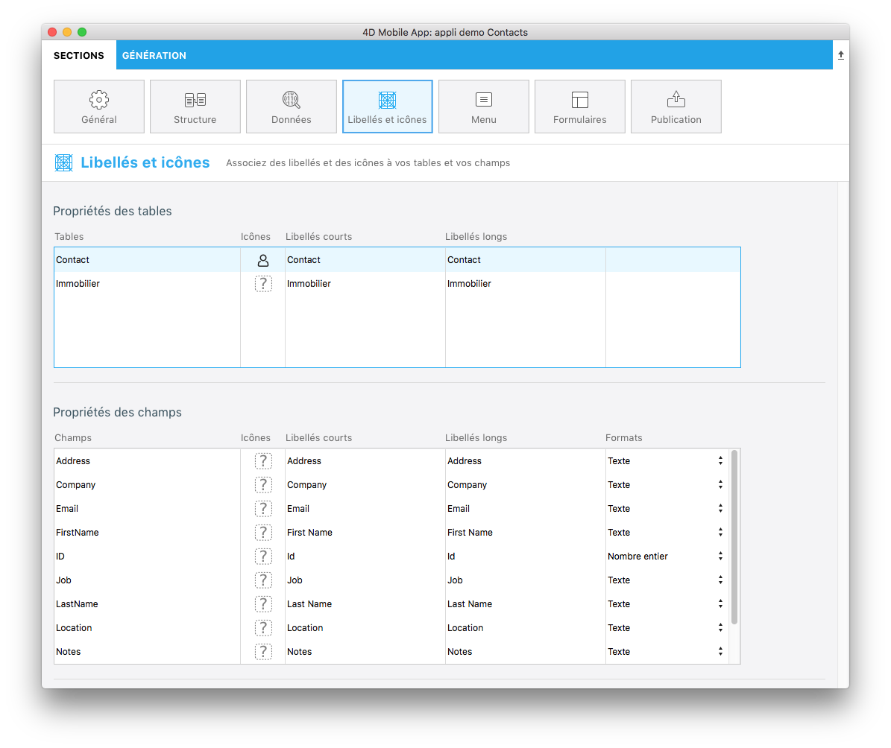

C'est dans cette sous-section que vous définirez les libellés longs et courts ainsi que les icônes de vos champs et tables.

* **Libellés longs et courts :** Les libellés longs et courts sont utilisés en fonction de l'espace disponible dans le modèle (pour optimiser l'espace et éviter de surcharger la barre d'onglets).
* **Icônes :** 4D for iOS fournit une vaste bibliothèque d'icônes intégrées pour répondre à vos besoins. Il s’agit d’icônes en référence à différents domaines : le commerce, la finance, l'éducation, le gouvernement, la santé, l'industrie, l'immobilier, les services, etc.
* **Formats :** permettent de gérer l'affichage des valeurs des champs (monnaies, pourcentages, etc.)
 

**CONSEILS**

* Pour maintenir un ensemble cohérent, des **icônes par défaut** sont générées pour les champs vides si au moins une icône a été définie pour un champ.

* Vous pouvez également laisser la zone consacrée aux icônes vide si vous ne souhaitez pas afficher d'icônes dans votre application.
