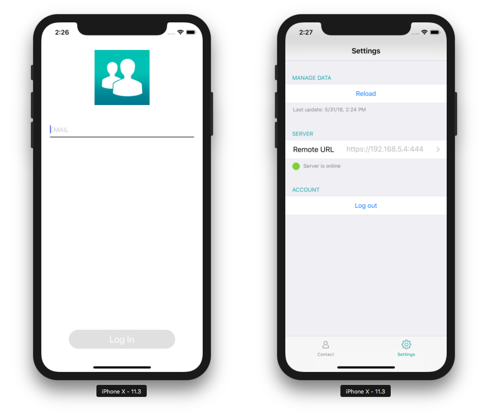

C’est ici que votre application est définie et créée : * Paramètres du serveur Web * Mode d'authentification * Méthode d’authentification


## Paramètres du serveur Web<div class = "tips"> 

**NOTE**

* Le simulateur fonctionne localement (127.0.0.1 ou localhost).
* Si l’URL de production est défini, HTTP et HTTPS sont acceptés. Dans le cas contraire, c'est l'adresse IP qui est utilisée.
* Si HTTP et HTTPS sont tous les deux activés, c'est HTTP qui est utilisé.</div> 

* Activez et définissez vos ports HTTPS et/ou HTTP si ce n'est pas déjà fait. Pour ce faire, cliquez sur le bouton **Éditer**.

* L'activation du port HTTPS nécessite une installation certifiée pour fonctionner correctement. Vous pouvez créer des certificats d'essai avec 4D.

## Authentification

**Authorized User:** Check the **Login required** option to display a login form when the app starts.

**Guest:** Leave the **Login required** option unchecked. Aucun formulaire de connexion ne s’affiche au démarrage de l'application.

## Méthode d’authentification

### On Mobile App Authentication Database Method

* **Développement** : la méthode d’authentification vous permet d’utiliser l’application localement. 
* **Déploiement** : vous devez créer/modifier la méthode de base de données *On Mobile App Authentication* pour autoriser des e-mails ou des appareils spécifiques, y compris en mode invité.

Un modèle disponible permettra : * d'accorder un accès (*ex :* e-mail à des domaines spécifiques) * d'obtenir toutes les informations nécessaires sur la session et l'utilisateur (adresse e-mail, renseignements sur l'application, appareil, Team ID, etc.)

Vous pouvez personnaliser cette méthode selon vos besoins !

### Gestion de la session

Lorsqu'un utilisateur ouvre l'application pour la première fois, un fichier session est créé et stocké avec le fichier de données courant dans le dossier MobileApps.

Les fichiers de session sont organisés et groupés par dossier d'application. Les Team ID et bundle ID de l'application sont concaténés pour créer des noms de dossiers d'application.

Voici un exemple de fichier de session généré par 4D for iOS :

```json
{
"application":{
"id":"com.contactApp.Contact",
"name":"Contact",
"version":"1.0.0"
},
"team":{
"id":"UTT7VDX8W5"
},
"language":{
"id":"en_US",
"code":"en",
"region":"US"
},
"email":"",
"device":{
"description":"iPhone X",
"version":"11.3",
"id":"0DC5132E-1EF4-407C-A832-5FE33D818AF3",
"simulator":true
},
"send":"link",
"session":{
"id":"7023d9205074199d1c16fc00d24354e778137675",
"ip":"::ffff:192.168.5.4"
},
"status":"accepted",
"token":"eyJhcHBOYW1lSUQiOiJjb20uY29udGFjdEFwcC5Db250YWN0IiwiaWQiOiI3MDIzZDkyMDUwNzQxOTlkMWMxNmZjMDBkMjQzNTRlNzc4MTM3Njc1IiwidGVhbUlEIjoiVVRUN1ZEWDhXNSJ9"
}

```

### Mobile Session Management Component

Les sessions peuvent être gérées par **MOBILE SESSION MANAGEMENT** :

<div style="text-align: center; margin-top: 20px">
  <p>
    

<a class="button"
href="../assets/session-management/MOBILE-SESSION-MANAGEMENT.zip">Composant de GESTION DE SESSION MOBILE</a>

  </p>
</div>

* Créez un dossier **Components** contenant les données de l’application au même emplacement que la base de données 4D. 
* Placez le composant **MOBILE SESSION MANAGEMENT** dans le dossier nouvellement créé **Components**.
* Redémarrez 4D. 
* Dans l’explorateur de méthodes 4D, sélectionnez la méthode **MOBILE SESSION MANAGEMENT** et cliquez sur le bouton **Execute**. 
* La fenêtre d'applications apparaitra et affichera toutes vos applications : 


* Faites un clic droit sur la session pour afficher le fichier session dans le Finder our bien supprimez-le.
* Vous pouvez modifier et définir le statut de la session pour chaque appareil : accepté ou en suspens


* Le bouton **Push** met à jour la session en mémoire.
* Le bouton **Refresh** met à jour la liste de session. 

## Aperçu sur l'appareil

Un écran de paramètres est disponible dans la barre d’onglets. Vous pouvez également le trouver sous l’onglet "More" si nécessaire (à savoir, votre application contient plus de quatre tables).

Les paramètres vous permettent de : * Recharger des données * Définir votre URL de serveur * Vous déconnecter (si vous êtes connecté en tant qu’utilisateur autorisé)

