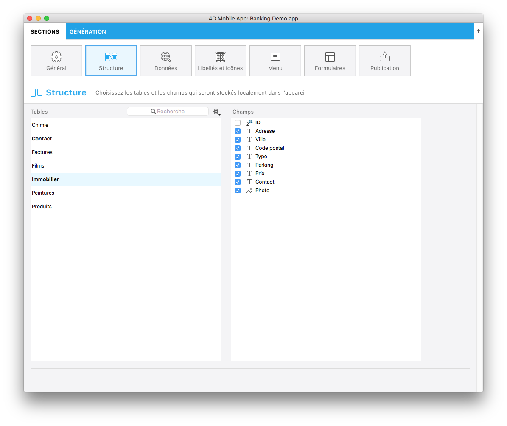

Cette section affiche tous les champs et les tables de votre base de données exposés par 4D Mobile Service.

Vous pouvez définir ici un sous-ensemble de votre structure pour le reproduire dans les appareils mobiles en sélectionnant des champs et des tables spécifiques. 

* les tables sélectionnées seront automatiquement ajoutées aux onglets de votre application.
* les champs sélectionnés seront disponibles plus tard, lorsque vous définirez vos formulaires Liste et vos formulaires détaillés.

**N to 1 relations**

* 4D 17R5 allows you to visualize table links and select related fields clicking on the link. Then when your related fields are published, they can be used like any other field in the app creation process.

 

**NOTE**

* Nous vous recommandons vivement de publier votre clé primaire afin d’identifier chaque enregistrement de votre base.
 

Pour vous aider à définir la structure de votre application, plusieurs filtres ainsi qu'un moteur de recherche sont disponibles pour sélectionner facilement vos tables et vos champs.
 

**CONSEILS**

Vous pouvez publier une sélection de champs en appuyant sur la barre d’espace, plutôt que de sélectionner les champs un par un.
